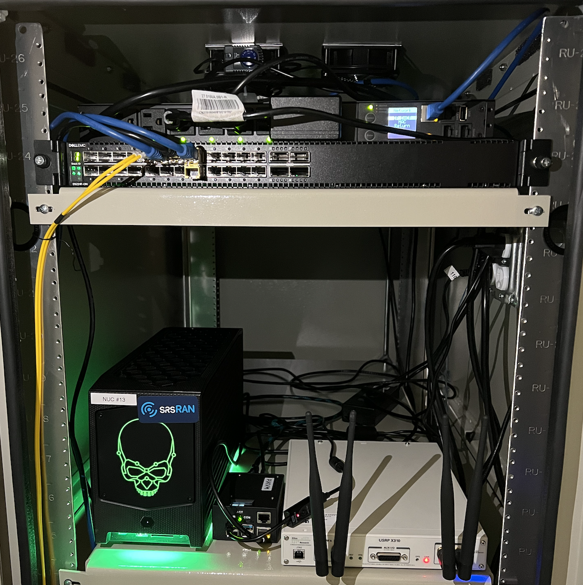
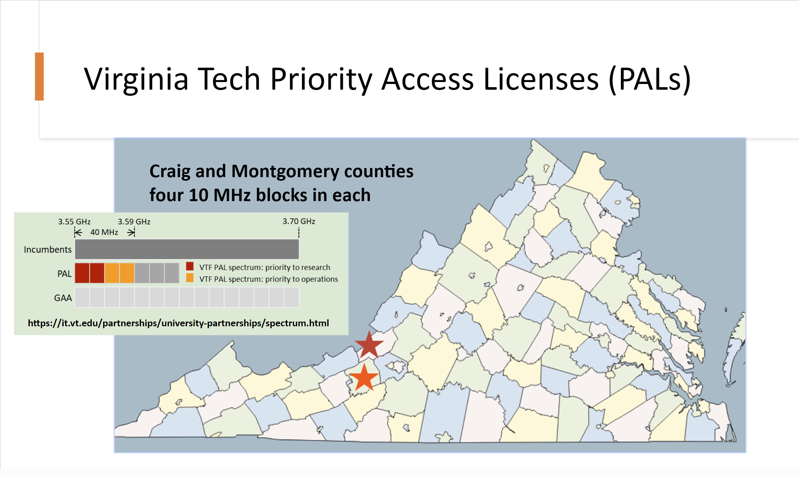

.. _Stroubles Creek CBRS Testbed Site:

CCI xG Testbed: Outdoor Experimentation and Testing Environment(CBRS Testbed Site)
==================================================================================

|

Introduction
------------

The transition from in-lab to in-the-field experimentation and testing is driving demand for a more realistic and uncontrollable environment to assess more deeply the behavior, performance, and resilience of wireless systems and their components. To address this need, the CCI xG Testbed Team has been deploying an outdoor environment to conduct experimentation and testing. This involves the construction of a Citizens Broadband Radio Service (CBRS) private network using Virginia Tech's Priority Access License (PAL).
|

CBRS Overview
-------------

CBRS, also known as the 3.5 GHz band (3550-3700 MHz), is designed to promote shared band usage through a spectrum access system (SAS). It features three tiers of access and authorization:

- **Incumbent Access:** This tier includes federal and non-federal incumbents, such as fixed satellite service earth stations and radar systems. Incumbents have the highest priority and are protected from interference by the lower tiers.
- **Priority Access License (PAL):** PALs are licensed on a county-by-county basis and consist of a 10 MHz channel in the 3550-3650 MHz portion of the band. PALs must protect incumbent users and accept interference from them.
- **General Authorized Access (GAA):** GAA operates in the 3550-3700 MHz band and includes any CBRS device that is not associated with a higher tier. GAA users must avoid causing interference to higher tier users and accept interference from them.

|

Stroubles Creek Outdoor Testbed
-------------------------------

The Stroubles Creek outdoor testbed, located in Blacksburg, Va., is an outdoor component of CCI's xG testbed at the Arlington, Va., site. It is composed of two networks:

- **Production Network (CBRS Private Network):** This network contains a commercial core and three Citizens Broadband Radio Service Devices (CBSDs) orchestrated by the Federated Wireless Spectrum Access System (SAS). It is designed to immediately support university use cases and generate real datasets.
- **Experimental Network:** This network consists of an open-source core, three software-defined radio (SDR)-based 5G CBSD prototypes built in the lab, and an open-source SAS called "OpenSAS." It allows researchers to customize, reconfigure, and control software and hardware parameters, develop algorithms, and improve performance and efficiency. For the first time, experimenters can perform end-to-end CBRS experimentation.

The outdoor testbed site covers a 1.5-mile corridor with three rooftop locations for the CBSD nodes:

- **CBSD1:** Human and Agricultural Biosciences Building rooftop
- **CBSD2:** Hahn Hall North rooftop
- **CBSD3:** The Animal Husbandry Barn

.. raw:: html

  

  <iframe src="https://www.google.com/maps/d/u/0/embed?mid=1y-14BrRX_dkfD7plXZ76obGwEjDvDzI&ehbc=2E312F" width="800" height="500"></iframe>

|

Experimental CBSD (5G NR Standalone Network in CBRS Band)
---------------------------------------------------------

The experimental CBSDs are deployed using USRP x310, srsRAN 5G NR stack, and Open5GS core network for the 5G NR standalone CBRS network deployment. Intel NUCs are used to host the core and RAN software, and a Commscope commercial CBRS antenna has been integrated. These equipment are housed in weatherproof enclosures equipped with PiKVM and Ethernet PDU for remote monitoring and control.

The Stroubles Creek outdoor testbed that's under construction in Blacksburgs, Va., an outdoor component of CCI's xG testbed at the Arlington, Va., site, is composed of two networks.

A production network (or CBRS private network) that contains a commercial core, three Citizens Broadband Radio Service Device (CBSD)s orchestrated by the FederatedWireless Spectrum Access System (SAS) to immediately support university use cases and to generate real datasets.

|

Outdoor Enclosure Components
----------------------------

The outdoor enclosure houses several key components that enable the deployment of the experimental CBSD (5G NR standalone network in the CBRS band). These components include:

- **Dell Networking Switch:** The Dell networking switch is used to connect the various devices within the enclosure and provide network connectivity to the external infrastructure.
- **Intel NUC:** The Intel NUC (Next Unit of Computing) is a small form factor computer that hosts the core and RAN software required for the 5G NR standalone network. It provides the computational power needed to run the software-defined radio (SDR) and core network functions.
- **PiKVM:** The PiKVM is a Raspberry Pi-based device that allows remote access and control of the equipment inside the enclosure. It enables administrators to monitor and manage the system remotely, reducing the need for on-site maintenance.
- **USRP x310:** The USRP (Universal Software Radio Peripheral) x310 is a high-performance, scalable software-defined radio platform. It is used to implement the physical layer of the 5G NR network, providing the radio frequency (RF) front-end for the CBSD.
- **CyberPower metered PDU:** The CyberPower metered power distribution unit (PDU) provides power to the devices within the enclosure and allows for remote monitoring and control of the power supply. It helps ensure the stability and reliability of the system by managing power distribution and enabling remote power cycling if needed.
- **CommScope CBRS Antenna:** The CommScope CBRS antenna is a commercial-grade antenna designed specifically for operation in the CBRS band. It is connected to the USRP x310 via an RF cable and provides the necessary radio frequency interface for the 5G NR network.

.. figure:: _static/hardware.png
  :alt: CBSD Equipment
  :align: center
  :width: 800px
  :height: 700px

|

The outdoor enclosure is designed to protect these components from the elements, ensuring reliable operation in various weather conditions. The enclosure is weatherproof and provides a controlled environment for the sensitive electronic equipment.
By integrating these components into a single outdoor enclosure, the CCI xG Testbed Team has created a modular and scalable solution for deploying experimental 5G NR networks in the CBRS band. This setup allows researchers to easily deploy and manage their experiments, while also providing remote access and control capabilities for efficient operation and maintenance.

|

Implementation of CBRS Hardware
-------------------------------

This section describes the implementation of the CBRS hardware components in the outdoor enclosure. The hardware components include the USRP x310, Intel NUC, CommScope CBRS antenna, Dell networking switch, CyberPower metered PDU, and PiKVM. These components are integrated into the enclosure to create a self-contained and weatherproof system for deploying the experimental CBSD (5G NR standalone network in the CBRS band).

|

Virginia Tech Priority Access License (PAL)
-------------------------------------------

The Virginia Tech Foundation has acquired Priority Access Licenses (PALs) for the newly available Citizens Broadband Radio Service (CBRS). Virginia Tech's priority access licenses include four 10-MHz blocks in Montgomery County and another four 10-MHz blocks in Craig County. The licenses are held by Virginia Tech Technology Assets (VTTA), a subsidiary of the Virginia Tech Foundation, and will be administered by the Division of Information Technology.
The planned deployment will also include commercial CBRS base stations that are part of the non-experimental or production deployment. These base stations will operate under the Virginia Tech PALs, providing a dedicated and licensed spectrum for the university's wireless needs.

