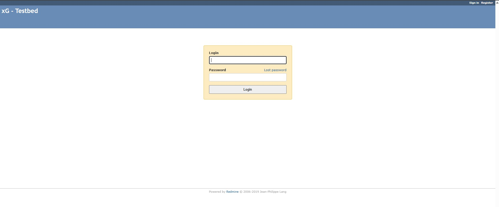
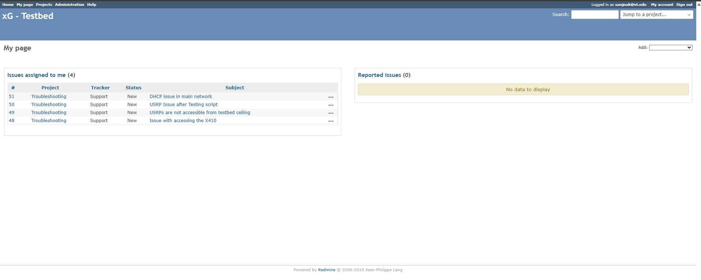
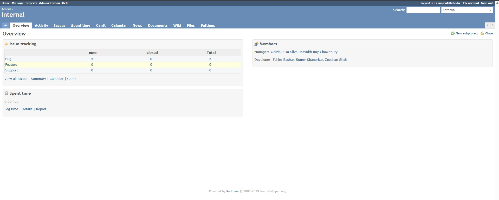
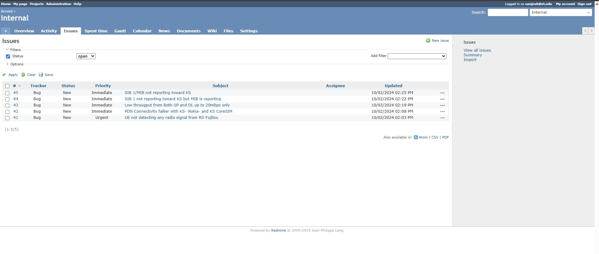
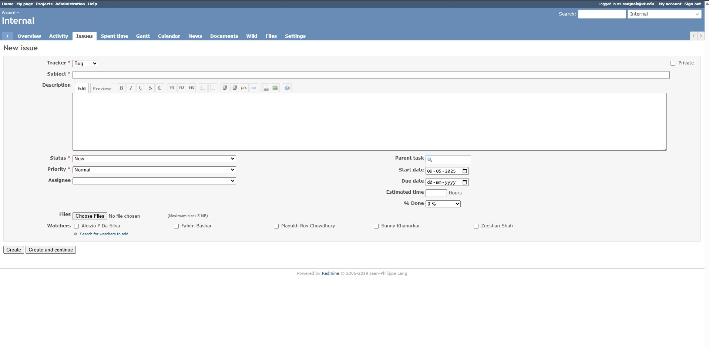
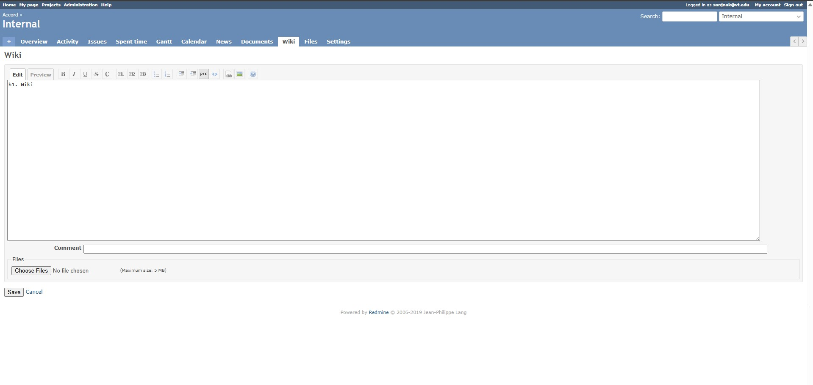
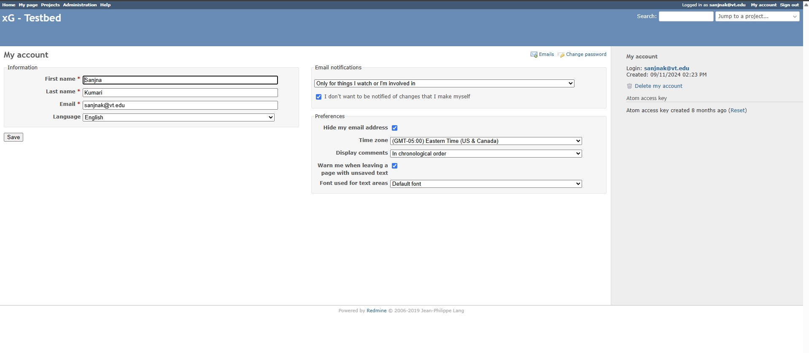
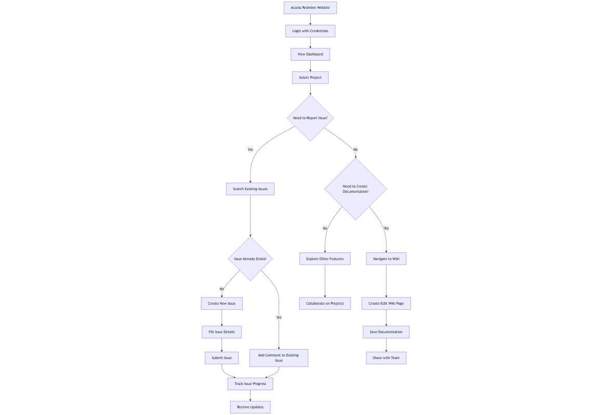

======================
Redmine Access Guide
======================

This guide provides detailed information about accessing and using the CCI xG Testbed Redmine project management system.

What is Redmine?
---------------

Redmine is a flexible project management and issue tracking system used by the CCI xG Testbed to:

* Track experiment progress
* Report and resolve technical issues
* Collaborate with team members and testbed administrators
* Access documentation and knowledge base articles
* Manage project timelines and milestones

Accessing Redmine
-------------------

After your account request is approved, you will receive Redmine credentials via email. These credentials include:

* **Username**: Your assigned Redmine username
* **Password**: Your initial Redmine password

To access Redmine:

1. Open your web browser
2. Navigate to the Redmine URL: `Link <https://redmine.xgtestbed.cyberinitiative.org/redmine/>`_
3. Enter your username and password
4. Click "Login"

   Figure: Redmine login page 

.. note:: Upon first login, you may be prompted to change your password. Choose a strong, unique password that you don't use for other services.

Getting Started with Redmine
---------------------------

Dashboard Overview
^^^^^^^^^^^^^^^^^

After logging in, you'll see the Redmine dashboard which provides:

* **My page**: A personalized view of your assigned issues and activities
* **Projects**: List of projects you have access to
* **Issues**: All issues across projects you can view
* **Help**: Documentation on using Redmine

   Figure: Redmine dashboard overview 

Navigating Projects
^^^^^^^^^^^^^^^^^

1. Click on the "Projects" tab to see all available projects
2. Select a project to view its details
3. Each project has several tabs:

   * **Overview**: General project information
   * **Activity**: Recent actions in the project
   * **Issues**: List of all issues in the project
   * **Wiki**: Project documentation
   * **Settings**: Project configuration (for administrators)

   Figure: Redmine projects page 

Working with Issues
-----------------

Searching for Existing Issues
^^^^^^^^^^^^^^^^^^^^^^^^^^^^

Before creating a new issue, it's best practice to search for existing issues that might address your concern:

1. Navigate to the "Issues" section
2. Use the search box to enter keywords related to your issue
3. Apply filters to narrow down results:

   * Status (open, closed, in progress)
   * Priority
   * Assignee
   * Date ranges
4. Review matching issues to see if your concern has already been addressed

   Figure: Redmine issue search interface

Creating New Issues
^^^^^^^^^^^^^^^^^

If you don't find an existing issue that matches your needs:

1. Navigate to your project
2. Click "New issue"
3. Fill in the required fields:

   * **Subject**: A brief, descriptive title
   * **Description**: Detailed information about the issue
   * **Priority**: The importance of the issue (Normal, High, Urgent)
   * **Assignee**: Who should work on this issue (leave blank if unsure)
   * **Category**: The type of issue (Bug, Feature, Support)
   * **Target version**: When this should be addressed (if applicable)
4. Add attachments if needed (screenshots, logs, etc.)
5. Click "Create" to submit the issue

   Figure: Redmine new issue creation form

Tracking and Updating Issues
^^^^^^^^^^^^^^^^^^^^^^^^^^

Once an issue is created:

1. You'll receive notifications about updates (based on your notification settings)
2. You can add comments to provide additional information
3. Update the status as the issue progresses:

   * **New**: Just created
   * **In Progress**: Being worked on
   * **Resolved**: Solution implemented
   * **Feedback**: Needs input from reporter
   * **Closed**: Completed and verified
4. Add time tracking information if required

   Figure: Redmine issue tracking interface 

Creating and Managing Documentation
---------------------------------

Redmine's Wiki Feature
^^^^^^^^^^^^^^^^^^^^

Each project has a wiki section for documentation:

1. Navigate to the "Wiki" tab in your project
2. Click "Edit" on an existing page or create a new page
3. Use the rich text editor or Textile/Markdown syntax to format your content
4. Add images, tables, and links as needed
5. Save your changes with a brief description of what was updated

   Figure: Redmine Wiki editing interface 

Documentation Best Practices
^^^^^^^^^^^^^^^^^^^^^^^^^^

* Structure documentation with clear headings and subheadings
* Include step-by-step instructions where appropriate
* Add screenshots or diagrams to illustrate complex procedures
* Link related wiki pages and issues for cross-reference
* Regularly update documentation as procedures change

Collaboration Features
--------------------

Redmine offers several ways to collaborate with team members:

* **Issue comments**: Discuss specific issues
* **Wiki discussions**: Collaborate on documentation
* **File sharing**: Upload and share relevant files
* **News**: Post project announcements
* **Forums**: Discuss broader topics (if enabled)

User Profile and Preferences
--------------------------

Customize your Redmine experience:

1. Click on your username in the top-right corner
2. Select "My account"
3. Update your:

   * Personal information
   * Password
   * Email notification preferences
   * UI theme and display options

   Figure: Redmine user profile settings page

Flow Diagram of Redmine Functionality
-----------------------------------

The following diagram illustrates the typical workflow for using Redmine:

 

   Figure: Redmine User-Flow 

Best Practices for Using Redmine
------------------------------

* Check Redmine regularly for updates on your issues
* Keep issue descriptions clear and concise
* Use appropriate issue categories and priorities
* Update issue statuses as they progress
* Include relevant attachments and screenshots when reporting problems
* Subscribe to notifications for issues you're interested in
* Contribute to documentation to help other users

Getting Support
-------------

If you encounter difficulties using Redmine:

1. Check the Redmine help documentation
2. Create a support issue in the appropriate project
3. Contact the CCI xG Testbed support team via email at the address provided in your welcome message

.. note:: For additional assistance with Redmine, please contact the CCI xG Testbed support team through Redmine or via email at the address provided in your welcome message.
