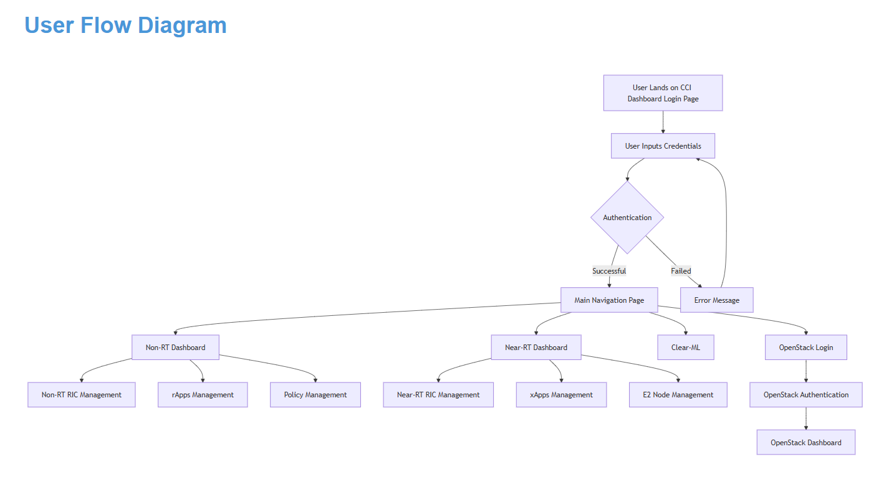

=================================
 Getting Started with CCI xG Testbed
=================================

CCI xG Testbed provides a platform consisting of wireless and computing
resources for researchers to carry out advanced wireless
research. Users can access the platform by completing the User Sign-up Form with their personal and project details.
Once approved, users can utilize the allocated resources for executing their wireless experiments.

Access and Account Creation
==========================

User Sign-up Process
-----------------

To gain access to the CCI xG Testbed, you need to complete the User Sign-up Form:

`CCI xG Testbed User Sign-up Form <https://docs.google.com/forms/d/e/1FAIpQLSdabgove9qaSd6HdAFQQRSCwPfLcizga8na9gwxjZaWukF9qQ/viewform>`_

.. note:: Account requests typically take 2 business days for approval.

Once your submission is reviewed and approved, the Administrative team will send you an email 
containing your access credentials:

* **OpenStack Credentials**: For accessing the OpenStack dashboard and user environment.
* **Gateway Credentials**: For secure access to the network gateway.
* **Redmine Credentials**: For project management and support.

For detailed information on using the Gateway and Redmine systems, please refer to our 
:doc:`Gateway and Redmine Access Guide <gateway_and_redmine>`.

.. attention:: When completing the form, be specific about your project requirements in the "Purpose of CCI xG Testbed Usage" field to ensure that appropriate resources are allocated for your experiment.

CCI Dashboard and Experiment Environment
=======================================

After receiving your access credentials, you'll begin your journey with the CCI Dashboard, which serves as the central hub for accessing various components of the CCI xG Testbed and launching your experiments.

   
   Figure: Experimental User - Workflow Diagram

Authentication and Navigation
---------------------------

1. **Initial Access**:

   - Navigate to the CCI Dashboard login page
   - Enter your provided username and password
   - The system will validate your credentials

     * If invalid, an error message will be displayed, prompting you to re-enter your credentials
     * If valid, you'll be redirected to the main navigation page

2. **Main Navigation Options**:
   After successful login, you'll be presented with a clean, intuitive interface offering four main options:

   * **Non-RT Dashboard**: Access to Non-Real-Time RAN Intelligent Controller management
   * **Near-RT Dashboard**: Access to Near-Real-Time RAN Intelligent Controller management
   * **Clear-ML**: Access to the Clear-ML platform for ML model training and management
   * **OpenStack Login**: Button to authenticate and access the OpenStack environment

Dashboard Components
------------------

**Non-RT Dashboard**

If you select the Non-RT Dashboard option, you'll gain access to:

* **Non-RT RIC Management**: Monitor and configure the Non-RT RIC platform
* **rApps Management**: Deploy, configure, and monitor rApps
* **Policy Management**: Create, edit, and distribute policies to Near-RT RICs

**Near-RT Dashboard**

If you select the Near-RT Dashboard option, you'll gain access to:

* **Near-RT RIC Management**: Monitor and configure the Near-RT RIC platform
* **xApps Management**: Deploy, configure, and monitor xApps
* **E2 Node Management**: Monitor and manage E2 Nodes (CU/DU) connected to the Near-RT RIC

Accessing the Experiment Environment via OpenStack
-----------------------------------------------

The primary way to access your experiment environment is through the OpenStack dashboard. This is where you'll create and manage the virtual machines and resources needed for your experiments.

**Accessing OpenStack**:

1. From the CCI Dashboard main navigation page, click the **OpenStack Login** button
2. You'll be redirected to the OpenStack authentication page
3. Enter your OpenStack credentials (provided in your welcome email)
4. After successful authentication, you'll access the OpenStack Dashboard
5. From there, you can create instances, configure networks, manage volumes, and launch your experiment environment

**Setting Up Your Experiment Environment**:

Once logged into the OpenStack Dashboard, you can:

1. Create virtual machines with your required specifications
2. Configure networking for your experiment
3. Allocate storage resources
4. Deploy and run your experiment software
5. Document your experiment setup, track issues, and manage your project timeline using Redmine (refer to our :doc:`Redmine Access Guide <gateway_and_redmine>` for detailed instructions)

For detailed instructions on creating and managing OpenStack instances, please refer to our 
:doc:`OpenStack Instance Launch Guide <openstack>`.

.. note:: For the best experience with the CCI xG Testbed portal and OpenStack dashboard, we recommend 
          using modern web browsers such as Google Chrome, Mozilla Firefox, or Microsoft Edge.
