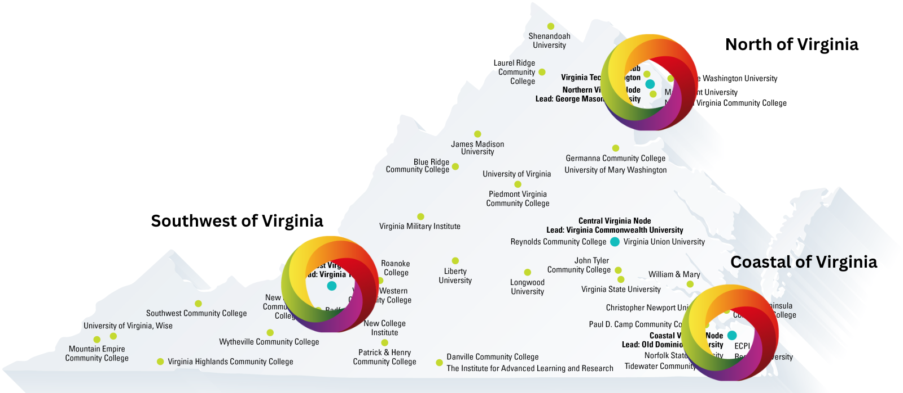

What is OTIC?
===============
The North American OTIC in the Washington DC/Arlington VA Metro is aimed at facilitating the design, development, and deployment of cloud-enhanced and open-software-defined wireless technologies. It provides multiple testbeds to support real-world experimentation, testing, and interoperability on advanced wireless technologies and applications for the next generation. The facility is open to a wide range of users—including universities, industry research labs, and both US and non-US institutions. Commercial entities are also encouraged to use the facility for product development and evaluation with certain provisions. Researchers can run experiments remotely on the testbed by logging in via a remote terminal (VPN and SSH), which provides various facilities for experiment execution, measurements, and data collection across the available testbeds.

OTIC Vision
===========
Serve as a center of excellence for R&D and innovation in O-RAN in the Washington DC metro area. OTIC is designed to support US government use cases, advance workforce development, and accelerate end-to-end O-RAN deployment and testing by providing state-of-the-art testbeds and remote access facilities. It brings together academia, industry, and government to ensure seamless integration and interoperability of open radio access network solutions, fostering practical innovation and progress in next-generation wireless communications.

Key Features of O-RAN OTIC at DC
=================================
Unique features include:

- **Hybrid Lab Infrastructure:** Combines indoor and outdoor testbeds to enable diverse experimental scenarios.
- **Advanced Remote Access:** Provides secure VPN and SSH access for remote experimentation.
- **Edge-Cloud Integration:** Supports real-time data processing and analytics through integrated edge and core cloud computing.

For further details, please refer to the OTIC description on the `O-RAN Alliance website <https://www.o-ran.org/otics/north-american-otic-in-washington-dc-virginia-tech>`_.

Testing and Evaluation Objective
===============================

.. toctree::
   :maxdepth: 1

   testing/conformance
   testing/performance
   testing/security
   testing/interoperability

OTIC Labs
=========

OTIC is composed of the following labs:

CCI xG Testbed
---------------

The CCI xG Testbed deployment is part of the Virginia State Commonwealth Cyber Initiative program for workforce development and O-RAN-based testbed deployment. It
enables users to explore the cutting-edge technology under different range of spectrum (i.e. VT CBRS PAL, FCC Experimental and Commission License) in a real-world environment.

CORNET/CCI SWVA 5G+
------------------
 
CORNET/CCI SWVA 5G+ indoor testbed at VT enables research on applications, enabling technologies, and potential enhancements to 5G and future generations of wireless communication systems, as well as other research related to software defined radio, cognitive radio and spectrum sharing including dynamic spectrum access

Old Dominion University (ODU)
-----------------------------
 
The ODU lab provides a unique environment for real-world testing of O-RAN components, emphasizing interoperability and hands-on experimentation in a controlled setting.

Testing Capabilities at CCI xG Testbed
======================================
The CCI xG Testbed is equipped with a range of testing equipment and software to support comprehensive O-RAN evaluations.

Testing Equipment
-----------------
- **Rohde & Schwarz Spectrum Analyzer**  

.. figure:: _static/spectrum_analyzer.png
   :alt: Spectrum Analyzer
   :align: center
   :width: 250px

*Feature:* High frequency resolution and rapid scanning capability for precise spectrum measurements.

- **Ettus USRP X310**  

.. figure:: _static/usrp_x310.png
   :alt: USRP X310
   :align: center
   :width: 250px

*Feature:* Versatile software-defined radio platform ideal for real-time wireless testing and experimentation.

- **Keysight Signal Generator**  

.. figure:: _static/signal_generator.png
   :alt: Signal Generator
   :align: center
   :width: 250px

  *Feature:* Provides accurate and reliable signal generation for device calibration and performance tests.

Testing Software
----------------
- **GNU Radio**  
  *Feature:* An open-source toolkit for building software-defined radio applications, allowing flexible signal processing development.

- **srsRAN**  
  *Feature:* A comprehensive open-source radio access network suite that supports both LTE and 5G NR, ideal for end-to-end testing scenarios.

- **O-RAN Software Community (OSC) Tools**  
  *Feature:* A collection of tools and frameworks for deploying, testing, and validating O-RAN compliant solutions.

.. note::
   The images and descriptions provided here are representative. For detailed specifications and additional resources, please refer to the CCI xG Testbed documentation and vendor materials.
