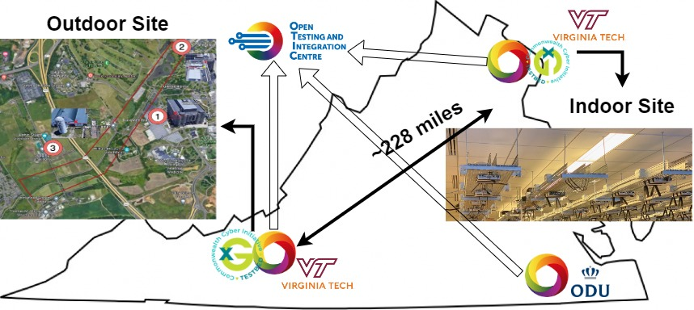

.. _xg-testbed:

Infrastructure  
=============================

Overview
--------

The Commonwealth Cyber Initiative (CCI) xG Testbed is a research and experimentation platform that embraces open-source ideology to enable real-world testing across indoor and outdoor scenarios for next generation (NextG) wireless communications systems. The testbed infrastructure is designed as an open-access virtualized cloud platform that enables scalable access to Software Defined Radios (SDRs) through state-of-the-art cloud computing capabilities.

The infrastructure leverages software-defined networking and network function virtualization to present an easy-to-use interface for managing radio, compute, and vector processing resources on-demand. This approach allows researchers to focus on their experiments rather than the underlying infrastructure complexities.

Key Infrastructure Components
----------------------------

The CCI xG Testbed infrastructure consists of several key components that work together to provide a comprehensive research and testing environment:

1. **Medium-to-Large Scale Geographic Distribution**: The testbed operates across geographically distributed locations, enabling investigations into various O-RAN deployment scenarios, including Open Centralized Unit (O-CU), Open Distributed Unit (O-DU), and Open Radio Unit (O-RU).

2. **Cloud Computing Resources**: The testbed includes numerous CPUs and GPUs that enable real-time signal processing and network function virtualization (NFV).

3. **Software Defined Radios (SDRs)**: A diverse array of SDRs, including Ettus Research models such as X310, X410, and N310, as well as B210 and B205-mini devices, provide the radio frequency (RF) front-end for wireless experimentation.

4. **Remote Management**: Core testbed services run on computing clusters that support remote experiment execution, measurements, and data collection via secure VPN and SSH connections.

5. **Orchestration and Management**: The infrastructure supports orchestration and management functionalities within the Service Management and Orchestration (SMO) layer, including rApp platforms, AI/ML Framework (AIMLFW), slicing capabilities, and policy frameworks.

Testbed Sites
------------

The CCI xG Testbed consists of two primary sites:

   **Figure 1:** Map showing the locations of the CCI xG Testbed sites across Virginia.

1. **Indoor Radio-Grid Testbed (Arlington, VA)**: 
   
   The indoor radio-grid testbed is housed at the Virginia Tech Research Center in North Virginia (Washington DC area). It features a novel two-dimensional grid configuration with a 9x8 array of programmable advanced SDR nodes. This controlled laboratory environment supports real-world experimentation, performance evaluations, and interoperability testing.

   *For more detailed information about the Indoor Radio-Grid Testbed, please refer to the* :doc:`../sites/indoor` *page.*

2. **Outdoor Experimentation and Testing Environment (Stroubles Creek Site, Blacksburg, VA)**:
   
   The Stroubles Creek outdoor testbed is designed to provide a more realistic and uncontrollable environment for assessing the behavior, performance, and resilience of wireless systems. It includes a Citizens Broadband Radio Service (CBRS) private network using Virginia Tech's Priority Access License (PAL) and covers a 1.5-mile corridor with three rooftop locations for CBSD nodes.

   *For more detailed information about the Outdoor Experimentation and Testing Environment, please refer to the* :doc:`../sites/outdoor` *page.*

Open Testing and Integration Centre (OTIC)
-----------------------------------------

In 2023, the CCI xG Testbed was designated by the O-RAN Alliance as an Open Testing and Integration Centre (OTIC) in the Washington DC metro area. The OTIC is composed of three laboratories located in Virginia:

1. **xG Testbed (Arlington, VA)**
2. **Old Dominion University (ODU) (Coastal Virginia)**
3. **Virginia Tech (VT) (Southwest Virginia)**

These labs complement each other to realize the OTIC services, with the xG Testbed orchestrating and coordinating the OTIC activities across the other two labs.

The OTIC focuses on performance, conformance, interoperability, and security testing. It is enriched with an end-to-end testing workflow composed of core testing components from Keysight and Rohde & Schwarz, resulting in an integrated solution for testing according to O-RAN Alliance specified processes and procedures.

Unique Characteristics
---------------------

The CCI xG Testbed infrastructure offers several unique characteristics compared to existing testbeds:

- It is the first platform to enable end-to-end O-RAN experimentation using SDRs and open-source components, including AIMLFW, Non-RT RIC, Near-RT RIC, RAN (4G and 5G), and UE.

- It is the only platform worldwide to provide an end-to-end CBRS ecosystem that offers experimentation capability due to the availability of SDR-based CBSDs and ESC nodes, an open-source SAS (OpenSAS), and CBRS PAL as well as FCC experimental licenses.

- It has a radio-grid deployment with over 70 latest-generation USRPs, enabling end-to-end advanced wireless experimentation with 5G and O-RAN, and capable of operating in different frequency ranges (in FR1, FR2, and FR3).

- It provides a combination of commercial and open-source components that are remotely accessible, and embraces network virtualization by enabling Virtual Machines (VMs) and containers to be dynamically connected to the SDRs.
