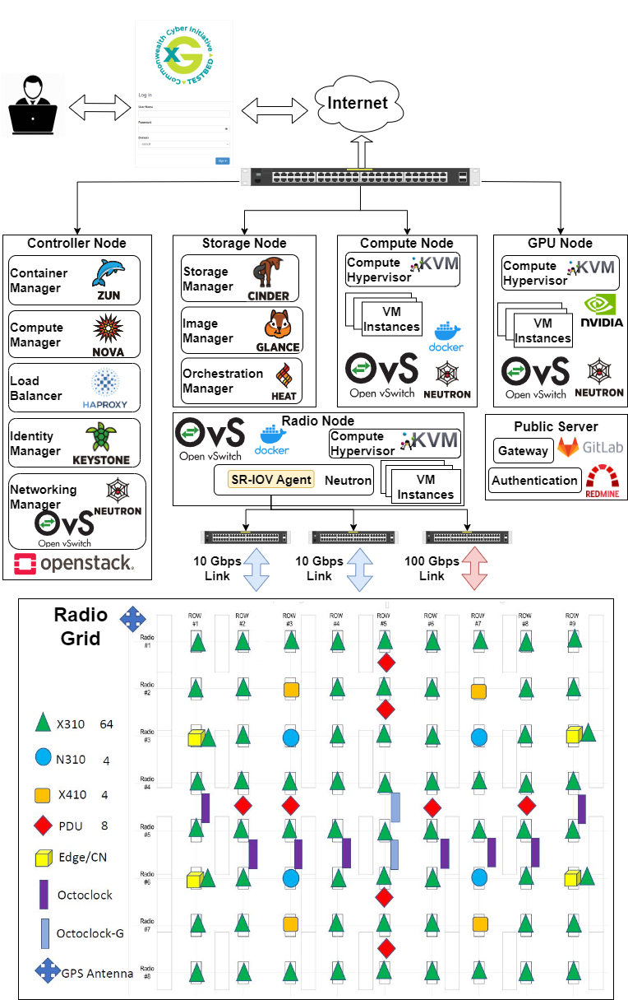

.. _xg-testbed:

Software Architecture  
====================================

Overview
--------

The CCI xG Testbed software architecture is designed with a focus on openness, flexibility, and virtualization. It embraces the open-source ideology to enable real-world testing across indoor and outdoor scenarios for next generation (NextG) wireless communications systems. The software stack is built to support the four pillars of O-RAN technology: intelligence, openness, virtualization, and disaggregation.

The testbed provides an open, programmable, interoperable, and virtualized RAN architecture that empowers network operators to seamlessly integrate hardware and software components from different vendors, resulting in heightened flexibility, scalability, and cost-efficiency.

Virtualization-First Approach
----------------------------

The CCI xG Testbed adopts a virtualization-first approach to enable more flexible experimentation and more efficient resource management while meeting the latency constraints demanded by baseband processing for waveform generation. This approach allows CPU cores, RAM, and storage to be allocated on demand, sharing server resources with other experiments, projects, or use cases.

Key software components of this virtualization approach include:

1. **OpenStack-based Cloud Environment**: The testbed leverages OpenStack as the foundation for resource orchestration and management. Through this framework, it provides a robust and scalable platform for creating, deploying, and managing cloud resources, including general-purpose computing, SDR access, and GPU computing.

2. **Virtual Machine and Container Management**: The testbed allows both VM and container management, deploying Kubernetes clusters over bare-metal machines. This flexibility enables researchers to choose the virtualization approach that best suits their experimental needs.

3. **Remote Access Portal**: An OpenStack-based portal allows users to log on remotely through the Horizon dashboard, run experiments, and collect data in the testbed's virtual environment. Users can access testbed resources via SSH sessions, deploy their own software, or use instantiated software provided by the testbed.

Software Architecture Layers
---------------------------

The testbed infrastructure can be visualized as a pyramid with three distinct layers:

   **Figure 1:** CCI xG Testbed software architecture showing the layered approach with OpenStack as the foundation.

1. **Core Infrastructure Layer**: At the base of the pyramid is the core infrastructure, including bare-metal hardware, GPU clusters, SDR grid, antennas, switches, RF and optical fiber cables, etc. This layer provides the physical foundation for the testbed.

2. **OpenStack-based Orchestration and Management Layer**: The second layer of the pyramid is the OpenStack-based orchestration and management system, where users can utilize resources for experimentation. Users can implement their own 5G/O-RAN building blocks through various flavors available for RAN, Core Network (CN), Near-RT RIC, and Non-RT RIC that are tested and available on the platform.

3. **O-RAN Testing and Experimentation Layer**: The third layer, forming the apex of the pyramid, is dedicated to O-RAN testing and experimentation, specifically curated for OTIC testing. This layer also supports research that can leverage an end-to-end system based on building blocks available through OpenStack. These components are tested and verified to run batches of experiments that enable validation of interoperability and testing of xApp and rApp software binaries.

O-RAN Software Components
------------------------

The CCI xG Testbed supports a comprehensive suite of O-RAN software components, enabling end-to-end O-RAN experimentation:

1. **Service Management and Orchestration (SMO)**: The testbed includes SMO layer functionalities, allowing for the extension of rApp platforms, AI/ML Framework (AIMLFW), slicing capabilities, and policy frameworks to cater to evolving needs and requirements.

2. **Non-RT RIC**: The Non-RT RIC (Radio Intelligent Controller) provides policy-based guidance, model training for the Near-RT RIC, and enrichment information to support intelligent radio resource management.

3. **Near-RT RIC**: The Near-RT RIC enables near-real-time control and optimization of RAN elements and resources via fine-grained data collection, control, and policy enforcement.

4. **O-CU, O-DU, and O-RU**: The testbed supports the disaggregated RAN components, including Open Centralized Unit (O-CU), Open Distributed Unit (O-DU), and Open Radio Unit (O-RU), positioned respectively at regional servers, edge servers, and cell sites.

5. **AI/ML Framework**: The testbed supports a highly distributed and native AI/ML framework that encompasses cross-domain and federated AI modules, with a focus on enhancing RIC, SMO, and O-Cloud functionalities.

Open-Source Software Support
---------------------------

The CCI xG Testbed embraces open-source software to enable flexible and customizable experimentation:

1. **Open-Source 4G and 5G Stacks**: The testbed supports open-source cellular stacks such as srsRAN and OpenAirInterface (OAI) for both 4G and 5G experimentation.

2. **OpenSAS**: An open-source Spectrum Access System (SAS) developed in-house for CBRS experimentation, which includes Environmental Sensing Capability (ESC), incumbent detection, and SAS-to-SAS communication.

3. **Open5GS**: An open-source implementation of the 5G core network functions, enabling end-to-end 5G experimentation.

4. **O-RAN Software Community (OSC)**: The testbed leverages software components from the O-RAN Software Community, including the Near-RT RIC, Non-RT RIC, and AI/ML framework.

For more detailed information about specific software components and experimental capabilities, please refer to the relevant sections in the documentation.
