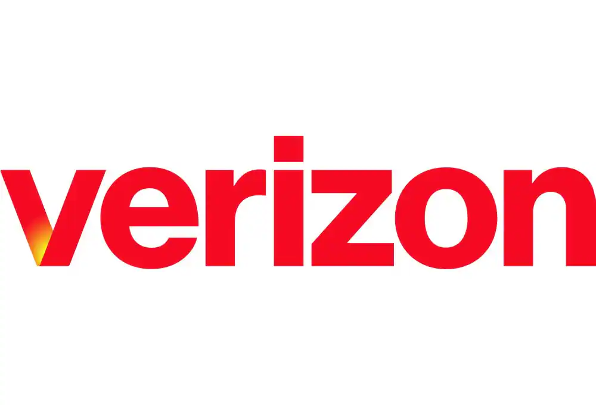
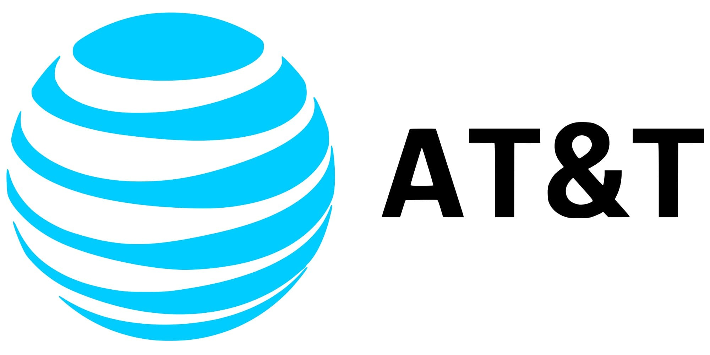
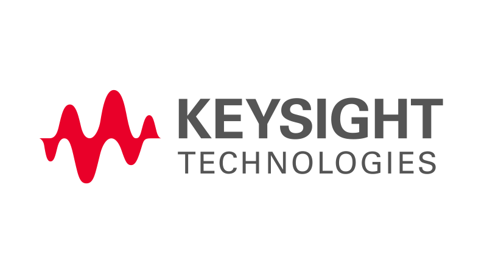
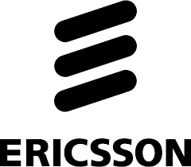
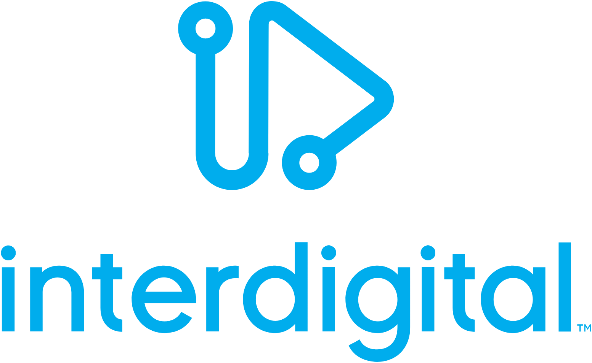

Partnerships
============

This page highlights key partnerships and collaborators of the CCI xG Testbed.

Strategic Partners
------------------

The CCI xG Testbed collaborates with industry leaders to advance research and development in next-generation wireless technologies.

.. raw:: html

   

.. raw:: html

   

.. figure:: _static/Samsung_Logo.jpg
   :alt: Samsung Logo
   :align: left
   :width: 200px

.. raw:: html

   

.. raw:: html

   

.. raw:: html

   

.. raw:: html

   

Our partnerships enable:

- Access to cutting-edge equipment and technologies
- Collaborative research and development opportunities
- Industry-standard testing and validation capabilities
- Knowledge sharing and technical expertise exchange
- Accelerated innovation in wireless communications