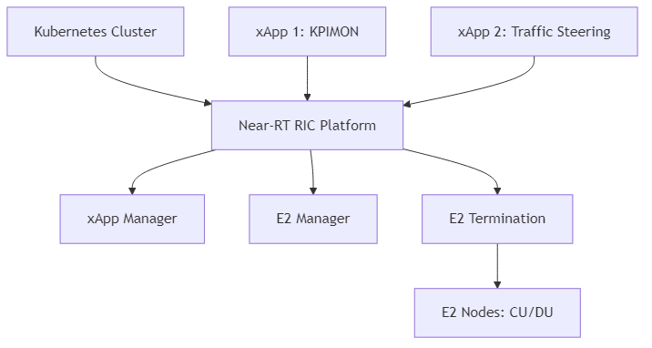

.. This file's sidebar/navigation title is set by the toctree entry in index.rst:
..   Time-Based Conflict Mitigation in Near-RT RIC <sample_experiments/near-rt>
.. The main heading below matches the sidebar title for consistency.

.. _near_rt_ric_experiment:

Time-Based Conflict Mitigation in Near-RT RIC
===============================================

Overview
--------
This tutorial details the experimental setup and procedures for deploying and testing an O-RAN Near-Real-Time RAN Intelligent Controller (Near-RT RIC) with xApps. It covers the complete process from environment setup to xApp deployment and testing.

.. note::
   The diagram above shows the experimental setup for the Near-RT RIC, including the Kubernetes cluster, Near-RT RIC platform components (xApp Manager, E2 Manager, E2 Termination), xApps (KPIMON, Traffic Steering), and E2 Nodes (CU/DU).

**Note:** Before deploying the experiment, ensure you have proper access to the testbed (e.g., SSH access to the gateway node and virtual machines).

Objective
---------
- **Deploy Near-RT RIC:** Set up a Near-RT RIC platform in a Kubernetes environment.
- **Develop and Deploy xApps:** Create and deploy example xApps on the Near-RT RIC platform.
- **Connect to E2 Nodes:** Establish connections between the Near-RT RIC and E2 Nodes (CU/DU).
- **Test and Validate:** Verify the functionality of the Near-RT RIC and xApps.
- **Understand O-RAN Architecture:** Gain practical knowledge of O-RAN components and their interactions.

Resources
---------
- **Hardware:**
   - Server with sufficient resources (minimum 8 CPU cores, 16GB RAM, 100GB storage)
   - Network connectivity to E2 Nodes (CU/DU)
  
- **Software:**
   - Ubuntu 22.04 LTS
   - Kubernetes (K8s) or Minikube
   - Docker
   - Helm
   - O-RAN Software Community (OSC) Near-RT RIC components
   - Example xApps (e.g., KPIMON)

Prerequisites
------------
Before starting the experiment, ensure the following prerequisites are met:

1. **Kubernetes Cluster:**
   - A running Kubernetes cluster (or Minikube for local testing)
   - kubectl configured to access the cluster

2. **Docker:**
   - Docker installed and configured
   - Access to Docker Hub or a private Docker registry

3. **Helm:**
   - Helm 3 installed

4. **Network Configuration:**
   - Network connectivity between the Kubernetes cluster and E2 Nodes
   - Required ports open in firewalls

Experimental Procedure
----------------------

Setting Up the Environment
~~~~~~~~~~~~~~~~~~~~~~~~~

1. **Install Required Tools:**
   
   .. code-block:: bash
   
      # Update package list
      sudo apt update
      
      # Install Docker
      sudo apt install -y docker.io
      sudo systemctl enable docker
      sudo systemctl start docker
      sudo usermod -aG docker $USER
      
      # Install kubectl
      curl -LO "https://dl.k8s.io/release/$(curl -L -s https://dl.k8s.io/release/stable.txt)/bin/linux/amd64/kubectl"
      chmod +x kubectl
      sudo mv kubectl /usr/local/bin/
      
      # Install Minikube (for local testing)
      curl -LO https://storage.googleapis.com/minikube/releases/latest/minikube-linux-amd64
      chmod +x minikube-linux-amd64
      sudo mv minikube-linux-amd64 /usr/local/bin/minikube
      sudo install minikube-linux-amd64 /usr/local/bin/minikube
      # Install Helm
      curl https://raw.githubusercontent.com/helm/helm/main/scripts/get-helm-3 | bash

2. **Start Minikube (for local testing):**
   
   .. code-block:: bash
   
      minikube start --cpus=4 --memory=8192 --disk-size=50g

3. **Clone the O-RAN SC Near-RT RIC Repository:**
   
   .. code-block:: bash
   
      git clone https://gerrit.o-ran-sc.org/r/ric-plt/ric-dep
      cd ric-dep/bin

Deploying the Near-RT RIC Platform
~~~~~~~~~~~~~~~~~~~~~~~~~~~~~~~~~

1. **Deploy the Near-RT RIC Platform using Helm:**
   
   .. code-block:: bash
   
      # Deploy the Near-RT RIC platform
      ./deploy-ric-platform -f ../helm/ric-common/config/config-values.yaml

2. **Verify the Deployment:**
   
   .. code-block:: bash
   
      kubectl get pods -n ricplt
      
   Expected output:
   
   .. code-block:: text
   
      NAME                                        READY   STATUS    RESTARTS   AGE
      deployment-ricplt-a1mediator-5b8b7f9c7b-7vxrw   1/1     Running   0          2m
      deployment-ricplt-appmgr-6c774c5bc4-m5lzs       1/1     Running   0          2m
      deployment-ricplt-dbaas-7c44fb4697-xh7xs        1/1     Running   0          2m
      deployment-ricplt-e2mgr-7976f5f5d4-nhkl7        1/1     Running   0          2m
      deployment-ricplt-e2term-alpha-7c4b5446bf-8g5xz 1/1     Running   0          2m
      deployment-ricplt-rtmgr-665f74d94-kfzxp         1/1     Running   0          2m
      deployment-ricplt-submgr-6bbfc8cf8f-t4h2t       1/1     Running   0          2m
      deployment-ricplt-vespamgr-864f96c6cb-nl9w8     1/1     Running   0          2m

Developing and Deploying xApps
~~~~~~~~~~~~~~~~~~~~~~~~~~~~~

1. **Clone the xApp SDK Repository:**
   
   .. code-block:: bash
   
      git clone https://gerrit.o-ran-sc.org/r/ric-app/ric-app-kpimon
      cd ric-app-kpimon

2. **Build the xApp Docker Image:**
   
   .. code-block:: bash
   
      docker build -t kpimon-xapp:latest .

3. **Push the Docker Image to a Registry:**
   
   .. code-block:: bash
   
      # For Docker Hub
      docker tag kpimon-xapp:latest <your-dockerhub-username>/kpimon-xapp:latest
      docker push <your-dockerhub-username>/kpimon-xapp:latest
      
      # For a private registry
      docker tag kpimon-xapp:latest <private-registry-url>/kpimon-xapp:latest
      docker push <private-registry-url>/kpimon-xapp:latest

4. **Create a Config File for the xApp:**
   
   .. code-block:: bash
   
      cat > config.json << EOF
      {
        "name": "kpimon",
        "version": "1.0.0",
        "containers": [
          {
            "name": "kpimon",
            "image": {
              "registry": "<your-registry>",
              "name": "kpimon-xapp",
              "tag": "latest"
            }
          }
        ],
        "messaging": {
          "ports": [
            {
              "name": "rmr-data",
              "container": "kpimon",
              "port": 4560,
              "rxMessages": ["RIC_SUB_RESP", "RIC_INDICATION"],
              "txMessages": ["RIC_SUB_REQ"],
              "policies": [],
              "description": "RMR port for data"
            },
            {
              "name": "rmr-route",
              "container": "kpimon",
              "port": 4561,
              "description": "RMR port for route"
            }
          ]
        },
        "rmr": {
          "protPort": "tcp:4560",
          "maxSize": 2072,
          "numWorkers": 1,
          "txMessages": ["RIC_SUB_REQ"],
          "rxMessages": ["RIC_SUB_RESP", "RIC_INDICATION"]
        }
      }
      EOF

5. **Deploy the xApp using the App Manager API:**
   
   .. code-block:: bash
   
      # Get the App Manager service IP and port
      APPMGR_IP=$(kubectl get svc -n ricplt service-ricplt-appmgr-http -o jsonpath='{.spec.clusterIP}')
      APPMGR_PORT=$(kubectl get svc -n ricplt service-ricplt-appmgr-http -o jsonpath='{.spec.ports[0].port}')
      
      # Deploy the xApp
      curl -X POST "http://$APPMGR_IP:$APPMGR_PORT/ric/v1/xapps" -H "Content-Type: application/json" -d @config.json

6. **Verify the xApp Deployment:**
   
   .. code-block:: bash
   
      kubectl get pods -n ricxapp
      
   Expected output:
   
   .. code-block:: text
   
      NAME                      READY   STATUS    RESTARTS   AGE
      ricxapp-kpimon-7f7b9b6f8c-2xvqz   1/1     Running   0          1m

Connecting to E2 Nodes
~~~~~~~~~~~~~~~~~~~~~

1. **Configure E2 Node Connectivity:**
   
   The E2 Nodes (CU/DU) need to be configured to connect to the Near-RT RIC. This typically involves:
   
   - Setting the E2 Termination (E2T) IP address and port in the E2 Node configuration
   - Configuring the SCTP connection parameters
   - Setting up the E2AP protocol parameters

2. **Verify E2 Node Connection:**
   
   .. code-block:: bash
   
      # Check E2 Manager logs
      kubectl logs -n ricplt deployment-ricplt-e2mgr-7976f5f5d4-nhkl7
      
   Look for messages indicating successful connection from E2 Nodes.

Testing and Validation
~~~~~~~~~~~~~~~~~~~~~

1. **Verify xApp Subscription to E2 Nodes:**
   
   .. code-block:: bash
   
      # Check xApp logs
      kubectl logs -n ricxapp ricxapp-kpimon-7f7b9b6f8c-2xvqz
      
   Look for messages indicating successful subscription to E2 Nodes.

2. **Monitor xApp Operation:**
   
   .. code-block:: bash
   
      # Continue monitoring xApp logs
      kubectl logs -n ricxapp ricxapp-kpimon-7f7b9b6f8c-2xvqz -f
      
   Look for messages indicating reception of E2 indications and processing of data.

3. **Access xApp API (if available):**
   
   .. code-block:: bash
   
      # Get the xApp service IP and port
      XAPP_IP=$(kubectl get svc -n ricxapp service-ricxapp-kpimon-http -o jsonpath='{.spec.clusterIP}')
      XAPP_PORT=$(kubectl get svc -n ricxapp service-ricxapp-kpimon-http -o jsonpath='{.spec.ports[0].port}')
      
      # Access the xApp API
      curl -X GET "http://$XAPP_IP:$XAPP_PORT/ric/v1/kpimon/metrics"

Advanced Experiments
-------------------

1. **Developing a Custom xApp:**
   
   You can develop your own xApp to implement custom control logic. The basic steps are:
   
   - Create a new xApp project using the xApp SDK
   - Implement the required functionality
   - Build and deploy the xApp as described above

2. **Testing Multiple xApps:**
   
   You can deploy multiple xApps and test their interaction. For example:
   
   - Deploy a KPIMON xApp to collect metrics
   - Deploy a Traffic Steering xApp to optimize traffic based on the metrics
   - Observe how the xApps interact and affect the RAN performance

3. **Integration with Non-RT RIC:**
   
   You can integrate the Near-RT RIC with a Non-RT RIC to test policy-based control:
   
   - Deploy a Non-RT RIC (e.g., using the OSC implementation)
   - Configure the A1 interface between the Non-RT RIC and Near-RT RIC
   - Define and deploy policies from the Non-RT RIC to the Near-RT RIC
   - Observe how the policies affect the behavior of xApps

Troubleshooting
--------------

1. **xApp Deployment Issues:**
   
   - Check the App Manager logs: `kubectl logs -n ricplt deployment-ricplt-appmgr-6c774c5bc4-m5lzs`
   - Verify the xApp config file format
   - Check if the Docker image is accessible

2. **E2 Connection Issues:**
   
   - Check the E2 Manager logs: `kubectl logs -n ricplt deployment-ricplt-e2mgr-7976f5f5d4-nhkl7`
   - Verify network connectivity between the Near-RT RIC and E2 Nodes
   - Check firewall settings

3. **xApp Runtime Issues:**
   
   - Check the xApp logs: `kubectl logs -n ricxapp ricxapp-kpimon-7f7b9b6f8c-2xvqz`
   - Verify that the xApp is subscribed to the correct E2 service model
   - Check if the E2 Nodes are sending the expected indications

Conclusion
---------
This experiment demonstrates how to:
   - Deploy a Near-RT RIC platform in a Kubernetes environment
   - Develop and deploy xApps on the Near-RT RIC platform
   - Connect the Near-RT RIC to E2 Nodes
   - Test and validate the functionality of the Near-RT RIC and xApps

The Near-RT RIC is a key component of the O-RAN architecture, enabling programmability and intelligence in the RAN. By deploying and experimenting with the Near-RT RIC and xApps, you can gain practical knowledge of O-RAN components and their interactions, and explore the potential of open, intelligent, and programmable RAN.

For architectural details and integration, see the :ref:`Near-RT RIC Architecture <near_rt_ric_architecture>` in the Software Architecture section.

References
----------
   - O-RAN Software Community (OSC): https://o-ran-sc.org/
   - O-RAN SC Near-RT RIC: https://docs.o-ran-sc.org/projects/o-ran-sc-ric-plt-ric-dep/en/latest/
   - O-RAN SC xApp SDK: https://docs.o-ran-sc.org/projects/o-ran-sc-ric-plt-xapp-frame/en/latest/
   - O-RAN Alliance Specifications: https://www.o-ran.org/specifications
