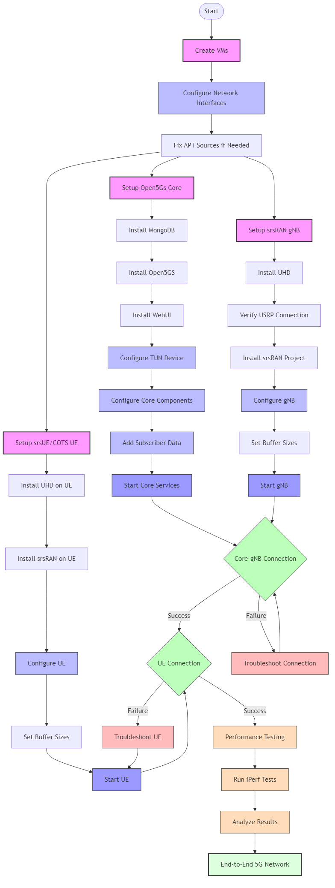

End-to-end 5G with srsRAN
=======================================

Overview
--------
This tutorial details the experimental setup and procedures for establishing a 5G network using Open5Gs Core, srsRAN gNB, and User Equipment (UE). It covers the complete process from VM creation to network verification, including connecting a commercial off-the-shelf (COTS) UE to the network.

**Note:** Before deploying the experiment, ensure you have proper access to the testbed (e.g., SSH access to the gateway node and virtual machines).

.. .. image:: placeholders/simplified_5g_flow.png
   :alt: Simplified 5G Setup Flow
   :align: center

Objective
---------
- **Set Up a 5G SA Network:** Deploy and configure a 5G Standalone network using Open5Gs Core, srsRAN gNB, and Ettus X310 USRPs.
- **Integrate a COTS UE:** Connect a mobile phone or dedicated 5G device to the experimental network.
- **Performance Verification:** Validate network operation via performance tests and monitor outputs for troubleshooting.
- **Understand 5G Architecture:** Gain practical knowledge of 5G network components and their interactions.

Resources
---------
- **Hardware:**
   - Personal Computer (Host machine)
   - Two Ettus X310 USRPs
   - Laptop running Ubuntu (for COTS UE experiment)
   - USB Hub
   - Sysmocom USIM
   - 5G-compatible smartphone or dedicated 5G device
   - Omnikey SIM Reader
  
- **Software:**
   - Ubuntu 20.04 OS (on host and VMs)
   - Open5Gs Core Software Suite
   - srsRAN Software Suite
   - UHD (USRP Hardware Driver, version 3.15.00)
   - MongoDB (for Open5Gs Core)
   - Node.js (for Open5Gs WebUI)
   - iperf (for network performance testing)
   - pcsc-tools and pcscd (for SIM detection)

Testbed Access Requirement
---------------------------
**Important:** Before deploying any experiment, ensure:

- SSH connectivity to the gateway node.
- Verified access to all required VMs (Core, gNB, UE).
- Confirmation that the USRPs are visible (e.g., via ``uhd_find_devices``).
- Proper network configuration between VMs.
- Sufficient permissions to install and configure software.

.. .. image:: placeholders/testbed_access.png
   :alt: Testbed access diagram
   :align: center

Components Overview
------------------

5G Core Network Components (Open5Gs)
~~~~~~~~~~~~~~~~~~~~~~~~~~~~~~~~~~~~
The 5G Standalone (SA) Core consists of several key components:

1. **NRF (NF Repository Function)**: Acts as a directory of all available core functions, like a library catalog. It's responsible for maintaining a directory of all available core functions. Other core components register with NRF, seeking its assistance to discover their peers.

2. **SCP (Service Communication Proxy)**: Mediates communication between different core functions. Think of it as a skilled translator that ensures different core functions can understand and interact with each other seamlessly.

3. **AMF (Access and Mobility Management Function)**: Manages connections and mobility, like an air traffic controller. It's the air traffic controller of the 5G network, coordinating how devices connect and move within the network. When gNBs (5G basestations) need to establish connections, they reach out to the AMF.

4. **UDM (Unified Data Management)**: Stores subscriber profiles and authentication vectors. Much like a personal identity vault, it securely houses subscriber information, ensuring secure and authorized access to the network.

5. **AUSF (Authentication Server Function)**: Generates authentication credentials. It collaborates closely with UDM, generating authentication credentials. It's akin to the guardian at the gateway, ensuring that only authorized users gain entry to the network.

6. **UDR (Unified Data Repository)**: Provides a comprehensive data repository. Think of it as the library archives where historical data, usage patterns, and network statistics are stored for analysis and decision-making.

7. **PCF (Policy and Charging Function)**: Enforces policies and charging rules. It acts as the traffic cop of the 5G SA Core, enforcing policies and charging rules. It manages the allocation of network resources, ensuring fair usage and efficient resource utilization while also handling charging for services.

8. **NSSF (Network Slice Selection Function)**: Selects appropriate network slices for different applications. It's the strategist in our journey, responsible for selecting the appropriate "slice" of the network for different applications and services. It ensures that the network is tailored to meet specific requirements, such as low latency for critical applications or high bandwidth for multimedia streaming.

9. **BSF (Binding Support Function)**: Enables indirect communication between core functions. It's like the postal service, ensuring that messages reach their intended recipients even if they don't have direct connections.

10. **SMF (Session Management Function)**: Orchestrates and manages sessions. It takes on the role of orchestrating and managing sessions within the 5G network. It's the conductor of the symphony, ensuring that data flows smoothly between devices and services. In the past, this responsibility belonged to the 4G MME (Mobility Management Entity) and its counterparts in the control plane.

11. **UPF (User Plane Function)**: Carries user data packets between gNB and external WAN. The UPF represents the highway of data transmission in the 5G SA Core. It carries user data packets between the gNB and the external Wide Area Network (WAN). As the sole user plane component, UPF is responsible for efficiently routing data to its destination.

Radio Access Network (RAN) Components
~~~~~~~~~~~~~~~~~~~~~~~~~~~~~~~~~~~~
1. **gNB (gNodeB)**: The 5G base station that connects UEs to the core network.
2. **UE (User Equipment)**: End-user devices like smartphones or specialized 5G devices.

Hardware Components
~~~~~~~~~~~~~~~~~
1. **USRP (Universal Software Radio Peripheral)**: Software-defined radio devices used for implementing the radio access network.
2. **Virtual Machines (VMs)**: Used to host the different components of the 5G network.

Communication Flow in 5G Network
-------------------------------

1. **Initialization**: When a 5G device connects to the network, it communicates with the gNB, which establishes a connection with the AMF.

2. **Authentication and Authorization**: The AMF checks with AUSF and UDM for subscriber credentials. Once authenticated and authorized, the device gains access.

3. **Session Management**: SMF takes charge of session management. It sets up data paths, allocates resources, and ensures data flows seamlessly.

4. **Policy Enforcement**: PCF enforces policies, ensuring data usage aligns with subscriber plans and network policies. It also handles charging for services used.

5. **Data Transmission**: The UPF carries user data packets between the gNB and the external WAN, efficiently routing data with low latency and high throughput.

6. **Network Slicing**: NSSF selects the appropriate network slice to optimize performance based on application requirements.

7. **Indirect Communication**: For functions that need to communicate indirectly, BSF facilitates this interaction.

Throughout this process, the SCP acts as a communication bridge, ensuring messages are correctly translated and transmitted between core functions.

Setup Process Flow
-----------------

.. .. note::
..    Detailed flow diagrams for the 5G setup process are available in HTML format with the following files:
   
..    - ``5g_diagrams_index.html`` - Index page with links to both diagrams
..    - ``simplified_5g_flow.html`` - High-level overview of the setup process
..    - ``detailed_5g_flow.html`` - Comprehensive diagram with all steps and troubleshooting paths
   
..    The raw Mermaid files are also available:
   
..    - ``simplified_5g_flow.mmd`` - Source for the simplified diagram
..    - ``detailed_5g_flow.mmd`` - Source for the detailed diagram
   
..    These diagrams can be viewed in a web browser and saved as images.

Below is a simplified overview of the setup process:

1. Create VMs for Core, gNB, and UE
2. Set up Open5Gs Core (install MongoDB, Open5GS, WebUI)
3. Set up srsRAN gNB (install UHD, verify USRP, install srsRAN)
4. Set up srsUE (similar to gNB setup)
5. Configure all components with proper IP addresses and parameters
6. Start Core services and gNB, verify connection
7. Start UE and verify connection to the network
8. Troubleshoot as needed if connections fail

Experimental Procedure
----------------------

VM Creation and Initial Setup
~~~~~~~~~~~~~~~~~~~~~~~~~~~~~

1. **Create VMs for Core, gNB, and UE**:
   
   * For Open5Gs Core: Create a VM with Ubuntu 20.04 desktop (recommended specs: 4 CPUs, 4GB RAM, 12GB disk)
   * For gNB and UE: Create VMs using OpenStack CLI or GUI
   
   .. code-block:: bash
   
      # Example command for creating a gNB VM using OpenStack CLI
      openstack --insecure server create --flavor 4cpu-6ram-16disk --image Ubuntu-20.04-ServerImage --nic port-id=`openstack --insecure port list | grep USRP-120 | awk '{print $2}'` --nic net-id=ff409397-4e45-4af9-afbe-00a979369aea --user-data cloud-config.yml --availability-zone radio USRP-120-gNB

   * For the Core VM, go to OpenStack GUI and launch an instance. Name it whatever you want and have it set to the compute availability zone. The rest of the settings will be the same as the one set for the gNB and UE.

2. **Network Configuration**:
   
   * Configure network interfaces to ensure connectivity between VMs
   * Set up proper IP addressing for communication between components
   * For UE VM, configure netplan:

     .. code-block:: bash
     
        # On the UE VM, edit the netplan configuration
        sudo vi /etc/netplan/50-cloud-init.yaml
        
     Configure the network interfaces to have a connection to the USRP. Example configuration:
     
     .. .. image:: placeholders/ue.png
      :alt: Testbed access diagram
      :align: center
        
     After editing, apply the configuration:
     
     .. code-block:: bash
     
        sudo netplan apply

   * Perform the same procedure in the gNB machine with the netplan file so that the VM has a USRP connection.
   * Verify connectivity by pinging the USRP.

Open5Gs Core Setup
~~~~~~~~~~~~~~~~~

1. **Install MongoDB**:

   .. code-block:: bash
   
      # If you have issues with apt update, run this command to fix sources.list
      sudo sed -i -e 's|disco|focal|g' /etc/apt/sources.list
      
      sudo apt update
      sudo apt install gnupg
      curl -fsSL https://pgp.mongodb.com/server-6.0.asc | sudo gpg -o /usr/share/keyrings/mongodb-server-6.0.gpg --dearmor
      echo "deb [ arch=amd64,arm64 signed-by=/usr/share/keyrings/mongodb-server-6.0.gpg] https://repo.mongodb.org/apt/ubuntu focal/mongodb-org/6.0 multiverse" | sudo tee /etc/apt/sources.list.d/mongodb-org-6.0.list
      sudo apt update
      sudo apt install -y mongodb-org
      sudo systemctl start mongod
      sudo systemctl enable mongod

2. **Install Open5GS**:

   .. code-block:: bash
   
      sudo apt install python3-pip python3-setuptools python3-wheel ninja-build build-essential flex bison git cmake libsctp-dev libgnutls28-dev libgcrypt-dev libssl-dev libidn11-dev libmongoc-dev libbson-dev libyaml-dev libnghttp2-dev libmicrohttpd-dev libcurl4-gnutls-dev libnghttp2-dev libtins-dev libtalloc-dev meson libtool libdw-dev binutils-dev libdwarf-dev doxygen libmbedtls-dev libfftw3-dev libgtest-dev libyaml-cpp-dev libsctp-dev libboost-program-options-dev libconfig++-dev ca-certificates curl
      
      git clone https://github.com/open5gs/open5gs
      cd open5gs
      meson build --prefix=`pwd`/install
      ninja -C build
      ./build/tests/registration/registration

3. **Install Open5GS WebUI**:

   .. code-block:: bash
   
      sudo apt update
      sudo apt install -y ca-certificates curl gnupg
      sudo mkdir -p /etc/apt/keyrings
      curl -fsSL https://deb.nodesource.com/gpgkey/nodesource-repo.gpg.key | sudo gpg --dearmor -o /etc/apt/keyrings/nodesource.gpg
      NODE_MAJOR=20
      echo "deb [signed-by=/etc/apt/keyrings/nodesource.gpg] https://deb.nodesource.com/node_20.x nodistro main" | sudo tee /etc/apt/sources.list.d/nodesource.list
      sudo apt update
      sudo apt install nodejs -y
      curl -fsSL https://open5gs.org/open5gs/assets/webui/install | sudo -E bash -

4. **Set Up TUN Device and Network Configuration**:

   .. code-block:: bash
   
      # Set up TUN device
      sudo ip tuntap add name ogstun mode tun
      sudo ip addr add 10.45.0.1/16 dev ogstun
      sudo ip addr add 2001:db8:cafe::1/48 dev ogstun
      sudo ip link set ogstun up
      
      # Set CPU performance and network parameters
      echo performance | sudo tee /sys/devices/system/cpu/cpu*/cpufreq/scaling_governor >/dev/null
      sudo sysctl -w net.core.wmem_max=33554432
      sudo sysctl -w net.core.rmem_max=33554432
      sudo sysctl -w net.core.wmem_default=33554432
      sudo sysctl -w net.core.rmem_default=33554432
      
      # Set up IP forwarding and NAT
      sudo sysctl -w net.ipv4.ip_forward=1
      sudo sysctl -w net.ipv6.conf.all.forwarding=1
      sudo iptables -t nat -A POSTROUTING -s 10.45.0.0/16 ! -o ogstun -j MASQUERADE
      sudo ip6tables -t nat -A POSTROUTING -s 2001:db8:cafe::/48 ! -o ogstun -j MASQUERADE
      sudo iptables -I INPUT -i ogstun -j ACCEPT

   .. note::
      You need to perform this network configuration procedure any time your Core VM restarts.

5. **Configure Open5GS**:
   
   * Edit the sample.yaml file in the `/open5gs/build/configs/` directory
   * Update the ngap server IP address to match your Core VM's IP address
   * The WebUI makes editing subscriber data very easy

6. **Register Subscriber Information**:

   * Connect to the WebUI by opening your web browser and navigating to http://localhost:3000
   * Log in with the default admin account credentials:
     * Username: admin
     * Password: 1423
   * To add subscriber information:
     * Go to the Subscriber Menu
     * Click the "+" button to add a new subscriber
     * Fill in the required information, including IMSI, security context (K, OPc, AMF), and APN for the subscriber
     * Click the "SAVE" button to save the subscriber details

7. **Start the Core Services**:

   .. code-block:: bash
   
      # Go to the app directory
      cd /open5gs/build/tests/app
      
      # Run the 5G core
      sudo ./5gc

srsRAN gNB Setup
~~~~~~~~~~~~~~~

1. **Install UHD (USRP Hardware Driver)**:

   .. code-block:: bash
   
      # If you have issues with apt update, run this command to fix sources.list
      sudo sed -i -e 's|disco|focal|g' /etc/apt/sources.list
      
      sudo apt update && sudo apt upgrade -y
      sudo apt install -y cmake git libboost-all-dev libusb-1.0-0-dev libudev-dev libncurses5-dev libuhd-dev uhd-host
      git clone https://github.com/EttusResearch/uhd.git
      cd uhd
      git checkout v3.15.0.0
      cd host
      mkdir build
      cd build
      cmake ..
      make
      sudo make install
      sudo ldconfig

2. **Verify USRP Connection**:

   .. code-block:: bash
   
      uhd_find_devices

3. **Install srsRAN**:

   .. code-block:: bash
   
      sudo apt-get install -y cmake make gcc g++ pkg-config libfftw3-dev libmbedtls-dev libsctp-dev libyaml-cpp-dev libgtest-dev libyaml-cpp-dev libdw-dev binutils-dev libdwarf-dev libelf-dev
      
      git clone https://github.com/srsran/srsRAN_Project.git
      cd srsRAN_Project
      mkdir build
      cd build
      cmake ../
      make -j`nproc`
      sudo make install
      sudo ldconfig

4. **Configure gNB**:
   
   * Go to `/srsRAN_Project/configs` and create a copy of the n310 configuration file for easier editing
   * Edit the gNB configuration file to set the correct IP addresses:
     * Set ``addr`` to the core machine address
     * Set ``bind_addr`` to the address of the gNB itself (from ifconfig)
     * Adjust cell_cfg values as needed (use different values than the default to avoid conflicts with other experiments)
   
   * Set buffer sizes:

   .. code-block:: bash
   
      sudo sysctl -w net.core.rmem_max=24862979
      sudo sysctl -w net.core.wmem_max=24862979

5. **Start the gNB**:

   .. code-block:: bash
   
      # Go to the configs directory
      cd /srsRAN_Project/configs
      
      # Start the gNB with your configuration file
      sudo gnb -c gnb_rf_b200_tdd_n78_20mhz.yml

srsUE Setup (or COTS UE Configuration)
~~~~~~~~~~~~~~~~~~~~~~~~~~~~~~~~~~~~~

1. **Install UHD and srsRAN on UE VM** (for software UE):

   .. code-block:: bash
   
      # Install UHD
      # If you have issues with apt update, run this command to fix sources.list
      sudo sed -i -e 's|disco|focal|g' /etc/apt/sources.list
      sudo apt update
      sudo apt install -y cmake git libboost-all-dev libusb-1.0-0-dev libudev-dev libncurses5-dev libuhd-dev uhd-host
      git clone https://github.com/EttusResearch/uhd.git
      cd uhd
      git checkout v3.15.0.0
      cd host
      mkdir build
      cd build
      cmake ..
      make
      sudo make install
      sudo ldconfig
      
      # Install srsRAN
      sudo apt install build-essential cmake libfftw3-dev libmbedtls-dev libboost-program-options-dev libconfig++-dev libsctp-dev
      git clone https://github.com/srsRAN/srsRAN_4G.git
      cd srsRAN_4G
      mkdir build && cd build
      
      # If compiler issues occur
      sudo apt install gcc-10 g++-10
      export CC=$(which gcc-10)
      export CXX=$(which g++-10)
      cmake .. -DCMAKE_BUILD_TYPE=Release
      make -j$(nproc)
      sudo make install
      sudo ldconfig

2. **Configure UE**:
   
   * Run the configuration script: ``sudo ./srsran_install_configs.sh service``
   * Edit the UE configuration file (ue.conf) to connect to the gNB in SA mode
   * Modify the USIM section with unique values for opc, k, and imsi
   * The location of the configuration file will be output after running the configuration script

3. **Set Buffer Sizes**:

   .. code-block:: bash
   
      sudo sysctl -w net.core.rmem_max=24862979
      sudo sysctl -w net.core.wmem_max=24862979

4. **For COTS UE Setup**:
   
   * Install SIM card tools: ``sudo apt install pcsc-tools pcscd``
   * Program the SIM card with the same credentials configured in the Core
   * Configure the phone's APN settings to match the network

Connecting the Components and Testing
~~~~~~~~~~~~~~~~~~~~~~~~~~~~~~~~~~~~

1. **Start the Core Services**:
   
   * On the Core VM, start the Open5GS services as described earlier

2. **Start the gNB**:
   
   * On the gNB VM, start the srsRAN gNB service as described earlier

3. **Verify Connection**:
   
   * The gNB and core should be able to connect to each other
   * Check logs for successful connection

4. **Start the UE**:
   
   * On the UE VM, start the srsUE service (or connect with COTS UE)
   * Verify connection to the network

5. **Network Performance Testing with iPerf3**:

   * Install iPerf3:
   
   .. code-block:: bash
   
      sudo apt -y update
      sudo apt -y install iperf3
      iperf3 -v

   * On the UE, run the iPerf server:
   
   .. code-block:: bash
   
      iperf3 --server

   * On the Core VM, run the iPerf client (replace IP with the UE's IP address):
   
   .. code-block:: bash
   
      # For UDP test (higher throughput)
      iperf3 -c 10.45.0.9 -t 1000 -i 1 -u -b 80M
      
      # For TCP test (more reliable)
      iperf3 -c 10.45.0.9 -t 1000 -i 1

   * Analyze the results:
     * The UDP test (-u option) typically shows higher throughput
     * The TCP test includes retransmission (Retr) and congestion window (Cwnd) information
     * The interval, transfer, and bitrate columns show the network performance over time

Understanding gNB Output
~~~~~~~~~~~~~~~~~~~~~~~

When running the gNB, you'll see various metrics in the output:

- **PCI (Physical Cell Identity)**: A unique identifier for each cell in the network
- **RNTI (Radio Network Temporary Identifier)**: Temporary identifier assigned to a UE
- **CQI (Channel Quality Indicator)**: Indicates the quality of the radio channel
- **RI (Rank Indicator)**: Shows the number of independent data streams a UE can receive
- **MCS (Modulation and Coding Scheme)**: Combination of modulation and coding used for data transmission
- **Brate (Bitrate)**: Data rate at which information is transmitted
- **OK/NOK (%)**: Success rate of operations
- **DL_BS (Downlink Buffer Status)**: Status of the downlink buffer
- **PUSCH (Physical Uplink Shared Channel)**: Channel used by UE to send data to gNB
- **BSR (Buffer Status Report)**: Information about data waiting in UE's buffer

Common issues to watch for:

- **Overflow**: Occurs when there's excess data being transmitted over available bandwidth
- **Underflow**: Caused by insufficient data from the CU/DU side

5G Network Architecture
----------------------

.. .. code-block:: text

..    # 5G Network Architecture Diagram
..    # (Mermaid syntax preserved as text)
   
..    graph TD
..        UE[User Equipment] <--> gNB[gNodeB]
..        gNB <--> AMF[AMF]
..        gNB <--> UPF[UPF]
..        AMF <--> SMF[SMF]
..        AMF <--> AUSF[AUSF]
..        AUSF <--> UDM[UDM]
..        UDM <--> UDR[UDR]
..        SMF <--> PCF[PCF]
..        SMF <--> UPF
..        PCF <--> UDR
..        NRF[NRF] <--> AMF
..        NRF <--> SMF
..        NRF <--> PCF
..        NRF <--> UDM
..        NRF <--> AUSF
..        NRF <--> UDR
..        SCP[SCP] <--> NRF
..        NSSF[NSSF] <--> AMF
..        BSF[BSF] <--> PCF
..        UPF <--> Internet[Internet/External Network]

.. .. note::
..    The diagram above is in Mermaid syntax. For an interactive version, you can copy this code and paste it into the Mermaid Live Editor at https://mermaid.live/

Creating a Disaggregated System
------------------------------

For a disaggregated system, you can create separate VMs for different components and connect them using subnet IPs:

1. **Create a New VM for Open5Gs Core**:
   * Follow the same installation steps for MongoDB and Open5Gs as described earlier
   * Use the subnet IP to connect to other VMs

2. **Configure Network Connectivity**:
   * Edit the sample.yaml file in the Core VM to use its IP address
   * Edit the gNB configuration file to point to the Core VM's IP address
   * Ensure all VMs can communicate with each other

3. **Start the Services**:
   * Start the Core services on the Core VM
   * Start the gNB on the gNB VM
   * Verify connectivity between components

Results and Graphics
-------------------
- **Results Generated:**  
  - Terminal outputs (device discovery, build logs, error resolutions)
  - Network performance data (throughput values, latency measurements from iperf)
  - Connection logs confirming successful UE registration
  - Core network component status and interactions
  - Radio signal quality measurements

- **Graphics:**  
  - Network topology diagrams
  - Performance graphs showing throughput and latency
  - Signal quality measurements over time
  - Core network component interaction diagrams

.. .. image:: placeholders/5g_performance.png
   :alt: 5G Network Performance Results
   :align: center

Troubleshooting Common Issues
----------------------------
1. **Connection Failures Between gNB and Core**:
   - Verify IP addresses in configuration files
   - Check network connectivity (ping between VMs)
   - Examine firewall settings
   - Review logs for specific error messages

2. **UE Registration Issues**:
   - Verify USIM credentials match in both UE and Core
   - Check signal quality and radio parameters
   - Ensure proper network slicing configuration

3. **Performance Problems**:
   - Adjust buffer sizes
   - Verify USRP firmware and driver versions
   - Check for interference or resource contention
   - Optimize radio parameters

4. **APT Update Issues**:
   - If you encounter problems with apt update, fix the sources.list file:
   
   .. code-block:: bash
   
      sudo sed -i -e 's|disco|focal|g' /etc/apt/sources.list

Conclusion
----------
This experiment demonstrates how to:
   - Configure a 5G SA network using Open5Gs Core and srsRAN
   - Set up multiple VMs running Core, gNB, and UE processes
   - Integrate a COTS UE or use srsUE for testing
   - Validate network performance with iperf and monitor data transmission
   - Understand the complex interactions between 5G network components

The 5G setup provides a flexible platform for further experimentation with advanced 5G features such as network slicing, edge computing, and ultra-reliable low-latency communications (URLLC).

References
----------
   - Open5GS Documentation: https://open5gs.org/open5gs/docs/
   - Open5GS Quickstart Guide: https://open5gs.org/open5gs/docs/guide/01-quickstart/
   - srsRAN Documentation: https://docs.srsran.com/
   - srsRAN Installation Guide: https://docs.srsran.com/projects/project/en/latest/user_manuals/source/installation.html
   - srsUE Documentation: https://docs.srsran.com/projects/project/en/latest/tutorials/source/srsUE/source/index.html
   - 3GPP 5G Specifications
   - Ettus Research UHD Installation Guides
