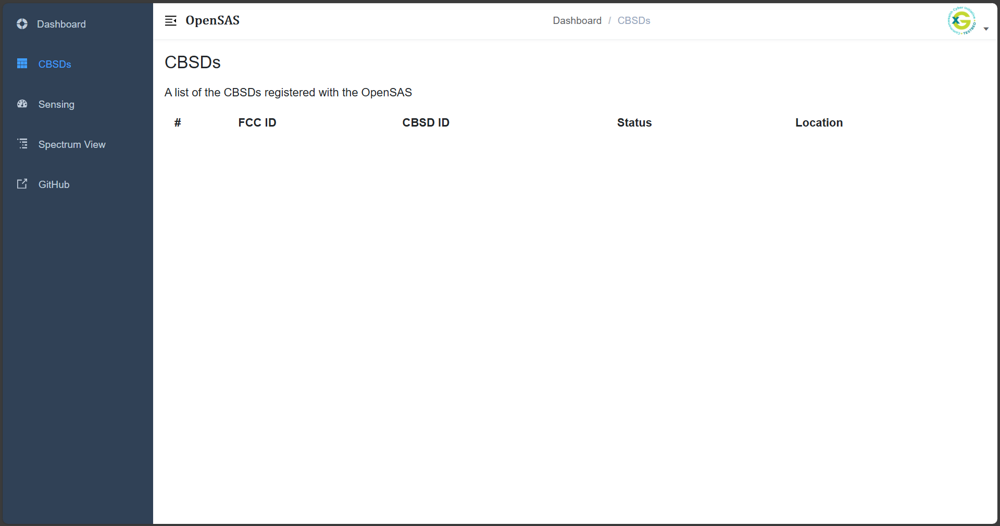
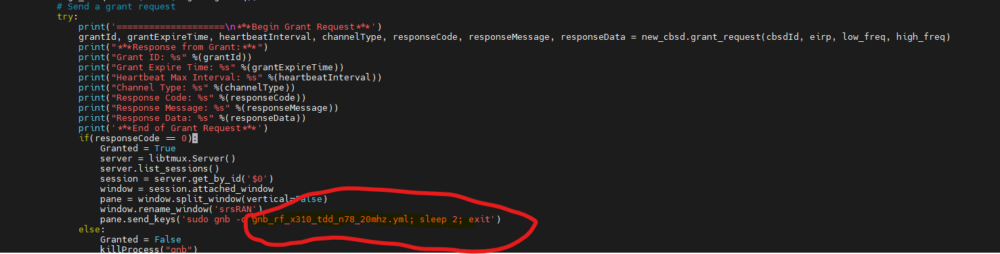

.. OpenSAS
.. ============

.. Citizens Broadband Radio Service (CBRS)
.. ---------------------------------------

.. The Citizens Broadband Radio Service (CBRS) spectrum (3550-3700 MHz) in the U.S. enables shared wireless communication through a three-tiered access system:

.. - **Incumbent Access (Tier 1)**: Reserved for military and government users with the highest priority.
.. - **Priority Access License (PAL, Tier 2)**: Licensed users with priority over unlicensed users, obtained via FCC auction. The Virginia Tech Foundation has acquired Priority Access Licenses (PALs) for the newly available Citizens Broadband Radio Service (CBRS). Virginia Tech’s priority access licenses include four 10-MHz blocks in Montgomery County and another four 10-MHz blocks in Craig County. The licenses are held by Virginia Tech Technology Assets (VTTA), a subsidiary of the Virginia Tech Foundation, and will be administered by the Division of Information Technology. `Virginia Tech Spectrum Information <https://it.vt.edu/partnerships/university-partnerships/spectrum.html>`_
.. - **General Authorized Access (GAA, Tier 3)**: Unlicensed users with access to available spectrum but must defer to higher tiers.

.. CBRS spectrum is managed by a Spectrum Access System (SAS) to avoid interference and priority protection. CBRS supports private LTE/5G networks, industrial IoT, and rural broadband, offering flexible, cost-effective cellular connectivity. These LTE/5G base stations are called CBRS Devices (CBSDs). SAS also has environmental sensing Capabilities (ESC) to detect incumbent users and protect them from interference. More information on Outdoor CBRS deployments can be found at `Stroubles Creek CBRS Testbed Site <https://ccixgtestbed.org/stroubles-creek-testbed-site.html>`_.

.. .. figure:: _static/cbrs_three_tier_system.png
..    :align: center
..    :alt: CBRS Three-Tier Priority Access System

..    **Figure 1:** CBRS Three-Tier Priority Access System.

.. Open Source Spectrum Access System (OpenSAS)
.. --------------------------------------------

.. To enable research and experimentation in the CBRS ecosystem, Virginia Tech/CCI has developed an open-source SAS called OpenSAS `[3][4] <https://cci-opensas.readthedocs.io/en/latest/references.html>`_. OpenSAS aligns with WInnForum specifications and has successfully tested with Software Defined Radio (SDR) based CBSDs and ESCs. The role of the SAS is to allow spectrum management of CBSDs, activation of dynamic protection zones, and environmental sensing for incumbent protection. OpenSAS strives to adhere to WInnForum and FCC regulations on SAS and CBRS operations.

.. OpenSAS Architecture
.. --------------------

.. OpenSAS manages and enforces spectrum via the SAS-CBSD interface and the Environmental Sensing Capability (ESC) sensor nodes. The critical components incorporated inside OpenSAS to achieve this include the grant algorithm and the incumbent detection model. The architecture diagram for OpenSAS is provided in Figure 2.

.. .. figure:: _static/opensas_architecture.png
..    :align: center
..    :alt: OpenSAS Architecture

..    **Figure 2:** OpenSAS Architecture.

.. The OpenSAS code has been updated to incorporate the HTTPS protocol, aligning it more closely with the ideal WInnForum SAS architecture.

.. CBSD (Citizens Broadband Radio Service Device)
.. ----------------------------------------------

.. A CBSD is a CBRS device, typically a 5G base station with a CBSD client running on it. For example, a CBSD client with srsRAN gNodeB (gNB).

OpenSAS
=======

Introduction
-------------------

Citizens Broadband Radio Service (CBRS) Overview
~~~~~~~~~~~~~~~~~~~~~~~~~~~~~~~~~~~~~~~~~~~~~~~~~~~~~~~~~~~~

The Citizens Broadband Radio Service (CBRS) spectrum (3550-3700 MHz) in the U.S. enables shared wireless communication through a three-tiered access system:

- **Incumbent Access (Tier 1)**: Reserved for military and government users with the highest priority.
- **Priority Access License (PAL, Tier 2)**: Licensed users with priority over unlicensed users, obtained via FCC auction. The Virginia Tech Foundation has acquired Priority Access Licenses (PALs) for the newly available Citizens Broadband Radio Service (CBRS). Virginia Tech’s priority access licenses include four 10-MHz blocks in Montgomery County and another four 10-MHz blocks in Craig County, Blacksburg, VA, where Virginia Tech's main campus is located. The licenses are held by Virginia Tech Technology Assets (VTTA), a subsidiary of the Virginia Tech Foundation, and will be administered by the Division of Information Technology. `Virginia Tech Spectrum Information <https://it.vt.edu/partnerships/university-partnerships/spectrum.html>`_
- **General Authorized Access (GAA, Tier 3)**: Unlicensed users with access to available spectrum but must defer to higher tiers.

CBRS spectrum is managed by a Spectrum Access System (SAS) to avoid interference and priority protection. CBRS supports private LTE/5G networks, industrial IoT, and rural broadband, offering flexible, cost-effective cellular connectivity. These LTE/5G base stations are called CBRS Devices (CBSDs). SAS also has environmental sensing Capabilities (ESC) to detect incumbent users and protect them from interference. More information on Outdoor CBRS deployments can be found at `Stroubles Creek CBRS Testbed Site <https://ccixgtestbed.org/stroubles-creek-testbed-site.html>`_.

.. figure:: ../../_static/opensas/cbrs_three_tier_system.png
   :align: center
   :alt: CBRS Three-Tier Priority Access System

   **Figure 1:** CBRS Three-Tier Priority Access System.

Why OpenSAS
~~~~~~~~~~~~~~~~~~~~

While several commercial SAS providers (such as Google SAS and Federated SAS) are available today, 
SDR-based CBSDs cannot be certified by the FCC due to their easily modifiable software and firmware—this violates FCC guidelines. 
Consequently, experimental research in the SAS ecosystem using commercial solutions is limited. 
To address this gap, Virginia Tech/CCI developed an open-source SAS that supports SDR/O-RAN based CBSDs for experimental purposes. 
We enhanced this platform to include ML-based incumbent sensing, SAS-SAS communication, and named it OpenSAS. OpenSAS aligns with WInnForum specifications and has been 
successfully integrated and tested with SDR-based 5G CBSDs and ESCs. 
Its primary functions include managing spectrum for CBSDs, activating dynamic protection zones, and providing environmental sensing for incumbent protection—all 
while striving to adhere to FCC and WInnForum regulations for SAS-SAS and SAS-CBSD communications.

Open Source Spectrum Access System (OpenSAS)
~~~~~~~~~~~~~~~~~~~~

To enable research and experimentation in the CBRS ecosystem, Virginia Tech/CCI has developed an open-source SAS called OpenSAS `[3][4] <https://cci-opensas.readthedocs.io/en/latest/references.html>`_. OpenSAS aligns with WInnForum specifications and has successfully tested with Software Defined Radio (SDR) based CBSDs and ESCs. The role of the SAS is to allow spectrum management of CBSDs, activation of dynamic protection zones, and environmental sensing for incumbent protection. OpenSAS strives to adhere to WInnForum and FCC regulations on SAS and CBRS operations.

OpenSAS Architecture
~~~~~~~~~~~~~~~~~~~~

OpenSAS manages and enforces spectrum via the SAS-CBSD interface and the Environmental Sensing Capability (ESC) sensor nodes. The critical components incorporated inside OpenSAS to achieve this include the grant algorithm and the incumbent detection model. The architecture diagram for OpenSAS is provided in Figure 2.

.. figure:: ../../_static/opensas/opensas_architecture.png
   :align: center
   :alt: OpenSAS Architecture

   **Figure 2:** OpenSAS Architecture.

The OpenSAS code has been updated to incorporate the HTTPS protocol, aligning it more closely with the ideal WInnForum SAS architecture.

CBSD (Citizens Broadband Radio Service Device)
~~~~~~~~~~~~~~~~~~~~~~~~~~~~~~~~~~~~~~~~~~~~~~~~~~~~~~~~~~~~~~~~~~~~~~~~~~~~~~~~

A CBSD is a CBRS device, typically a 5G base station with a CBSD client running on it. For example, a CBSD client with srsRAN gNodeB (gNB).

Installation and Configuration
--------------------------------------

This section presents installation and configuration steps for OpenSAS server, OpenSAS dashboard, and CBSDs in linux environment. OpenSAS and its dashboard can be installed from source or using Docker. The following sections provide detailed instructions for each method.

Building OpenSAS from Source
~~~~~~~~~~~~~~~~~~~~~~~~~~~~~~~~~~~~~~~~
The `Core/` folder contains everything required to launch the SAS Core Server. Regardless of your institution, this contains the code that is of primary interest for SAS researchers.

Clone the Repository
"""""""""""""""""""""""

In this method, the repository is cloned locally. This is the way to go if HTTPS is required.

First clone the repository using git

.. code-block:: bash

   git clone https://github.com/CCI-NextG-Testbed/OpenSAS

Generate Certificates
""""""""""""""""""""""""""""""""""""""""""""""

- Next, create the CA and server/client certificates using the create_ssl_certs.sh script. Go into the /Core/Certs folder and run the script. 

.. code-block:: bash

   cd OpenSAS/Core/Certs
   sudo chmod +x create_ssl_certs.sh

- Before running the script, make sure to delete the existing `ca.cert` and all other `.key`, `.crt`, and `.csr` files. The only files remaining should be `create_ssl_certs.sh` and `create_client_certs.sh`. The `create_client_certs.sh` can be used to create client certs for each new client. Once existing certs are deleted, run the script.

.. code-block:: bash

   ./create_ssl_certs.sh

- Enter the IP of the machine running OpenSAS and CBSD client. If making the requests locally, the IP/hostname can be `127.0.0.1`.

- This will create certificate for the server and one CBSD client in the `Certs` folder. Copy the `ca.cert`, `client-<IP/hostname>-0.cert`, and `client-<IP/hostname>-0.key` files to the client machine (CBSD) to make HTTPS requests. To generate more CBSD client certificates, run the `create_client_certs.sh` script.

.. figure:: ../../_static/opensas/image1.png
   :align: center
   :alt: Certificate Generation
   :scale: 50%

   **Figure:** Certificate Generation.

Update Server Configuration
""""""""""""""""""""""""""""""""""""""""""""""

Update the paths to the server certificate and key in `Core/server.py`. The following code snipped show which paths to update.

.. code-block:: bash

   httpd = HTTPServer(('0.0.0.0', 1443), SimpleHTTPRequestHandler)
    httpd.socket = ssl.wrap_socket (httpd.socket, 
           keyfile="Certs/server_10.147.20.60.key",                       //Update this to reflect the new server key
           certfile='Certs/server_10.147.20.60.crt', server_side=True)    //Update this to reflect the new server cert
    print("Listening on port 1443")
    httpd.serve_forever()    
   

Install Requirements
"""""""""""""""""""""""

Finally, before starting the server, install all the requirements (packages) by running pip3 install as follows:

.. code-block:: bash

   pip3 install -r requirements.txt

- This will install all the required packages such as `requests`, `python-engine.io`. For the communication between the frontend and core to work, the `python-socketio` and `vue-socket.io` versions should be compatible. The versions specified in the `requirements.txt` are tested to be compatible.

.. figure:: ../../_static/opensas/image3.png
   :align: center
   :alt: Installing Requirements
   :scale: 50%

   **Figure:** Installation Requirements.

Run the OpenSAS Server
"""""""""""""""""""""""

Start the OpenSAS server:

.. code-block:: bash

   cd ../
   python3 server.py

.. figure:: ../../_static/opensas/image4.png
   :align: center
   :alt: OpenSAS Server Running
   :scale: 50%

   **Figure:** OpenSAS Server Running.

The OpenSAS server will start listening for HTTPS requests from CBSDs.

**CBSDs can access the SAS via the following URL endpoints:**

.. code-block:: none

   https://<IP/hostname>:1443/sas-api/<request>

**Examples:**

- `https://127.0.0.1:1443/sas-api/registration`
- `https://192.168.0.110:1443/sas-api/registration`
- `https://localhost:1443/sas-api/spectrumInquiry`
- `https://localhost:1443/sas-api/grant`
- `https://localhost:1443/sas-api/heartbeat`
- `https://localhost:1443/sas-api/relinquishment`
- `https://localhost:1443/sas-api/deregistration`

These endpoints allow CBSDs to perform various actions such as registration, spectrum inquiry, grant requests, heartbeats, relinquishment, and deregistration with the OpenSAS server.

Building OpenSAS Dashboard from Source
~~~~~~~~~~~~~~~~~~~~~~~~~~~~~~~~~~~~~~~~~~~~~~~~~~~~~~~~~~~~

Clone the Repository
"""""""""""""""""""""""""""

.. code-block:: bash

   git clone https://github.com/CCI-NextG-Testbed/OpenSAS-dashboard/

Install npm
"""""""""""""""""""""""""""

Install npm if it's not already installed:

.. code-block:: bash

   sudo apt-get install npm

Install Dependencies
"""""""""""""""""""""""""""

From the cloned directory, install dependencies:

.. code-block:: bash

   cd OpenSAS-dashboard
   npm install --legacy-peer-deps

Configure and Run the Dashboard
""""""""""""""""""""""""""""""""""""""""""""""""""""""

- Set the IP and port to the OpenSAS SocketIO in the configuration files.
- If the OpenSAS core is running on a different VM or machine, use its IP; else it will be `localhost`.
- The port on OpenSAS is set to `8000`.

In your configuration file (e.g., `main.js`), update the connection settings:

.. code-block:: javascript

   Vue.use(new VueSocketIO({
      debug: true,
      connection: 'http://10.147.20.114:8000',
      options: { transports: ['websocket', 'polling', 'flashsocket'] } // Optional options
   }))

Then, start the dashboard:

.. code-block:: bash

   npm run dev

.. figure:: ../../_static/opensas/image7.png
   :align: center
   :alt: OpenSAS Dashboard Running
   :scale: 80%

   **Figure:** OpenSAS Dashboard Running.

- Access the dashboard at `http://localhost:9528/` or `http://<host-machine-ip>:9528`.

.. figure:: ../../_static/opensas/image8.png
   :align: center
   :alt: OpenSAS Dashboard Login
   :scale: 40%

   **Figure:** OpenSAS Dashboard Login Page.

- You can view the list of CBSDs here.

   **Figure:** CBSD List on Dashboard.

Build from Docker Image of OpenSAS and OpenSAS Dashboard
~~~~~~~~~~~~~~~~~~~~~~~~~~~~~~~~~~~~~~~~~~~~~~~~~~~~~~~~~~~~~~~~~~~~~~~~~~~~~~~~~~~~

Alternatively, you can build and run OpenSAS using Docker. The Dockerfile provides an easy way to get started.

Install Docker Engine
""""""""""""""""""""""""

Update your package lists and install Docker:

.. code-block:: bash

   sudo apt update
   sudo apt install docker.io

Clone the Docker Repository
""""""""""""""""""""""""""""""""""""""""""""""""

.. code-block:: bash

   git clone https://github.com/CCI-NextG-Testbed/OpenSASDocker.git
   cd OpenSASDocker

Build the Docker Image
""""""""""""""""""""""""

.. code-block:: bash

   sudo docker build . --tag=opensas-server-dash --no-cache

Run the OpenSAS Container
""""""""""""""""""""""""""""""""""""""""""""""""

.. code-block:: bash

   docker run --network=host --name=opensas-container -it --privileged opensas-server-dash

- The OpenSAS core and dashboard services will start automatically.
- This starts the two services:

  - **The OpenSAS core**, which will listen to HTTPS requests from CBSDs.
  - **The OpenSAS dashboard webserver**.

- The web portal can be accessed via `http://localhost:9528/`.
- The CBSDs can access the SAS via the following URL endpoints:

  - `https://localhost:1443/sas-api/registration`
  - `https://localhost:1443/sas-api/spectrumInquiry`
  - `https://localhost:1443/sas-api/grant`
  - `https://localhost:1443/sas-api/heartbeat`
  - `https://localhost:1443/sas-api/relinquishment`
  - `https://localhost:1443/sas-api/deregistration`

CBSD Client for OpenSAS
~~~~~~~~~~~~~~~~~~~~~~~~~~~~~~

CBSD consists of a CBSD client and a 4G/5G gNB. The CBSD client is responsible for communicating with the OpenSAS server to register, request spectrum, and perform other actions. Once CBSD client receives the grant from the SAS, it communicates with the gNB to start transmitting on the assigned frequency. Open-source 4G/5G stacks can be used for end-to-end deployment in the CBRS ecosystem, however it is not mandatory to have over-the-air 4G/5G setup. ZMQ or simulated-RF can also be used. For 4G/5G gNB installation, refer to the srsRAN/OAI documentation. We use `tmux` terminal to trigger gNB operation, once the grant is received from the SAS.

1. Clone the Repository
""""""""""""""""""""""""

.. code-block:: bash

   git clone https://github.com/CCI-NextG-Testbed/CBSD
   cd CBSD

2. Install TMUX and Copy the Certificates
""""""""""""""""""""""""""""""""""""""""""""""""""""""""""""""""""""""""

Make sure that the `tmux` is installed on CBSD machine and client Certs are generated in OpenSAS server with client's machine IP (accessible from other VMs) and placed in the Certs folder here. Also, the proper gnb yml file is copied from your srsRAN/configs folder. modify the run.py script to include any specific srsRAN config file. Make appropriate changes in the run.py and CBSD.py.

3. Modify run.py
""""""""""""""""""""""""

Modify run.py to add you gnb yml file name

   **Figure:** run.py snippet.

4. Modify CBSD.py
""""""""""""""""""""""""

Modify CBSD.py to inculde OpenSAS IP and proper CBSD client certificate path:

.. figure:: ../../_static/opensas/image26.png
   :align: center
   :alt: CBSD List
   :scale: 40%

   **Figure:** cbsd.py snippet.

The link to the experiment can be found at `OpenSAS Experiment <https://cci-testbed-docs-public.readthedocs.io/en/latest/sample_experiments/cbrs.html>`_.