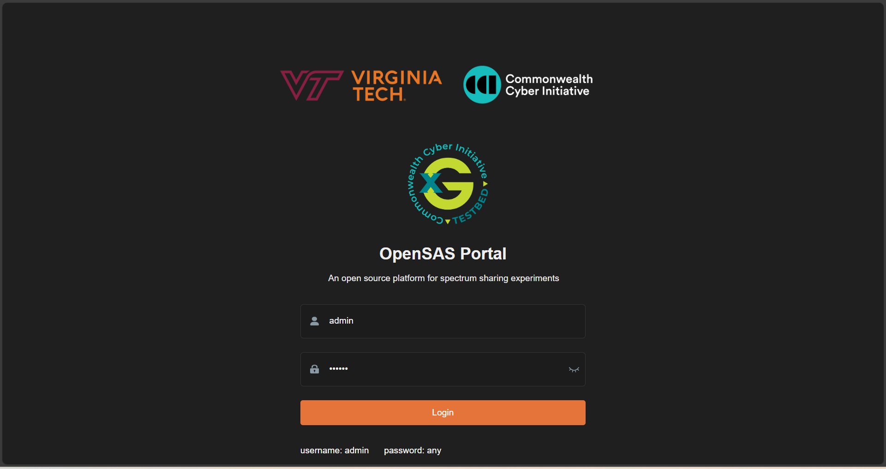
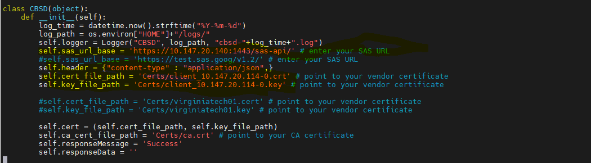

.. OpenSAS
.. ============

.. Citizens Broadband Radio Service (CBRS)
.. ---------------------------------------

.. The Citizens Broadband Radio Service (CBRS) spectrum (3550-3700 MHz) in the U.S. enables shared wireless communication through a three-tiered access system:

.. - **Incumbent Access (Tier 1)**: Reserved for military and government users with the highest priority.
.. - **Priority Access License (PAL, Tier 2)**: Licensed users with priority over unlicensed users, obtained via FCC auction. The Virginia Tech Foundation has acquired Priority Access Licenses (PALs) for the newly available Citizens Broadband Radio Service (CBRS). Virginia Tech’s priority access licenses include four 10-MHz blocks in Montgomery County and another four 10-MHz blocks in Craig County. The licenses are held by Virginia Tech Technology Assets (VTTA), a subsidiary of the Virginia Tech Foundation, and will be administered by the Division of Information Technology. `Virginia Tech Spectrum Information <https://it.vt.edu/partnerships/university-partnerships/spectrum.html>`_
.. - **General Authorized Access (GAA, Tier 3)**: Unlicensed users with access to available spectrum but must defer to higher tiers.

.. CBRS spectrum is managed by a Spectrum Access System (SAS) to avoid interference and priority protection. CBRS supports private LTE/5G networks, industrial IoT, and rural broadband, offering flexible, cost-effective cellular connectivity. These LTE/5G base stations are called CBRS Devices (CBSDs). SAS also has environmental sensing Capabilities (ESC) to detect incumbent users and protect them from interference. More information on Outdoor CBRS deployments can be found at `Stroubles Creek CBRS Testbed Site <https://ccixgtestbed.org/stroubles-creek-testbed-site.html>`_.

.. .. figure:: _static/cbrs_three_tier_system.png
..    :align: center
..    :alt: CBRS Three-Tier Priority Access System

..    **Figure 1:** CBRS Three-Tier Priority Access System.

.. Open Source Spectrum Access System (OpenSAS)
.. --------------------------------------------

.. To enable research and experimentation in the CBRS ecosystem, Virginia Tech/CCI has developed an open-source SAS called OpenSAS `[3][4] <https://cci-opensas.readthedocs.io/en/latest/references.html>`_. OpenSAS aligns with WInnForum specifications and has successfully tested with Software Defined Radio (SDR) based CBSDs and ESCs. The role of the SAS is to allow spectrum management of CBSDs, activation of dynamic protection zones, and environmental sensing for incumbent protection. OpenSAS strives to adhere to WInnForum and FCC regulations on SAS and CBRS operations.

.. OpenSAS Architecture
.. --------------------

.. OpenSAS manages and enforces spectrum via the SAS-CBSD interface and the Environmental Sensing Capability (ESC) sensor nodes. The critical components incorporated inside OpenSAS to achieve this include the grant algorithm and the incumbent detection model. The architecture diagram for OpenSAS is provided in Figure 2.

.. .. figure:: _static/opensas_architecture.png
..    :align: center
..    :alt: OpenSAS Architecture

..    **Figure 2:** OpenSAS Architecture.

.. The OpenSAS code has been updated to incorporate the HTTPS protocol, aligning it more closely with the ideal WInnForum SAS architecture.

.. CBSD (Citizens Broadband Radio Service Device)
.. ----------------------------------------------

.. A CBSD is a CBRS device, typically a 5G base station with a CBSD client running on it. For example, a CBSD client with srsRAN gNodeB (gNB).

OpenSAS
=======

Why OpenSAS
---------------

While several commercial SAS providers (such as Google SAS and Federated SAS) are available today, SDR-based CBSDs cannot be certified by the FCC due to their easily modifiable software and firmware—this violates FCC guidelines. Consequently, research in the SAS ecosystem using commercial solutions is limited. To address this gap, Virginia Tech/CCI developed an open-source SAS that supports SDR-based CBSDs for experimental purposes. We enhanced this platform and named it OpenSAS. OpenSAS aligns with WInnForum specifications and has been successfully tested with SDR-based CBSDs and ESCs. Its primary functions include managing spectrum for CBSDs, activating dynamic protection zones, and providing environmental sensing for incumbent protection—all while striving to adhere to FCC and WInnForum regulations.

Citizens Broadband Radio Service (CBRS)
~~~~~~~~~~~~~~~~~~~~~~~~~~~~~~~~~~~~~~~~
The Citizens Broadband Radio Service (CBRS) spectrum (3550–3700 MHz) in the U.S. enables shared wireless communication through a three-tiered access system:

- **Incumbent Access (Tier 1):** Reserved for military and government users with the highest priority.
- **Priority Access License (PAL, Tier 2):** Licensed users with priority over unlicensed users, obtained via FCC auction. The Virginia Tech Foundation has acquired Priority Access Licenses (PALs) for the newly available Citizens Broadband Radio Service (CBRS). Virginia Tech’s priority access licenses include four 10-MHz blocks in Montgomery County and another four 10-MHz blocks in Craig County. The licenses are held by Virginia Tech Technology Assets (VTTA), a subsidiary of the Virginia Tech Foundation, and will be administered by the Division of Information Technology. `Virginia Tech Spectrum Information <https://it.vt.edu/partnerships/university-partnerships/spectrum.html>`_
- **General Authorized Access (GAA, Tier 3):** Unlicensed users with access to available spectrum but must defer to higher tiers.

CBRS spectrum is managed by a Spectrum Access System (SAS) to avoid interference and provide priority protection. CBRS supports private LTE/5G networks, industrial IoT, and rural broadband by offering flexible, cost-effective cellular connectivity. These LTE/5G base stations are called CBRS Devices (CBSDs). The SAS also incorporates Environmental Sensing Capabilities (ESC) to detect incumbent users and protect them from interference. More information on Outdoor CBRS deployments can be found at `Stroubles Creek CBRS Testbed Site <https://ccixgtestbed.org/stroubles-creek-testbed-site.html>`_.

.. figure:: _static/cbrs_three_tier_system.png
   :align: center
   :alt: CBRS Three-Tier Priority Access System

   **Figure 1:** CBRS Three-Tier Priority Access System.

OpenSAS Architecture
~~~~~~~~~~~~~~~~~~~~
OpenSAS manages and enforces spectrum via the SAS-CBSD interface and the Environmental Sensing Capability (ESC) sensor nodes. The critical components incorporated inside OpenSAS to achieve this include the grant algorithm and the incumbent detection model. The architecture diagram for OpenSAS is provided in Figure 2.

.. figure:: _static/opensas_architecture.png
   :align: center
   :alt: OpenSAS Architecture

   **Figure 2:** OpenSAS Architecture.

The OpenSAS code has been updated to incorporate the HTTPS protocol, aligning it more closely with the ideal WInnForum SAS architecture.

CBSD (Citizens Broadband Radio Service Device)
~~~~~~~~~~~~~~~~~~~~~~~~~~~~~~~~~~~~~~~~~~~~~~~~~
A CBSD is a CBRS device, typically a 5G base station with a CBSD client running on it. For example, a CBSD client with srsRAN gNodeB (gNB).

Installation
------------

This section presents installation and configuration steps for OpenSAS (including the core server, the dashboard, and CBSD client setup) in a Linux environment. OpenSAS and its dashboard can be installed from source or using Docker.

Building OpenSAS from Source
""""""""""""""""""""""""""""
The `Core/` folder contains everything required to launch the SAS Core Server. Regardless of your institution, this contains the code that is of primary interest for SAS researchers.

Clone the Repository
~~~~~~~~~~~~~~~~~~~~
Clone the repository using git:

.. code-block:: bash

   git clone https://github.com/CCI-NextG-Testbed/OpenSAS

Generate Certificates
~~~~~~~~~~~~~~~~~~~~~~
Next, create the CA and server/client certificates using the `create_ssl_certs.sh` script. Change to the `/Core/Certs` folder and run the script:

.. code-block:: bash

   cd OpenSAS/Core/Certs
   sudo chmod +x create_ssl_certs.sh

Before running the script, delete the existing `ca.cert` and all other `.key`, `.crt`, and `.csr` files, leaving only `create_ssl_certs.sh` and `create_client_certs.sh`. Then run:

.. code-block:: bash

   ./create_ssl_certs.sh

Enter the IP of the machine running OpenSAS (or use `127.0.0.1` for local requests). This will create certificates for the server and one CBSD client in the `Certs` folder. Copy `ca.cert`, `client-<IP/hostname>-0.cert`, and `client-<IP/hostname>-0.key` to the client machine to make HTTPS requests. To generate more CBSD client certificates, use the `create_client_certs.sh` script.

.. figure:: _static/image1.png
   :align: center
   :alt: Certificate Generation
   :scale: 50%

   **Figure:** Certificate Generation.

Update Server Configuration
~~~~~~~~~~~~~~~~~~~~~~~~~~~~~
Update the paths to the server certificate and key in `Core/server.py`. For example, update the following lines:

.. code-block:: bash

   httpd = HTTPServer(('0.0.0.0', 1443), SimpleHTTPRequestHandler)
   httpd.socket = ssl.wrap_socket(
       httpd.socket, 
       keyfile="Certs/server_10.147.20.60.key",      // Update to new server key path
       certfile='Certs/server_10.147.20.60.crt',       // Update to new server cert path
       server_side=True
   )
   print("Listening on port 1443")
   httpd.serve_forever()

Install Requirements
~~~~~~~~~~~~~~~~~~~~
Before starting the server, install all required packages:

.. code-block:: bash

   pip3 install -r requirements.txt

This will install packages such as `requests`, `python-engine.io`, and `python-socketio` (ensuring compatibility with `vue-socket.io` as specified in `requirements.txt`).

.. figure:: _static/image3.png
   :align: center
   :alt: Installing Requirements
   :scale: 50%

   **Figure:** Installation Requirements.

Run the OpenSAS Server
~~~~~~~~~~~~~~~~~~~~~~
Start the OpenSAS server by executing:

.. code-block:: bash

   cd ../
   python3 server.py

.. figure:: _static/image4.png
   :align: center
   :alt: OpenSAS Server Running
   :scale: 50%

   **Figure:** OpenSAS Server Running.

The OpenSAS server will listen for HTTPS requests from CBSDs at endpoints such as:

.. code-block:: none

   https://<IP/hostname>:1443/sas-api/<request>

For example:
- https://127.0.0.1:1443/sas-api/registration
- https://localhost:1443/sas-api/grant
- https://localhost:1443/sas-api/heartbeat
- https://localhost:1443/sas-api/relinquishment
- https://localhost:1443/sas-api/deregistration

Building OpenSAS Dashboard from Source
"""""""""""""""""""""""""""""""""""""""
Clone the repository for the dashboard:

.. code-block:: bash

   git clone https://github.com/CCI-NextG-Testbed/OpenSAS-dashboard/

Install npm
~~~~~~~~~~~
Install npm if not already installed:

.. code-block:: bash

   sudo apt-get install npm

Install Dependencies
~~~~~~~~~~~~~~~~~~~~
From the dashboard directory, install dependencies:

.. code-block:: bash

   cd OpenSAS-dashboard
   npm install --legacy-peer-deps

Configure and Run the Dashboard
~~~~~~~~~~~~~~~~~~~~~~~~~~~~~~~
- Update the IP and port in the configuration file (e.g., `main.js`) for the OpenSAS SocketIO connection.  
- If the OpenSAS core is running on a different machine, update the IP accordingly; otherwise, use `localhost`.  
- The OpenSAS port is set to `8000`.

Example configuration (in `main.js`):

.. code-block:: javascript

   Vue.use(new VueSocketIO({
      debug: true,
      connection: 'http://10.147.20.114:8000',
      options: { transports: ['websocket', 'polling', 'flashsocket'] }
   }))

Then, start the dashboard:

.. code-block:: bash

   npm run dev

.. figure:: _static/image7.png
   :align: center
   :alt: OpenSAS Dashboard Running
   :scale: 80%

   **Figure:** OpenSAS Dashboard Running.

Access the dashboard at `http://localhost:9528/` or `http://<host-machine-ip>:9528`.

   **Figure:** OpenSAS Dashboard Login Page.

.. figure:: _static/image9.png
   :align: center
   :alt: CBSD List on Dashboard
   :scale: 40%

   **Figure:** CBSD List on Dashboard.

Building from Docker Image of OpenSAS and OpenSAS Dashboard
""""""""""""""""""""""""""""""""""""""""""""""""""""""""
Alternatively, you can build and run OpenSAS using Docker.

Install Docker Engine
~~~~~~~~~~~~~~~~~~~~~
Update your package lists and install Docker:

.. code-block:: bash

   sudo apt update
   sudo apt install docker.io

Clone the Docker repository:

.. code-block:: bash

   git clone https://github.com/CCI-NextG-Testbed/OpenSASDocker.git
   cd OpenSASDocker

Build the Docker image without cache:

.. code-block:: bash

   sudo docker build . --tag=opensas-server-dash --no-cache

Run the OpenSAS container:

.. code-block:: bash

   docker run --network=host --name=opensas-container -it --privileged opensas-server-dash

This command starts both the OpenSAS core and dashboard services:
- The OpenSAS core listens for HTTPS requests from CBSDs.
- The OpenSAS dashboard is accessible via `http://localhost:9528/`.

CBSD Client for OpenSAS
""""""""""""""""""""""""
A CBSD consists of a CBSD client and a 4G/5G gNB. The CBSD client is responsible for communicating with the OpenSAS server to register, request spectrum, and perform other actions. Once a grant is received from the SAS, the CBSD client instructs the gNB to start transmitting on the assigned frequency. Open-source 4G/5G stacks (such as srsRAN or OAI) can be used for a full end-to-end deployment, though simulated RF or ZMQ-based methods may also be used.

1. Clone the CBSD repository:

.. code-block:: bash

   git clone https://github.com/CCI-NextG-Testbed/CBSD
   cd CBSD

2. Install TMUX and Copy the Certificates
~~~~~~~~~~~~~~~~~~~~~~~~~~~~~~~~~~~~~~~~~~~~
Ensure that `tmux` is installed on the CBSD machine. Generate client certificates on the OpenSAS server (with the client machine's IP) and place them in the CBSD Certs folder. Also, copy the appropriate gNB YAML file from your srsRAN/configs folder. Modify `run.py` and `CBSD.py` as necessary for your environment.

3. Modify run.py
~~~~~~~~~~~~~~~~
Update `run.py` to include your gNB YAML file name.

.. figure:: _static/image25.png
   :align: center
   :alt: run.py snippet
   :scale: 40%

   **Figure:** run.py snippet.

4. Modify CBSD.py
~~~~~~~~~~~~~~~~~
Update `CBSD.py` to include the OpenSAS IP and proper CBSD client certificate path.

   **Figure:** CBSD.py snippet.
