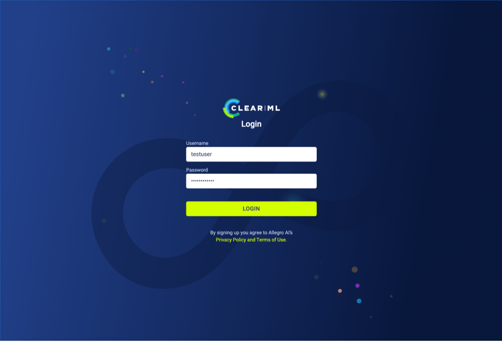
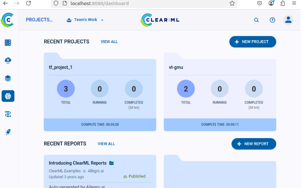
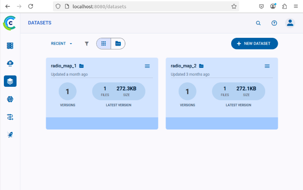

.. _clearml_architecture:

ClearML
=======

Introduction
------------

The integration of an AI/ML Framework within an O-RAN (Open Radio Access Network) setup serves as a pivotal enabler for realizing intelligent, adaptive, and efficient next-generation RAN operations. The primary objective is to harness data-driven learning to optimize network performance in real-time while ensuring openness and interoperability across RAN components.

Objectives
----------

- **Enable Intelligent RAN Control:** Incorporate AI-driven decision-making to manage RAN functions (e.g., handover, scheduling, resource allocation) dynamically and autonomously.
- **Support Near-RT and Non-RT Inference:** Enable low-latency inference in Near-Real-Time RIC (Near-RT RIC) and policy-/model-driven control in Non-Real-Time RIC (Non-RT RIC).
- **Facilitate Data Collection and Model Training:** Aggregate large-scale RAN data via the SMO and RICs to support centralized or federated model training pipelines.
- **Improve Network Efficiency and QoS:** Use predictive and adaptive ML models to optimize network KPIs such as throughput, latency, energy consumption, and slice SLA assurance.
- **Enable Closed-Loop Automation:** Integrate with RIC control loops to support self-optimizing, self-healing, and self-configuring RAN behavior.

Architecture
------------

.. figure:: ../../_static/AI_ML.png
   :align: center
   :alt: AI-ML Architecture
   :width: 900px
   
   **Figure:** ClearML-Based AI/ML System for CCI-xG O-RAN Architecture.
This figure illustrates a **ClearML**-based AI/ML pipeline integrated with the CCI-xG Testbed O-RAN (Open Radio Access Network) architecture, specifically showing interactions between:

- Non-Real-Time RIC (Non-RT RIC)
- Near-Real-Time RIC (Near-RT RIC)
- ClearML Training Framework
- ML Designer

**Key Components and Flow:**

**1. RAW data/telemetry sources:**

- UE (User Equipment)
- O-CU/O-DU (Centralized and Distributed Units)
- Near-RT RIC
- Non-RT RIC

These components are configured to communicate over standard O-RAN interfaces like O1, A1, and E1.

**2. Non-RT RIC:**

- VES Collector: Gathers telemetry/events from the RAN elements and stores them in InfluxDB, a time-series database.

- AI/ML Inference Host: It hosts ML rApps (RIC applications) that perform AI/ML inferences, collects inference data, and communicates with the A1 adapter to push policies or models to the Near-RT RIC, ensuring seamless transfer of inference results.

**3. ClearML Framework for AI/ML Training:**

- A cloud-based setup using ClearML to automate ML workflows.
- Raw data from database extraction and storing for ML tasks.
- Tasks like model training, data prep, etc., creation and make queue.
- Models training execution on extracted and clean data.
- Trained models storing and pushing to the AI/ML Inference Host.
- Manages task tracking, logging, and coordination.
- Perform training on distributed compute nodes using backend ClearML Agents.
- ML Designer required configuring and monitoring AI/ML experiments via the ClearML Dashboard.

**4. Near-RT RIC:**

- Receives inference results from the Non-RT RIC.
- Executes xApps (Near-RT RIC applications) using ML-generated policies or decisions.
- Monitored via the Near-RT RIC dashboard.

Setup
-----

Before Getting Started
~~~~~~~~~~~~~~~~~~~~~

1. **Check the Deployment**: Ensure that the ClearML server and ClearML agent are deployed in virtual machines (VMs) within the OpenStack project.

   *If any of the components are missing, please contact the administrator.*

   - **ClearML Server**: The backend service infrastructure for ClearML. It allows multiple users to collaborate and manage their experiments by working seamlessly with the ClearML Python package and ClearML Agent.

     **Components**:

     - **Web Server**: Includes the ClearML Web UI, which is the user interface for tracking, comparing, and managing experiments.
     - **API Server**: A RESTful API for:
       - Documenting and logging experiments, including information, statistics, and results.
       - Querying experiment history, logs, and results.
     - **File Server**: Stores media and models, making them easily accessible via the ClearML Web UI.

2. **Communicate with the ClearML Server**:

   - **Create a VM in the OpenStack Project**:

     **Requirements**:

     - Ubuntu 20.04
     - Flavor: 8 CPU, 8 GB RAM, 128 GB Disk

   - **Create a Virtual Environment**:

     .. code-block:: bash

        sudo apt-get update
        sudo apt-get install python3-venv
        python3 -m venv myenv

   - **Activate the Virtual Environment**:

     .. code-block:: bash

        source myenv/bin/activate

   - **Install the ClearML Python Package**:

     .. code-block:: bash

        pip install clearml

   - **Connect the ClearML SDK to the Server**:

     - Run the ClearML setup wizard:

       .. code-block:: bash

          clearml-init

     - The setup wizard will prompt for ClearML credentials:

       *"Please create new ClearML credentials through the settings page in your `clearml-server` web app (e.g., http://localhost:8080/settings/workspace-configuration), or create a free account at https://app.clear.ml/settings/workspace-configuration. In the settings page, press 'Create new credentials', then press 'Copy to clipboard'. Paste the copied configuration here:"*

       - **Note**: To get credentials, please contact the administrator.
       - At the command prompt, paste the copied ClearML credentials. The setup wizard will verify the credentials.

     - **Sample Output**:

       .. code-block:: text

          Detected credentials key="********************" secret="*******"
          CLEARML Hosts configuration:
              Web App: https://app.<your-domain>
              API: https://api.<your-domain>
              File Store: https://files.<your-domain>
          Verifying credentials ...
          Credentials verified!
          New configuration stored in /home/<username>/clearml.conf
          CLEARML setup completed successfully.

     - You are now ready to use ClearML in your code!

ClearML Dashboard
-----------------

The project dashboard provides a summary of users most recent projects, reports, and tasks. Click a project, report or task to quickly access it.

To access the dashboard:

.. raw:: html

     

After logging in you can see the project pages, dataset pages, and access various experiment management features from the dashboard.

.. raw:: html

     

.. raw:: html

     

On the Datasets page, you can view, manage, and create datasets, as well as track their versions and storage usage

.. raw:: html

     
   

Data Management
---------------

Check InfluxDB Credentials
~~~~~~~~~~~~~~~~~~~~~~~~~~

Ensure you have the following InfluxDB credentials:

.. code-block:: python

   INFLUXDB_URL = "..."  # InfluxDB URL
   TOKEN = "..."         # Your token
   ORG = "..."           # Your organization name
   BUCKET = "..."        # Your bucket name

Upload a Dataset from InfluxDB to ClearML Server Storage
~~~~~~~~~~~~~~~~~~~~~~~~~~~~~~~~~~~~~~~~~~~~~~~~~~~~~~~~

Use the ClearML Data Management tool to upload datasets. The following Python code serves as a template:

.. code-block:: python

   from clearml import Dataset
   from influxdb import InfluxDBClient
   import pandas as pd
   import time
   import io

   # InfluxDB credentials and configurations
   INFLUXDB_URL = "..."  # Replace with your InfluxDB URL
   TOKEN = "..."         # Your token
   ORG = "..."           # Your organization name
   BUCKET = "..."        # Your bucket name

   # Create InfluxDB client
   client = InfluxDBClient(url=INFLUXDB_URL, token=TOKEN)

   # Define the number of days you want to retrieve data from
   X_days = 30  # Change this to the number of days you need

   # Calculate the timestamp X days ago from the current time
   end_time = int(time.time() * 1e9)  # Current time in nanoseconds
   start_time = end_time - (X_days * 24 * 3600 * 1e9)  # X days ago in nanoseconds

   # Query data from InfluxDB
   query = f'SELECT * FROM "randata" WHERE time >= {start_time} AND time <= {end_time}'
   result = client.query(query)

   # Convert the result to a Pandas DataFrame
   df = pd.DataFrame(result.get_points())

   # Convert the DataFrame to a CSV-like string in memory
   csv_buffer = io.StringIO()
   df.to_csv(csv_buffer, index=False)
   csv_buffer.seek(0)  # Reset the buffer to the beginning

   # Upload the in-memory CSV data to ClearML
   dataset = Dataset.create(dataset_name="rapp_data", dataset_project="rapp_examples")
   dataset.add_object(csv_buffer, "randata.csv")  # Add the in-memory CSV as an object with a filename
   dataset.upload()
   dataset.finalize()

   print(f"Dataset uploaded to ClearML with ID: {dataset.id}")

Accessing the Uploaded Data and Preparing It
~~~~~~~~~~~~~~~~~~~~~~~~~~~~~~~~~~~~~~~~~~~~

.. code-block:: python

   from clearml import Dataset
   import os
   import pandas as pd
   from pathlib import Path
   from clearml import Task

   # Initialize ClearML Task
   task = Task.init(project_name="Your-Project", task_name="Data Preparation", output_uri=True)

   # Load dataset from ClearML
   dataset_name = "your-dataset-name"
   dataset_project = "your-dataset-project"
   local_dataset_path = Path(Dataset.get(
       dataset_project=dataset_project,
       dataset_name=dataset_name,
       alias="dataset-alias"
   ).get_local_copy())

   # List all files in the dataset directory
   data_files = [data_path for data_path in os.listdir(local_dataset_path) if data_path.endswith(".csv")]
   print("Data files:", data_files)

   # Function to preprocess a single CSV file
   def process_file(file_path):
       df = pd.read_csv(file_path)
       # ... code for preparing the data ...
       return df

   # Process all data files
   dataframes = [process_file(os.path.join(local_dataset_path, file)) for file in data_files]

   # Combine into a single DataFrame
   combined_data = pd.concat(dataframes, axis=0).reset_index(drop=True)

   # Display basic statistics
   print(combined_data.describe())

Preprocessing and Normalization
~~~~~~~~~~~~~~~~~~~~~~~~~~~~~~~

.. code-block:: python

   import pandas as pd
   from sklearn.preprocessing import StandardScaler, MinMaxScaler

   def preprocess_data(df, numeric_cols=None, fill_strategy="mean", drop_cols=None):
       """
       Preprocess the dataset:
       - Fill missing values
       - Drop unnecessary columns
       - Ensure consistent data types
       """
       # Drop unnecessary columns if specified
       if drop_cols:
           df = df.drop(columns=drop_cols, errors="ignore")

       # Fill missing values
       if fill_strategy == "mean":
           df = df.fillna(df.mean(numeric_only=True))
       elif fill_strategy == "median":
           df = df.fillna(df.median(numeric_only=True))
       elif fill_strategy == "zero":
           df = df.fillna(0)
       elif fill_strategy == "ffill":
           df = df.fillna(method="ffill")
       elif fill_strategy == "bfill":
           df = df.fillna(method="bfill")
       else:
           raise ValueError("Unsupported fill strategy. Use 'mean', 'median', 'zero', 'ffill', or 'bfill'.")

       # Ensure numeric columns are of proper type
       if numeric_cols:
           df[numeric_cols] = df[numeric_cols].apply(pd.to_numeric, errors="coerce")

       return df

   def normalize_data(df, cols_to_normalize, method="standard"):
       """
       Normalize the specified columns using the given method:
       - 'standard': StandardScaler (z-score normalization)
       - 'minmax': MinMaxScaler (scale to [0, 1])
       """
       if method == "standard":
           scaler = StandardScaler()
       elif method == "minmax":
           scaler = MinMaxScaler()
       else:
           raise ValueError("Unsupported normalization method. Use 'standard' or 'minmax'.")

       df[cols_to_normalize] = scaler.fit_transform(df[cols_to_normalize])

       return df

Model Training
--------------

Creating and Training the Model
~~~~~~~~~~~~~~~~~~~~~~~~~~~~~~~

.. code-block:: python

   import tensorflow as tf
   from tensorflow.keras import layers
   import numpy as np

   # Assuming 'combined_data' is your preprocessed dataset
   data = combined_data.to_numpy()

   # Split into training, validation, and test sets
   train_size = int(0.7 * len(data))
   val_size = int(0.15 * len(data))
   test_size = len(data) - train_size - val_size

   train_data = data[:train_size]
   val_data = data[train_size:train_size+val_size]
   test_data = data[train_size+val_size:]

   train_input, train_labels = train_data[:, :-1], train_data[:, -1]
   val_input, val_labels = val_data[:, :-1], val_data[:, -1]
   test_input, test_labels = test_data[:, :-1], test_data[:, -1]

   # Create the model
   model = tf.keras.Sequential([
       layers.Dense(32, activation='relu', input_shape=(train_input.shape[1],)),
       layers.Dense(16, activation='relu'),
       layers.Dense(8, activation='relu'),
       layers.Dense(3, activation='softmax')  # Adjust '3' to the number of classes in your dataset
   ])

   model.compile(optimizer='adam',
                 loss=tf.keras.losses.SparseCategoricalCrossentropy(),
                 metrics=['accuracy'])

   # Train the model
   history = model.fit(
       train_input, train_labels,
       validation_data=(val_input, val_labels),
       batch_size=64,
       epochs=15,
       callbacks=[
           tf.keras.callbacks.EarlyStopping(monitor='val_loss', patience=5),
           tf.keras.callbacks.ReduceLROnPlateau(monitor='val_loss', factor=0.1, patience=3)
       ]
   )

   print("Training complete!")

Evaluation and Logging
----------------------

.. code-block:: python

   import matplotlib.pyplot as plt

   # Evaluate the model
   test_loss, test_accuracy = model.evaluate(test_input, test_labels)
   print(f"Test Loss: {test_loss}, Test Accuracy: {test_accuracy}")

   # Log metrics to ClearML
   task.get_logger().report_single_value("Test Loss", test_loss)
   task.get_logger().report_single_value("Test Accuracy", test_accuracy)

   # Log training history
   def plot_training(history):
       plt.figure()
       plt.plot(history.history['loss'], label='Train Loss')
       plt.plot(history.history['val_loss'], label='Validation Loss')
       plt.title('Loss Curve')
       plt.legend()
       plt.savefig('loss_curve.png')
       plt.show()

   plot_training(history)

   # Save the model
   model.save("trained_model.keras")
   task.upload_artifact("Trained Model", artifact_object="trained_model.keras")

For a step-by-step walkthrough and practical usage, see the :ref:`ClearML Experiment <clearml_experiment>` in the Sample Experiments section.

References
----------

.. [1] https://clear.ml/docs/latest/docs/

.. [2] https://clear.ml/docs/latest/docs/getting_started/ds/ds_first_steps/#auto-log-experiment

.. [3] https://clear.ml/docs/latest/docs/clearml_data/clearml_data_sdk
