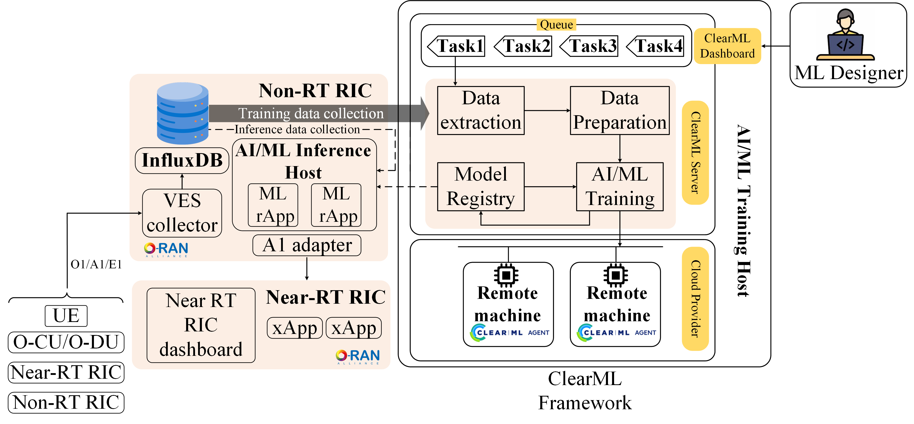

ClearML
=======

Introduction
------------

ClearML is an open-source, end-to-end AI Platform designed to streamline AI adoption and the entire development lifecycle. It supports every phase of AI development, from research to production, allowing users to leverage any model, dataset, or architecture at scale.

Architecture
------------

   
   **Figure 1:** ClearML-Based AI/ML System for CCI-xG O-RAN Architecture.
This figure illustrates a **ClearML**-based AI/ML pipeline integrated with the CCI-xG Testbed O-RAN (Open Radio Access Network) architecture, specifically showing interactions between:

- Non-Real-Time RIC (Non-RT RIC)
- Near-Real-Time RIC (Near-RT RIC)
- ClearML Training Framework
- ML Designer

**Key Components and Flow:**

**1. RAW data/telemetry sources:**

- UE (User Equipment)
- O-CU/O-DU (Centralized and Distributed Units)
- Near-RT RIC
- Non-RT RIC

These components are configured to communicate over standard O-RAN interfaces like O1, A1, and E1.

**2. Non-RT RIC:**

*VES Collector:*
- Gathers telemetry/events from the RAN elements and stores them in InfluxDB, a time-series database.

*AI/ML Inference Host:*
- Hosts ML rApps (rApps = RIC applications) for making AI/ML inferences.
- Communicates with the A1 adapter to push policies or models to the Near-RT RIC.
- Responsible for inference data collection and passing inference results to Near-RT RIC.

**3. ClearML Framework for AI/ML Training:**

- A cloud-based setup using ClearML to automate ML workflows.
- Raw data from database extraction and storing for ML tasks.
- Tasks like model training, data prep, etc., creation and make queue.
- Models training execution on extracted and clean data.
- Trained models storing and pushing to the AI/ML Inference Host.
- Manages task tracking, logging, and coordination.
- Perform training on distributed compute nodes using backend ClearML Agents.
- ML Designer required configuring and monitoring AI/ML experiments via the ClearML Dashboard.

**4. Near-RT RIC:**

- Receives inference results from the Non-RT RIC.
- Executes xApps (Near-RT RIC applications) using ML-generated policies or decisions.
- Monitored via the Near-RT RIC dashboard.

.. note::

   📘 **ClearML User Guide**
   Get started with ClearML using the official ClearML Guide. It provides step-by-step instructions for setup, experiment tracking, task management, and more: `ClearML Integration Guide <https://clearml-guide.readthedocs.io/>`_

