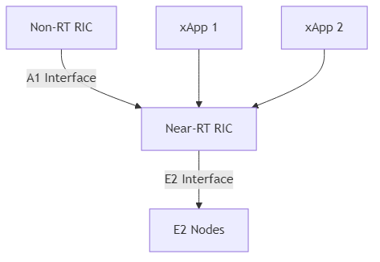

O-RAN Near-RT RIC
=======================================

Introduction
-----------
The Near-Real-Time RAN Intelligent Controller (Near-RT RIC) is a key component of the O-RAN (Open Radio Access Network) architecture. It operates on a time scale of 10 milliseconds to 1 second, enabling near-real-time control and optimization of RAN elements and resources. The Near-RT RIC introduces programmability in the RAN through a microservice-based platform that hosts applications called xApps.

Architecture
-----------
The Near-RT RIC is designed as a platform that hosts applications (xApps) which implement control logic for RAN elements. It follows a microservice-based architecture that enables flexibility, scalability, and vendor-neutral deployment.

.. note::
   The diagram above shows the key components of the O-RAN Near-RT RIC architecture, including the Non-RT RIC (connected via the A1 interface), the Near-RT RIC itself, xApps that run on the Near-RT RIC platform, and E2 Nodes (CU/DU) that connect to the Near-RT RIC via the E2 interface.

Key Components
-------------

1. **Near-RT RIC Platform**:

   - **RIC Framework**: Provides the core functionality for the Near-RT RIC, including message routing, xApp management, and security.
   - **RIC Message Router**: Routes messages between xApps and external entities.
   - **RIC Database**: Stores configuration data, policies, and other information needed by xApps.
   - **xApp Manager**: Manages the lifecycle of xApps, including deployment, configuration, and monitoring.

2. **xApps**:

   - Microservice-based applications that implement control logic for RAN elements.
   - Can be developed by third parties and deployed on the Near-RT RIC platform.
   - Examples include traffic steering, mobility management, and QoS optimization.

3. **Interfaces**:

   - **E2 Interface**: Connects the Near-RT RIC to E2 Nodes (CU/DU) in the RAN. It enables the Near-RT RIC to collect data from and control the RAN elements.
   - **A1 Interface**: Connects the Near-RT RIC to the Non-RT RIC. It enables the Non-RT RIC to provide policies and enrichment information to the Near-RT RIC.
   - **O1 Interface**: Used for management and configuration of the Near-RT RIC itself.

E2 Interface
-----------
The E2 interface is a critical component of the O-RAN architecture, connecting the Near-RT RIC to E2 Nodes (CU/DU) in the RAN. It enables the Near-RT RIC to collect data from and control the RAN elements.

The E2 interface supports two primary service models:

1. **RAN Control (RC)**: Enables the Near-RT RIC to control RAN functions.
2. **Key Performance Measurement (KPM)**: Enables the Near-RT RIC to collect performance metrics from RAN elements.

xApps
-----
xApps are microservice-based applications that run on the Near-RT RIC platform. They implement control logic for RAN elements and can be developed by third parties. xApps can subscribe to data from RAN elements via the E2 interface, process this data, and make control decisions that are sent back to the RAN elements.

Examples of xApps include:

1. **Traffic Steering**: Directs traffic to appropriate cells or slices based on various criteria.
2. **Mobility Management**: Optimizes handover decisions to improve user experience.
3. **QoS Optimization**: Adjusts QoS parameters to meet service requirements.
4. **Interference Management**: Mitigates interference between cells to improve performance.
5. **KPIMON**: Monitors Key Performance Indicators (KPIs) from RAN elements.
6. **Cell Configuration**: Manages and optimizes cell parameters.
7. **Handover Control**: Optimizes handover decisions between cells.
8. **Load Balancing**: Distributes load across cells to optimize network performance.

xApp Lifecycle
~~~~~~~~~~~~~
The lifecycle of an xApp includes:

1. **Development**: xApps are developed using the SDK provided by the Near-RT RIC platform.
2. **Onboarding**: xApps are packaged and onboarded to the Near-RT RIC platform.
3. **Deployment**: xApps are deployed on the Near-RT RIC platform.
4. **Configuration**: xApps are configured with appropriate parameters.
5. **Execution**: xApps run on the Near-RT RIC platform, processing data and making control decisions.
6. **Monitoring**: xApps are monitored for performance and health.
7. **Termination**: xApps can be terminated when no longer needed.

Implementation Options
---------------------
There are several open-source implementations of the Near-RT RIC:

1. **O-RAN Software Community (OSC)**: The OSC provides a reference implementation of the Near-RT RIC, including the RIC platform and several example xApps.
2. **ONF SD-RAN**: The Open Networking Foundation (ONF) provides an implementation of the Near-RT RIC as part of its Software-Defined RAN (SD-RAN) project.
3. **OpenRAN**: The Telecom Infra Project (TIP) OpenRAN project includes an implementation of the Near-RT RIC.

Deployment Considerations
------------------------
When deploying a Near-RT RIC, several factors need to be considered:

1. **Hardware Requirements**: The Near-RT RIC requires sufficient compute resources to run the platform and xApps.
2. **Networking**: The Near-RT RIC needs to be connected to the RAN elements via the E2 interface and to the Non-RT RIC via the A1 interface.
3. **Security**: The Near-RT RIC needs to be secured to prevent unauthorized access and ensure the integrity of control decisions.
4. **Scalability**: The Near-RT RIC needs to be able to scale to support the number of RAN elements and xApps required.
5. **Reliability**: The Near-RT RIC needs to be highly available to ensure continuous operation of the RAN.

Conclusion
---------
The Near-RT RIC is a key component of the O-RAN architecture, enabling programmability and intelligence in the RAN. It provides a platform for hosting xApps that implement control logic for RAN elements, enabling optimization of RAN performance and resource utilization. The Near-RT RIC, along with the Non-RT RIC, forms the intelligence layer of the O-RAN architecture, enabling the vision of an open, intelligent, and programmable RAN.
