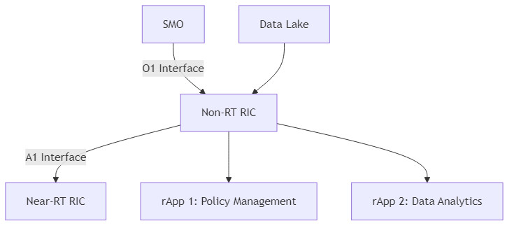

O-RAN Non-RT RIC
=======================================

Introduction
-----------
The Non-Real-Time RAN Intelligent Controller (Non-RT RIC) is a key component of the O-RAN (Open Radio Access Network) architecture. It operates on a time scale of more than 1 second, enabling non-real-time control and optimization of RAN elements and resources. The Non-RT RIC introduces AI/ML-based intelligence in the RAN through a microservice-based platform that hosts applications called rApps.

Architecture
-----------
The Non-RT RIC is designed as a platform that hosts applications (rApps) which implement control logic for RAN elements. It follows a microservice-based architecture that enables flexibility, scalability, and vendor-neutral deployment.

.. note::
   The diagram above shows the key components of the O-RAN Non-RT RIC architecture, including the Service Management and Orchestration (SMO) connected via the O1 interface, the Non-RT RIC itself, rApps that run on the Non-RT RIC platform, and the Near-RT RIC connected via the A1 interface. The Non-RT RIC also interfaces with a Data Lake for storage and retrieval of data.

Key Components
-------------

1. **Non-RT RIC Platform**:
   - **Policy Framework**: Provides the core functionality for policy management, including policy creation, distribution, and enforcement.
   - **Data Analytics Framework**: Enables data collection, processing, and analysis for AI/ML-based decision making.
   - **rApp Management**: Manages the lifecycle of rApps, including deployment, configuration, and monitoring.
   - **A1 Interface Management**: Handles communication with the Near-RT RIC via the A1 interface.

2. **rApps**:
   - Microservice-based applications that implement control logic for RAN elements.
   - Can be developed by third parties and deployed on the Non-RT RIC platform.
   - Examples include policy management, data analytics, and ML model training.

3. **Interfaces**:
   - **A1 Interface**: Connects the Non-RT RIC to the Near-RT RIC. It enables the Non-RT RIC to provide policies and enrichment information to the Near-RT RIC.
   - **O1 Interface**: Connects the Non-RT RIC to the Service Management and Orchestration (SMO) for management and configuration.
   - **Data Lake Interface**: Enables the Non-RT RIC to store and retrieve data from the Data Lake.

A1 Interface
-----------
The A1 interface is a critical component of the O-RAN architecture, connecting the Non-RT RIC to the Near-RT RIC. It enables the Non-RT RIC to provide policies and enrichment information to the Near-RT RIC.

The A1 interface supports several service models:

1. **Policy Management**: Enables the Non-RT RIC to define and distribute policies to the Near-RT RIC.
2. **Enrichment Information**: Enables the Non-RT RIC to provide additional information to the Near-RT RIC for decision making.
3. **ML Model Management**: Enables the Non-RT RIC to distribute ML models to the Near-RT RIC.

rApps
-----
rApps are microservice-based applications that run on the Non-RT RIC platform. They implement control logic for RAN elements and can be developed by third parties. rApps can define policies that are distributed to the Near-RT RIC via the A1 interface, which in turn influence the behavior of xApps running on the Near-RT RIC.

Examples of rApps include:

1. **Policy Management**: Defines and manages policies for the RAN.
2. **Data Analytics**: Analyzes data from the RAN to identify patterns and trends.
3. **ML Model Training**: Trains ML models based on data from the RAN.
4. **Traffic Prediction**: Predicts traffic patterns to optimize resource allocation.
5. **Anomaly Detection**: Identifies anomalies in the RAN behavior.

rApp Lifecycle
~~~~~~~~~~~~~
The lifecycle of an rApp includes:

1. **Development**: rApps are developed using the SDK provided by the Non-RT RIC platform.
2. **Onboarding**: rApps are packaged and onboarded to the Non-RT RIC platform.
3. **Deployment**: rApps are deployed on the Non-RT RIC platform.
4. **Configuration**: rApps are configured with appropriate parameters.
5. **Execution**: rApps run on the Non-RT RIC platform, processing data and making control decisions.
6. **Monitoring**: rApps are monitored for performance and health.
7. **Termination**: rApps can be terminated when no longer needed.

Implementation Options
---------------------
There are several open-source implementations of the Non-RT RIC:

1. **O-RAN Software Community (OSC)**: The OSC provides a reference implementation of the Non-RT RIC, including the RIC platform and several example rApps.
2. **ONF SDRAN**: The Open Networking Foundation (ONF) provides an implementation of the Non-RT RIC as part of its Software-Defined RAN (SDRAN) project.
3. **OpenRAN**: The Telecom Infra Project (TIP) OpenRAN project includes an implementation of the Non-RT RIC.

Deployment Considerations
------------------------
When deploying a Non-RT RIC, several factors need to be considered:

1. **Hardware Requirements**: The Non-RT RIC requires sufficient compute resources to run the platform and rApps.
2. **Networking**: The Non-RT RIC needs to be connected to the Near-RT RIC via the A1 interface and to the SMO via the O1 interface.
3. **Security**: The Non-RT RIC needs to be secured to prevent unauthorized access and ensure the integrity of control decisions.
4. **Scalability**: The Non-RT RIC needs to be able to scale to support the number of rApps and policies required.
5. **Reliability**: The Non-RT RIC needs to be highly available to ensure continuous operation of the RAN.

Conclusion
---------
The Non-RT RIC is a key component of the O-RAN architecture, enabling AI/ML-based intelligence in the RAN. It provides a platform for hosting rApps that implement control logic for RAN elements, enabling optimization of RAN performance and resource utilization. The Non-RT RIC, along with the Near-RT RIC, forms the intelligence layer of the O-RAN architecture, enabling the vision of an open, intelligent, and programmable RAN.
