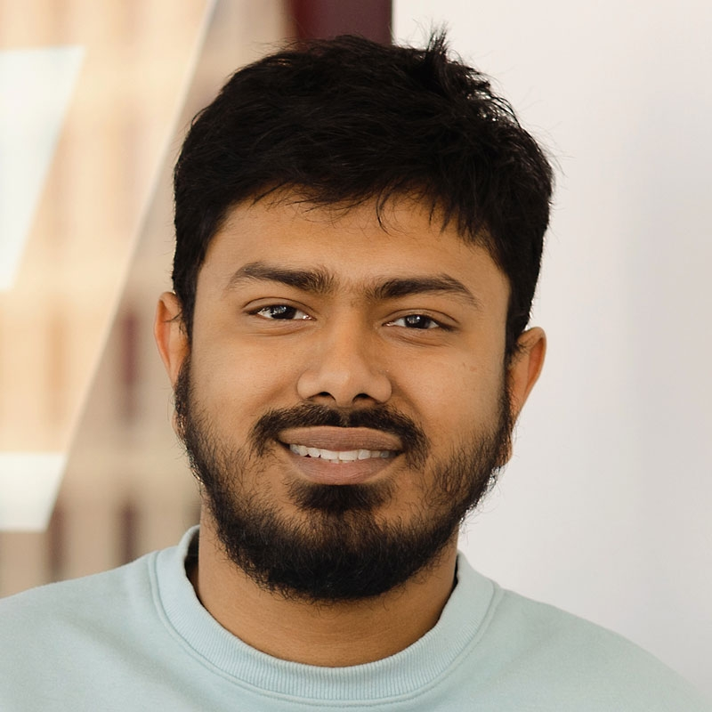
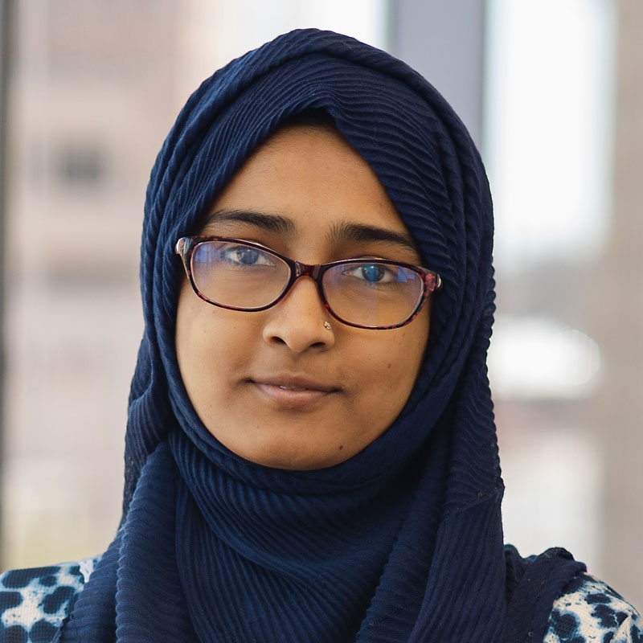
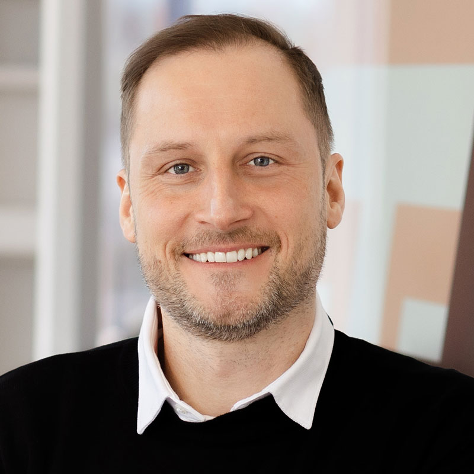

CCI xG Testbed Team Summary
===========================

The CCI xG Testbed Team at Virginia Tech is a diverse group of researchers and students working on next-generation wireless communication technologies.

Leadership
----------
- **Director**: :ref:`Aloizio P. DaSilva <aloizio_dassilva>`
  Expertise in wireless networking, NFV, SDN, and SDR

:ref: `Our Research Areas <research_area>`

Team Composition
----------------
- 1 Director
- 3 Doctoral Students
- 2 Master's Researchers
- 2 Postdoctoral Researchers
- 3 Interns
- 2 Research Faculty

The team's research spans various aspects of next-generation wireless technologies, from fundamental network architectures to advanced machine learning applications in communications. With a mix of experienced researchers and upcoming talent, the CCI xG Testbed Team is well-positioned to contribute to the evolving landscape of wireless communication.

|
|

Director
========
.. _`aloizio_dassilva`:

.. figure:: _static/aloizio.jpg
   :alt: Aloizio P. DaSilva
   :align: left
   :width: 200px

   Aloizio P. DaSilva

`Aloizio P. DaSilva <https://cyberinitiative.org/research/researcher-directory/silva-aloizio-pereira-da.html>`_
---------------------------------------------------------------------------------------------------------------

- **Expertise**: Wireless networking, network functions virtualization (NFV), software-defined networking (SDN), software-defined radio (SDR), radio and core networks.
- Aloizio P. DaSilva specializes in wireless networking communication, focusing on network functions virtualization (NFV), software-defined networking (SDN), and software-defined radio (SDR) on large-scale testbed experimentation. His work includes radio access networks and core networks. DaSilva is also a research faculty member at the Bradley Department of Electrical and Computer Engineering at Virginia Tech.

- **Google Scholar**: `Aloizio P. DaSilva <https://scholar.google.com/citations?user=Q62LeewAAAAJ&hl=fr>`_

.. clear::

|
|
|

**Doctoral Student(PhD)**
================================
|
|

   Md. Habibur Rahman

**Md. Habibur Rahman**
-----------------------
- **Advisor**: :ref:`Aloizio P. DaSilva <aloizio_dassilva>`
- **Research & Focus**: Machine learning (ML) and deep learning (DL) in wireless networks, open radio access networks (O-RAN).
- Md. Habibur Rahman is a Ph.D. student in electrical engineering at Virginia Tech. His research explores centralized and decentralized machine learning (ML) and deep learning (DL) methods in next-generation wireless communication networks. He holds an M.Sc. in electronics engineering from Kookmin University and a B.Sc. in electrical and electronic engineering from Khulna University of Engineering & Technology.
- **Google Scholar**: to be updated
|
|
|
|
|

   Aditya Sathish

`Aditya Sathish <https://scholar.google.com/citations?user=_DI_jTsAAAAJ&hl=en>`_
------------------
- **Advisor**: :ref:`Aloizio P. DaSilva <aloizio_dassilva>`
- Research & Focus: 5G and beyond 5G networks, wireless local area networks (WLAN).
- Aditya Sathish is a master’s student in computer engineering at Virginia Tech. His research focuses on 5G and beyond 5G radio access networks and the adoption challenges of the Open Radio Access Network (O-RAN) architecture and software-defined radios. He holds a Bachelor of Technology from the National Institute of Technology Karnataka in India and previously worked at Qualcomm India as a senior engineer in WLAN system software engineering.
- **Google Scholar**: `Aditya Sathish <https://scholar.google.com/citations?user=_DI_jTsAAAAJ&hl=en>`_

|
|
|
|
|
|

.. figure:: _static/asheesh.jpg
   :alt: Asheesh Tripathi
   :align: left
   :width: 200px

   Asheesh Tripathi

`Asheesh Tripathi <https://scholar.google.com/citations?user=fcRTl7kAAAAJ&hl=en>`_
--------------------------------------------------------------------------------
- **Advisor**: :ref:`Aloizio P. DaSilva <aloizio_dassilva>`
- Research & Focus: Software-defined radio (SDR) based CBRS networks, machine learning in wireless networks.
- Asheesh Tripathi, a Ph.D. student at Virginia Tech, works on software-defined radio-based CBRS networks and machine learning in wireless networks. He holds a B.Tech in electronics and telecommunications from Bharati Vidyapeeth College of Engineering and an M.S. in electrical engineering from the University of North Carolina, Charlotte. Tripathi has worked as a senior engineer at Verana Networks and a lead engineer at Parallel Wireless.
- **Google Scholar**: `Asheesh Tripathi <https://scholar.google.com/citations?user=fcRTl7kAAAAJ&hl=en>`_

|
|
|
|
|
|

Master's Researchers
===================

   Abida Sultana

**Abida Sultana**
------------------
- **Advisor**: :ref:`Aloizio P. DaSilva <aloizio_dassilva>`
- Research & Focus: Near Real-Time open radio access networks (O-RAN).
- Abida Sultana is a master’s student in electrical engineering at Virginia Tech. Her research focuses on Near Real-Time Open Radio Access Networks (O-RAN). She holds a B.Sc. in electronics and telecommunications engineering from Chittagong University of Engineering and Technology.
- **Google Scholar**: Abida Sultana to be added

|
|
|
|
|
|

.. figure:: _static/fahim-bashar-testbed-team.jpg
   :alt: Rohit Kumar
   :align: left
   :width: 200px

   Fahim Bashar
**Fahim Bashar**
----------------
- **Advisor**: :ref:`Aloizio P. DaSilva <aloizio_dassilva>`
- Research & Focus: NextG Testbed deployment and development.
- Fahim Bashar is an intern working with the NextG Testbed at the Commonwealth Cyber Initiative. His role involves deploying cloud solutions, supporting proof-of-concept development, and maintaining the CCI webpage. Bashar holds a bachelor’s degree in computer science from Temple University.

|
|
|
|
|
|

Postdoc Researcher
===================
|
|

.. figure:: _static/mayukh.jpg
   :alt: Mayukh Roy Chowdhury
   :align: left
   :width: 200px

   Mayukh Roy Chowdhury
`Mayukh Roy Chowdhury <https://scholar.google.com/citations?user=sr3_Ct4AAAAJ&hl=en>`_
---------------------------------------------------------------------------------------

- Research & Focus: AI-driven radio resource management, 5G and next-generation networks.
- Mayukh Roy Chowdhury holds a B.Tech in electronics and communication engineering from West Bengal University of Technology, an M.Tech in communication systems engineering from IIT Patna, and a Ph.D. in electrical engineering from IIT Delhi. His research interests include AI-driven radio resource management for cellular networks, reinforcement learning, AI on edge for smart IoT systems, and resource efficiency in communication networks.
- **Google Scholar**: `Mayukh Roy Chowdhury <https://sites.google.com/view/mayukh-roy-chowdhury/>`_
|
|
|
|
|
|
|

**Interns**
===========
|
|

.. figure:: _static/harshit_sai_teja.jpg
   :alt: Harshit Sai Teja Doddi
   :align: left
   :width: 200px

   Harshit Sai Teja Doddi

**Harshit Sai Teja Doddi**
--------------------------

- Focus: NextG Testbed, artificial intelligence (AI) and machine learning (ML) in cloud computing.
- Harshit Sai Teja Doddi is a master’s student in computer science and information at Virginia Tech. He works as an intern at the Commonwealth Cyber Initiative on the NextG Testbed, focusing on AI and ML in cloud computing. Doddi holds a bachelor’s degree in computer science and engineering from Vellore Institute of Technology University.

|
|
|
|
|
|
|

**Kshitij Narvekar**
----------------

- Research & Focus: Artificial intelligence and machine learning in cloud platforms.
- Kshitij Narvekar is a master's student in Computer Science at Virginia Tech and a research intern at the Commonwealth Cyber Initiative (CCI). He has experience in cloud engineering and healthcare technology from his work at Blazeclan Technologies. Kshitij holds multiple AWS certifications and applies his technical expertise to research projects integrating AI and ML in cloud environments.
|
|
|
|
|
|

.. .. figure:: _static/Abhi.jpg
..    :alt: Rohit Kumar
..    :align: left
..    :width: 200px

   Rajat Nagar
**Rajat Nagar**
----------------

- Research & Focus: NextG Testbed deployment and development.
- Rajat Nagar is an intern working with the NextG Testbed at the Commonwealth Cyber Initiative. His role involves deploying cloud solutions, supporting proof-of-concept development, and maintaining the CCI webpage.
|
|
|
|
|
|

**Research Faculty**
=====================
|
|

   Jacek Kibilda

`Jacek Kibilda <https://jacekkibilda.wordpress.com/>`_
------------------------------------------------------

- Research & Focus: Modeling and technology design for next-generation mobile networks.
- Jacek Kibilda is a Research Associate Professor with the Commonwealth Cyber Initiative and the Bradley Department of Electrical and Computer Engineering at Virginia Tech. His research focuses on modeling and technology design for next-generation mobile networks using stochastic geometry, AI, optimization, and computer modeling.
- **Google Scholar**: `Jacek Kibilda <https://scholar.google.com/citations?user=obwKxOoAAAAJ&hl=en&oi=ao>`_
|
|
|
|
|
|

.. figure:: _static/joao-santos-cci-researcher.jpg
   :alt: Joao Santos
   :align: left
   :width: 200px

   Joao Santos
`Joao Santos <https://cyberinitiative.org/research/researcher-directory/santos-joao.html>`_
--------------------------------------------------------------------------------------------

- Research & Focus: 5G Testbed and AI Assurance, software-defined radio (SDR) systems, software-defined networking (SDN) integration.
- Joao Santos is a 5G Testbed and AI Assurance Researcher with the Commonwealth Cyber Initiative at Virginia Tech. His work includes developing software-defined radio systems, implementing radio virtualization mechanisms, and integrating SDR with SDN for programmable end-to-end communication networks.
- **Google Scholar**: `Joao Santos <https://scholar.google.com/citations?user=N4C64eQAAAAJ&hl=demo>`_
|
|
|
|
|
|

Alumni and Former Students
==========================

.. figure:: _static/souradeep.jpg
   :alt: Souradeep Deb
   :align: left
   :width: 200px

   `Souradeep Deb <https://scholar.google.com/citations?user=4hCPcvoAAAAJ&hl=en>`_

.. figure:: _static/jaswanth_sai_reddy.jpg
   :alt: Jaswanth Sai Reddy
   :align: left
   :width: 200px

   Jaswanth Sai Reddy

|
|
|
|
|
|
|
|
|

For more information, visit the `CCI xG Testbed Team page <https://ccixgtestbed.org/cci-xg-testbed-team.html>`_.
