CCI xG Testbed Team Summary
============================

The CCI xG Testbed Team at Virginia Tech is a diverse group of researchers, students, and staff working on next-generation wireless communication technologies. This document outlines the organizational structure and profiles key personnel contributing to the testbed's success.

Organizational Structure
------------------------
Below is the organizational structure for the CCI xG Testbed Team, which defines the hierarchy and groups involved in research and operations.

.. .. graphviz::
..    :align: center

..    digraph org_structure {
..        graph [
..          dpi=130,       // Lower DPI for a more compact image
..          rankdir=TB,    // Top-to-bottom layout
..          splines=ortho, // Orthogonal edges for a clean look
..          ranksep=0.5    // Reduced vertical space between levels for a shorter diagram
..        ];

..        node [
..          shape=box,
..          style=filled,
..          color=lightblue,
..          fontname=Helvetica,
..          penwidth=2
..        ];

..        edge [
..          dir=none,      // No arrows, just lines
..          color=black,
..          penwidth=2
..        ];

..        // Define nodes
..        Director    [label="Director"];
..        Postdoc     [label="Postdoc"];
..        Associate   [label="Associate Faculty"];
..        TechTeam    [label="Technical Team"];
..        AdminTeam   [label="Admin Team"];
..        Visitors    [label="Visitor/Engineer Resident"];

..        // Force ranking by levels
..        { rank=min;  Director }
..        { rank=same; Postdoc; Associate }
..        { rank=max;  TechTeam; AdminTeam; Visitors }

..        // Direct (solid) reporting lines to Director
..        Director -> Postdoc    [style=solid];
..        Director -> TechTeam   [style=solid];
..        Director -> AdminTeam  [style=solid];
..        Director -> Visitors   [style=solid];

..        // Indirect (dotted) lines to Postdoc
..        Postdoc -> TechTeam   [style=dotted];
..        Postdoc -> AdminTeam  [style=dotted];

..        // Associate Faculty has no lines
..    }

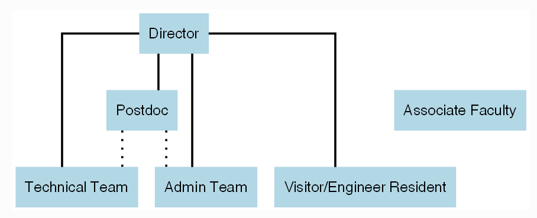

|

The People
==========

Director
--------
.. _director:

.. figure:: _static/aloizio.jpg
   :alt: Aloizio P. DaSilva
   :align: left
   :width: 200px
   :height: 200px

- **Name:** Aloizio P. DaSilva  
- **Role:** Director, CCI xG Testbed Team  
- **Expertise:** Wireless networking, NFV, SDN, and SDR  
- **Profile:** `Profile <https://cyberinitiative.org/research/researcher-directory/silva-aloizio-pereira-da.html>`_

.. clear::
|
|
|
|
|
|

Post-Doc Researchers
---------------------
.. figure:: _static/mayukh.jpg
   :alt: Mayukh Roy Chowdhury
   :align: left
   :width: 200px
   :height: 200px

- **Name:** Mayukh Roy Chowdhury  
- **Role:** Postdoctoral Researcher  
- **Focus:** AI-driven radio resource management, 5G, and next-generation networks  
- **Profile:** `Profile <https://sites.google.com/view/mayukh-roy-chowdhury/>`_

.. clear::
|
|
|
|
|
|

Technical Team
--------------
The Technical Team includes doctoral students and a subset of master's researchers dedicated to developing and implementing advanced wireless technologies.

**Doctoral Students:**

.. figure:: _static/habibur_rahman.jpg
   :alt: Md. Habibur Rahman
   :align: left
   :width: 200px
   :height: 200px

- **Name:** Md. Habibur Rahman  
- **Role:** Doctoral Student  
- **Focus:** Machine learning and deep learning in wireless networks and O-RAN
|
|
|
|
|
|
|

.. figure:: _static/asheesh.jpg
   :alt: Asheesh Tripathi
   :align: left
   :width: 200px
   :height: 200px

- **Name:** Asheesh Tripathi  
- **Role:** Doctoral Student  
- **Focus:** Spectrum Sharing, Machine learning in wireless systems, O-RAN and experimental cellular research.
- **Profile:** `Linkedin <https://www.linkedin.com/in/asheesh-tripathi/>`_, `Github <https://github.com/asheeshtripathi/>`_, `Google Scholar <https://scholar.google.com/citations?user=fcRTl7kAAAAJ&hl=en/>`_

|
|
|
|
|
|

**Master's Researchers and Interns:**

.. figure:: _static/abida.jpg
   :alt: Abida Sultana
   :align: left
   :width: 200px
   :height: 200px

- **Name:** Abida Sultana  
- **Role:** Graduate Research Assistant  
- **Focus:** Near Real-Time Open Radio Access Networks (O-RAN)
|
|
|
|
|
|

.. figure:: _static/fahim.png
   :alt: Fahim Bashar
   :align: left
   :width: 200px
   :height: 250px

- **Name:** Fahim Bashar  
- **Role:** Graduate Research Assistant
- **Focus:** NextG Testbed deployment and development
|
|
|
|
|
|
|

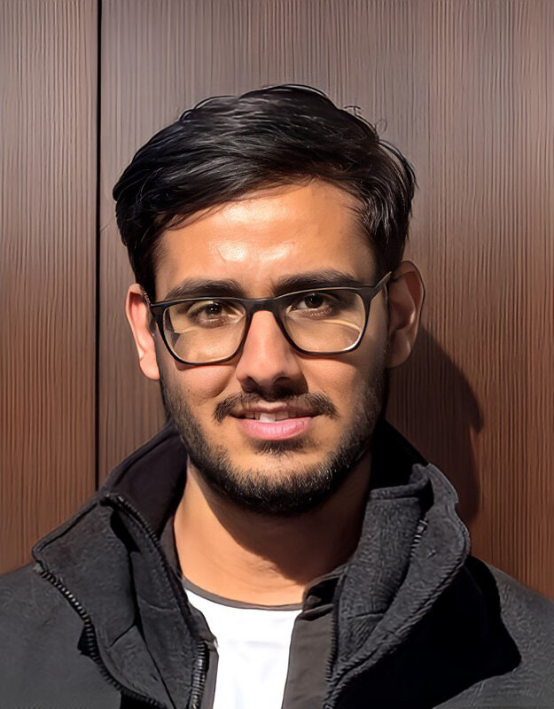

- **Name:** Rajat Nagar  
- **Role:** Research Intern   
- **Focus:** Deployment of cloud solutions and support for proof-of-concept development
|
|
|
|
|
|
|

Admin Team
----------

.. figure:: _static/harshit_sai_teja.jpg
   :alt: Harshit Sai Teja Doddi
   :align: left
   :width: 200px
   :height: 200px

- **Name:** Harshit Sai Teja Doddi  
- **Role:** Master's Researcher / Intern
- **Focus:** AI and ML in cloud computing for NextG Testbed applications
|
|
|
|
|
|

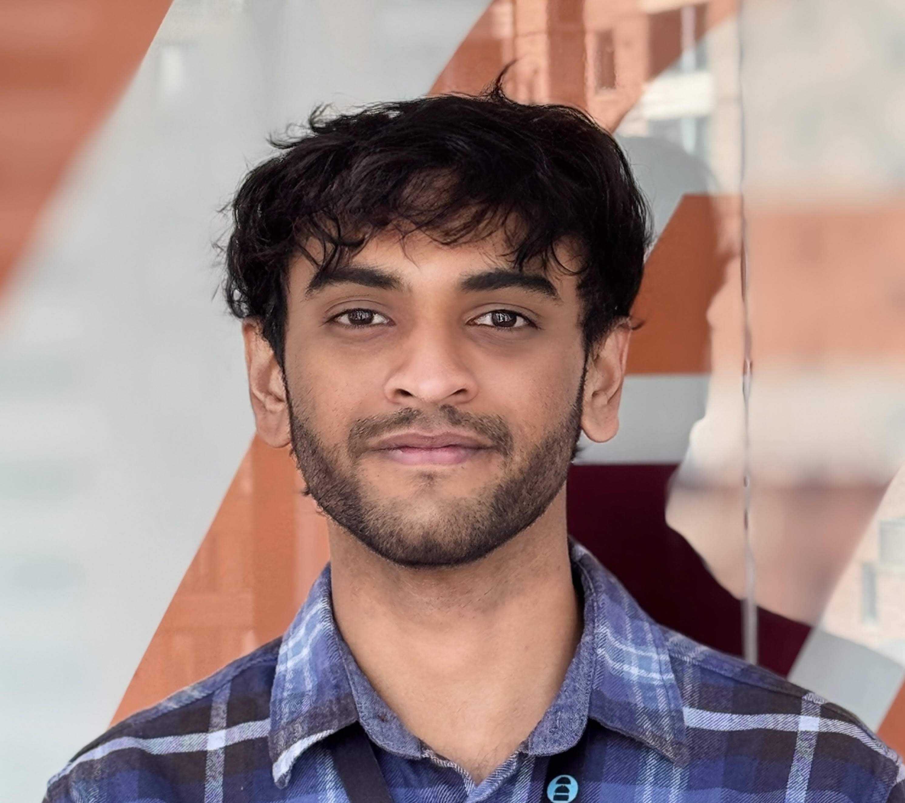

- **Name:** Kshitij Narvekar  
- **Role:** Master's Researcher / Intern 
- **Focus:** Integration of AI/ML in cloud platforms for wireless research
|
|
|
|
|
|

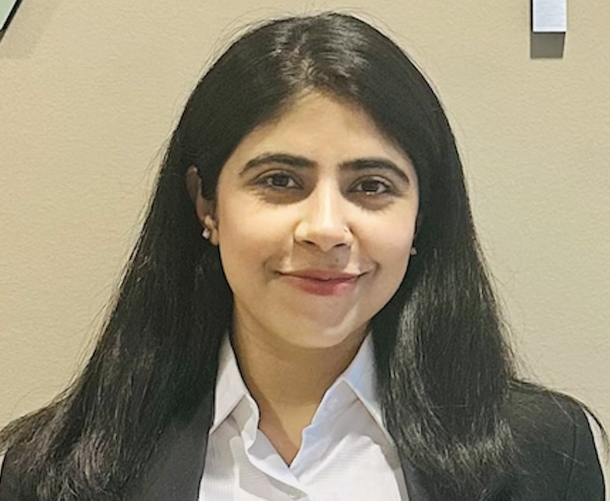

- **Name:** Sanjna Kumari  
- **Role:** Master's Researcher / Intern
- **Focus:** Cloud computing and non-real-time RIC aspects of O-RAN
|
|
|
|
|
|
|

Alumni and Former Students
----------------------------

.. figure:: _static/aditya.jpg
   :alt: Aditya Sathish
   :align: left
   :width: 200px
   :height: 220px

   `Aditya Sathish <https://scholar.google.com/citations?user=_DI_jTsAAAAJ&hl=en>`_

.. figure:: _static/souradeep.jpg
   :alt: Souradeep Deb
   :align: left
   :width: 200px
   :height: 220px

   `Souradeep Deb <https://scholar.google.com/citations?user=4hCPcvoAAAAJ&hl=en>`_

.. figure:: _static/jaswanth_sai_reddy.jpg
   :alt: Jaswanth Sai Reddy
   :align: left
   :width: 200px
   :height: 220px

   `Jaswanth Sai Reddy <https://www.linkedin.com/in/jaswanth-sai-reddy>`_

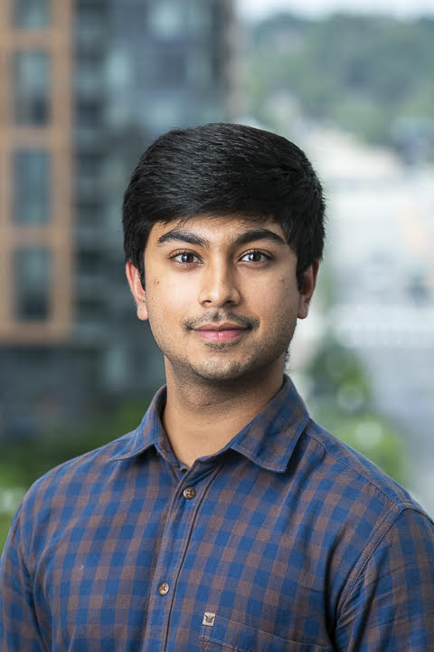

   `Prateek Sethi <https://www.linkedin.com/in/prateeksethiii/>`_

|
|     
|
|
|
|
|
|
|
|
|
|

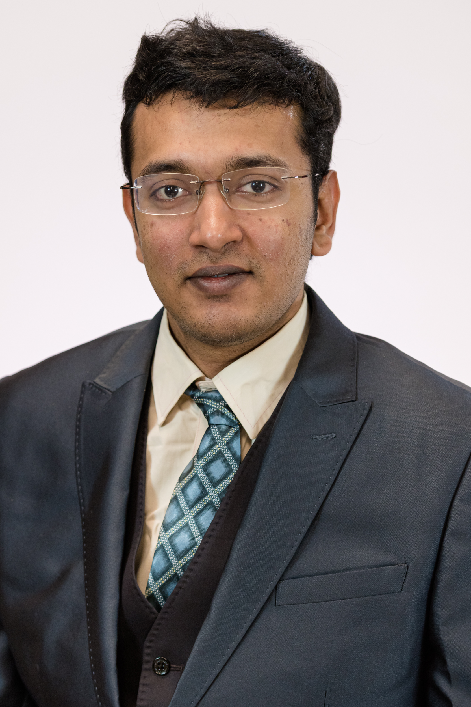

   Vikas

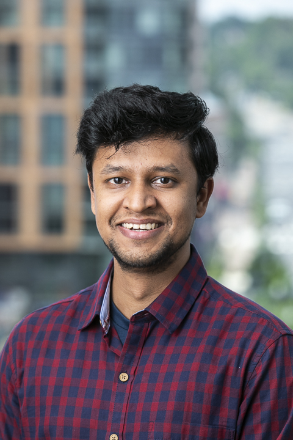

   `Tapan Bhatnagar <https://www.linkedin.com/in/prateeksethiii/>`_

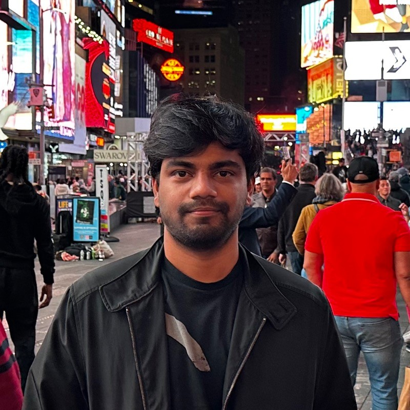

   `Oren Collaco <https://www.linkedin.com/in/prateeksethiii/>`_

.. figure:: _static/Adam.jpg
   :alt: Adam
   :align: left
   :width: 200px
   :height: 220px

   Adam
   
|
|     
|
|
|
|
|
|
|
|
|
|

Associated Research Faculty
---------------------------
.. figure:: _static/jacek-kibilda-cci-researcher.jpg
   :alt: Jacek Kibilda
   :align: left
   :width: 200px
   :height: 200px

- **Name:** Jacek Kibilda  
- **Role:** Associate Research Faculty  
- **Focus:** Modeling and technology design for next-generation mobile networks using stochastic geometry, AI, and optimization  
- **Profile:** `Profile <https://scholar.google.com/citations?user=obwKxOoAAAAJ&hl=en&oi=ao>`_

.. clear::
|
|
|
|
|
|

.. figure:: _static/joao-santos-cci-researcher.jpg
   :alt: Joao Santos
   :align: left
   :width: 200px
   :height: 200px

- **Name:** Joao Santos  
- **Role:** Associate Research Faculty  
- **Focus:** 5G testbed and AI assurance; integrating SDR with SDN for programmable networks  
- **Profile:** `Profile <https://cyberinitiative.org/research/researcher-directory/santos-joao.html>`_

.. clear::
|
|
|
|
|
|

Visiting Researchers
-------------------
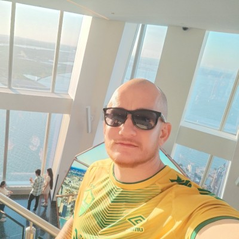

- **Name:** Gustavo Zanatta Bruno   
- **Role:** Visiting PhD Scholar
- **Profile:** `Profile <https://scholar.google.com/citations?user=XP3qsG8AAAAJ&hl=pt-BR/>`_

|
|
|
|
|
|

.. figure:: _static/Abhishek.jpg
   :alt: Abhishek
   :align: left
   :width: 200px
   :height: 200px

- **Name:** Abhishek Kumar  
- **Role:** Visiting PhD Scholar
- **Profile:** `Profile <https://scholar.google.co.kr/citations?user=VHuU14AAAAAJ&hl=en/>`_

|
|
|
|
|
|

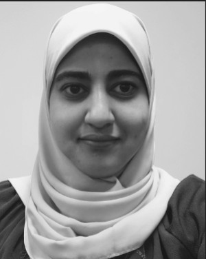

- **Name:** Efat Samir  
- **Role:** Visiting PhD Scholar 
- **Profile:** `Profile <https://scholar.google.com/citations?user=u0DoSvsAAAAJ&hl=en>`_
|
|
|
|
|
|

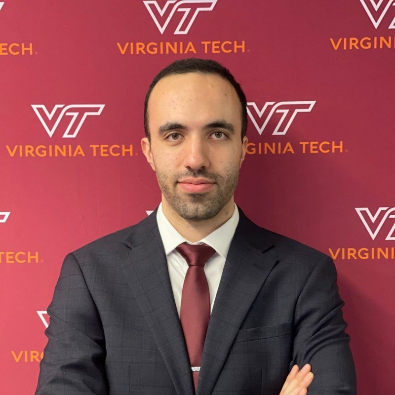

- **Name:** Amirreza Ghafoori 
- **Role:** Visiting PhD Scholar 
- **Profile:** `Profile <hhttps://scholar.google.com/citations?user=91cfNncAAAAJ&hl=en>`_

|
|
|
|
|
|

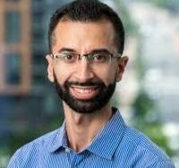

- **Name:** Abdellah El Baamrani
- **Role:** Former Intern Student 
- **Profile:** `Profile <https://www.linkedin.com/in/abdellah-el-baamrani-819898286>`_

|
|
|
|
|
|

Resident Engineers
-------------------
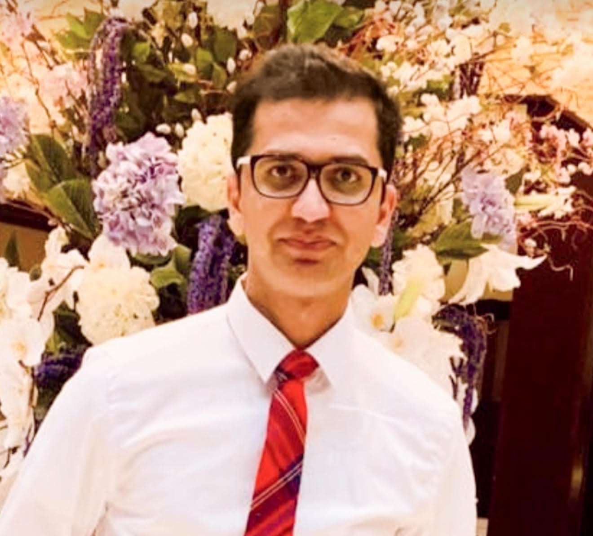

- **Name:** Zeeshan Shah  
- **Role:** Principal Engineer, Verizon- 5G ORAN Lab  
- **Focus:** 5G O-RAN- ACCoRD Testing and Integration Engineer- Support Day to Day ORAN ACCoRD testing activities  
- **Profile:** `Profile <https://www.linkedin.com/in/zeeshan-shah-pmp%C2%AE%EF%B8%8F-59406742/>`_

|
|
|
|
For more details, please visit the `CCI xG Testbed Team page <https://ccixgtestbed.org/cci-xg-testbed-team.html>`_.
