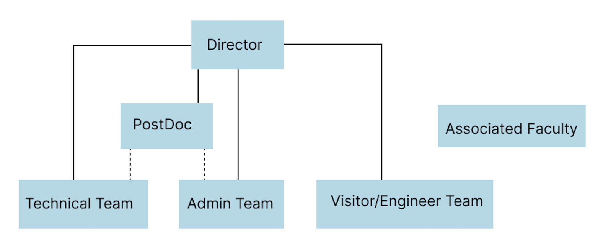
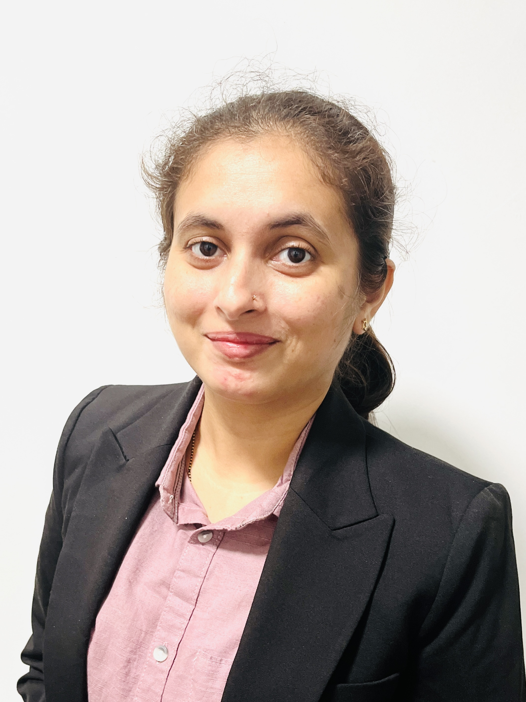
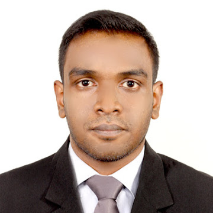
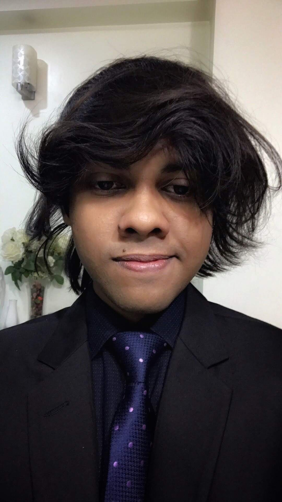
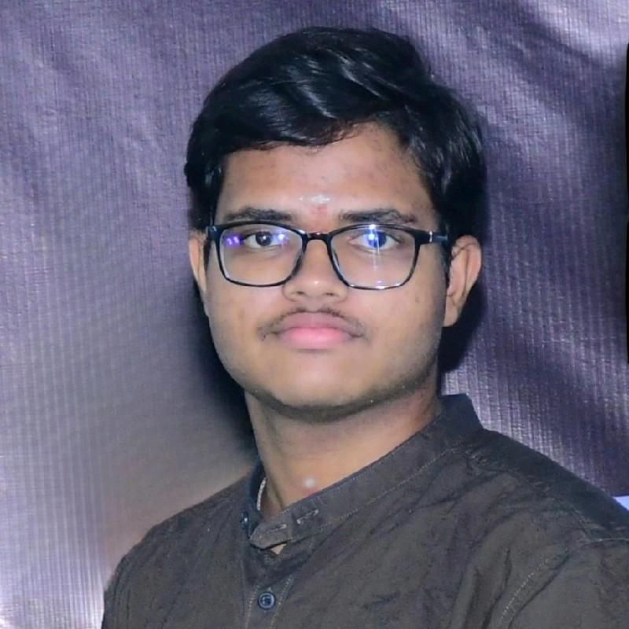
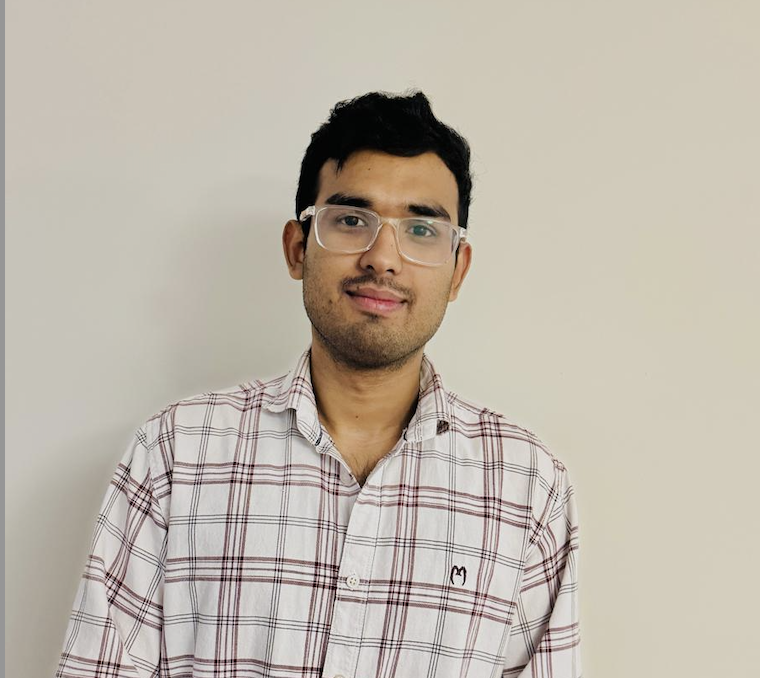
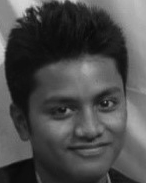

CCI xG Testbed Team Summary
============================

The CCI xG Testbed Team at Virginia Tech is a diverse group of researchers, students, and staff working on next-generation wireless communication technologies. This document outlines the organizational structure and profiles key personnel contributing to the testbed's success.

Organizational Structure
------------------------
Below is the organizational structure for the CCI xG Testbed Team, which defines the hierarchy and groups involved in research and operations.

.. .. graphviz::
..    :align: center

..    digraph org_structure {
..        graph [
..          dpi=130,       // Lower DPI for a more compact image
..          rankdir=TB,    // Top-to-bottom layout
..          splines=ortho, // Orthogonal edges for a clean look
..          ranksep=0.5    // Reduced vertical space between levels for a shorter diagram
..        ];

..        node [
..          shape=box,
..          style=filled,
..          color=lightblue,
..          fontname=Helvetica,
..          penwidth=2
..        ];

..        edge [
..          dir=none,      // No arrows, just lines
..          color=black,
..          penwidth=2
..        ];

..        // Define nodes
..        Director    [label="Director"];
..        Postdoc     [label="Postdoc"];
..        Associate   [label="Associate Faculty"];
..        TechTeam    [label="Technical Team"];
..        AdminTeam   [label="Admin Team"];
..        Visitors    [label="Visitor/Engineer Resident"];

..        // Force ranking by levels
..        { rank=min;  Director }
..        { rank=same; Postdoc; Associate }
..        { rank=max;  TechTeam; AdminTeam; Visitors }

..        // Direct (solid) reporting lines to Director
..        Director -> Postdoc    [style=solid];
..        Director -> TechTeam   [style=solid];
..        Director -> AdminTeam  [style=solid];
..        Director -> Visitors   [style=solid];

..        // Indirect (dotted) lines to Postdoc
..        Postdoc -> TechTeam   [style=dotted];
..        Postdoc -> AdminTeam  [style=dotted];

..        // Associate Faculty has no lines
..    }

|

The People
==========

Director
--------
.. _director:

.. figure:: _static/aloizio.jpg
   :alt: Aloizio P. DaSilva
   :align: left
   :width: 200px
   :height: 200px

- **Name:** Aloizio P. DaSilva  
- **Role:** Director, CCI xG Testbed Team  
- **Expertise:** Wireless networking, NFV, SDN, and SDR  
- **Profile:** `Profile <https://cyberinitiative.org/research/researcher-directory/silva-aloizio-pereira-da.html>`_

.. clear::
|
|
|
|
|
|

Post-Doc Researchers
---------------------

- **Name:** Madhura Adeppady
- **Role:** Postdoctoral Researcher  
- **Focus:** Resource-efficient microservice orchestration, edge computing, and serverless systems 
- **Profile:** `Profile <https://scholar.google.com/citations?user=uvJ9x24AAAAJ&hl=en>`_
- **Report To:** DR Aloizio P. DaSilva

.. clear::
|
|
|
|
|
|

Technical Team
--------------
The Technical Team includes doctoral students and a subset of master's researchers dedicated to developing and implementing advanced wireless technologies.

**Doctoral Students:**

.. figure:: _static/habibur_rahman.jpg
   :alt: Md. Habibur Rahman
   :align: left
   :width: 200px
   :height: 200px

- **Name:** Md. Habibur Rahman  
- **Role:** Doctoral Student  
- **Focus:** Machine learning and deep learning in wireless networks and O-RAN
- **Report To:** DR Aloizio P. DaSilva
|
|
|
|
|
|
|

.. figure:: _static/asheesh.jpg
   :alt: Asheesh Tripathi
   :align: left
   :width: 200px
   :height: 200px

- **Name:** Asheesh Tripathi  
- **Role:** Doctoral Student  
- **Focus:** Spectrum Sharing, Machine learning in wireless systems, O-RAN and experimental cellular research.
- **Profile:** `Linkedin <https://www.linkedin.com/in/asheesh-tripathi/>`_, `Github <https://github.com/asheeshtripathi/>`_, `Google Scholar <https://scholar.google.com/citations?user=fcRTl7kAAAAJ&hl=en/>`_
- **Report To:** DR Aloizio P. DaSilva

|
|
|
|
|
|

- **Name:** Mahesha Vidurange
- **Role:** Doctoral Student  
- **Focus:** Exploring O-RAN security and interoperability while building AI/ML solutions for adaptive management in next-gen wireless systems.
- **Report To:** DR Aloizio P. DaSilva
|
|
|
|
|
|
|

- **Name:** Ishtiaque Ahmed 
- **Role:** Doctoral Student  
- **Focus:** Cloud solutions for O-RAN and leading interoperability testing in the ACCoRD project.
- **Report To:** DR Aloizio P. DaSilva
|
|
|
|
|
|
|

- **Name:** Manikantha Rayudu
- **Role:** Doctoral Student  
- **Focus:** Focusing on federated learning to enhance reliability and privacy in IoT, extending to O-RAN systems.
- **Report To:** DR Aloizio P. DaSilva
|
|
|
|
|
|
|

**Master's Researchers and Interns:**

.. figure:: _static/fahim.png
   :alt: Fahim Bashar
   :align: left
   :width: 200px
   :height: 250px

- **Name:** Fahim Bashar  
- **Role:** Graduate Research Assistant
- **Focus:** NextG Testbed deployment and development
- **Report To:** DR Aloizio P. DaSilva
|
|
|
|
|
|
|

- **Name:** Shubam khantwal  
- **Role:** Research Intern   
- **Focus:** Deployment of cloud solutions and support for proof-of-concept development
- **Report To:** DR Aloizio P. DaSilva
|
|
|
|
|
|
|

Admin Team
----------

.. figure:: _static/harshit_sai_teja.jpg
   :alt: Harshit Sai Teja Doddi
   :align: left
   :width: 200px
   :height: 200px

- **Name:** Harshit Sai Teja Doddi  
- **Role:** Master's Researcher / Intern
- **Focus:** Network Administration and Management
- **Report To:** DR Aloizio P. DaSilva
|
|
|
|
|
|

Alumni and Former Students
----------------------------

.. container:: person-profile

   .. figure:: _static/aditya.jpg
      :alt: Aditya Sathish
      :width: 200px
      :height: 220px
      :target: https://scholar.google.com/citations?user=_DI_jTsAAAAJ&hl=en

   .. container:: person-info
      
      | Name: `Aditya Sathish <https://scholar.google.com/citations?user=_DI_jTsAAAAJ&hl=en>`_
      | Role: Graduate Researcher

.. container:: person-profile

   .. figure:: _static/souradeep.jpg
      :alt: Souradeep Deb
      :width: 200px
      :height: 220px
      :target: https://scholar.google.com/citations?user=4hCPcvoAAAAJ&hl=en

   .. container:: person-info

      | Name: `Souradeep Deb <https://scholar.google.com/citations?user=4hCPcvoAAAAJ&hl=en>`_
      | Role: Graduate Researcher
      
.. container:: person-profile

   .. figure:: _static/jaswanth_sai_reddy.jpg
      :alt: Jaswanth Sai Reddy
      :width: 200px
      :height: 220px
      :target: https://www.linkedin.com/in/jaswanth-sai-reddy

   .. container:: person-info

      | Name: `Jaswanth Sai Reddy <https://www.linkedin.com/in/jaswanth-sai-reddy>`_
      | Role: Graduate Researcher

.. container:: person-profile

   .. figure:: _static/Prateek.jpg
      :alt: Prateek Sethi
      :width: 200px
      :height: 220px
      :target: https://www.linkedin.com/in/prateeksethiii/

   .. container:: person-info

      | Name: `Prateek Sethi <https://www.linkedin.com/in/prateeksethiii/>`_
      | Role: Graduate Researcher

.. container:: person-profile

   .. figure:: _static/Vikas.jpg
      :alt: Vikas
      :width: 200px
      :height: 220px
      :target: # 

   .. container:: person-info

      | Name: Vikas
      | Role: Research Intern 

.. container:: person-profile

   .. figure:: _static/Tapan.jpg
      :alt: Tapan
      :width: 200px
      :height: 220px
      :target: https://www.linkedin.com/in/tapan212/

   .. container:: person-info

      | Name: `Tapan Bhatnagar <https://www.linkedin.com/in/tapan212/>`_
      | Role: Research Intern  

.. container:: person-profile

   .. figure:: _static/Oren.jpg
      :alt: Oren
      :width: 200px
      :height: 220px
      :target: https://www.linkedin.com/in/orencollaco/   

   .. container:: person-info

      | Name: `Oren Collaco <https://www.linkedin.com/in/orencollaco/>`_
      | Role: Research Intern  

.. container:: person-profile

   .. figure:: _static/Adam.jpg
      :alt: Adam
      :width: 200px
      :height: 220px
      :target: #  

   .. container:: person-info

      | Name: `Adam <https://www.linkedin.com/in/adam-k-1999/>`_
      | Role: Research Intern  

    

.. container:: person-profile

   .. figure:: _static/Abhimanyu.jpeg
      :alt: Abhimanyu Bhagwati
      :width: 200px
      :height: 220px
      :target: #  

   .. container:: person-info

      | Name: Abhimanyu Bhagwati
      | Role: Research Intern       

.. container:: person-profile

   .. figure:: _static/Abdellah.jpeg
      :alt: Abdellah El Baamrani
      :width: 200px
      :height: 220px
      :target: https://www.linkedin.com/in/abdellah-el-baamrani-819898286/  

   .. container:: person-info

      | Name: `Abdellah El Baamrani <https://www.linkedin.com/in/abdellah-el-baamrani-819898286/>`_
      | Role: Research Intern     

.. container:: person-profile

   .. figure:: _static/Amirreza.jpg
      :alt: Amirreza Ghafoori
      :width: 200px
      :height: 220px
      :target: https://www.linkedin.com/in/amirrezaghafoori/ 

   .. container:: person-info

      | Name: `Amirreza Ghafoori <https://www.linkedin.com/in/amirrezaghafoori/>`_
      | Role: Graduate Researcher      

.. container:: person-profile

   .. figure:: _static/Efat.jpg
      :alt: Efat Samir
      :width: 200px
      :height: 220px
      :target: #  

   .. container:: person-info

      | Name: Efat Samir
      | Role: Research Intern      

.. container:: person-profile

   .. figure:: _static/kshitij.png
      :alt: Kshitij Narvekar
      :width: 200px
      :height: 220px
      :target: https://www.linkedin.com/in/kshitij-narvekar/ 

   .. container:: person-info

      | Name: `Kshitij Narvekar <https://www.linkedin.com/in/kshitij-narvekar/>`_
      | Role: Research Intern        

.. container:: person-profile

   .. figure:: _static/Sunny.png
      :alt: Sunny Khanorkar
      :width: 200px
      :height: 220px
      :target: https://www.linkedin.com/in/sunny-khanorkar/   

   .. container:: person-info

      | Name: `Sunny Khanorkar <https://www.linkedin.com/in/sunny-khanorkar/>`_
      | Role: Research Intern        

.. container:: person-profile

   .. figure:: _static/rajat_2.png
      :alt: Rajat Nagar
      :width: 200px
      :height: 220px
      :target: https://www.linkedin.com/in/rajatnagarr/ 

   .. container:: person-info

      | Name: `Rajat Nagar <https://www.linkedin.com/in/rajatnagarr/>`_
      | Role: Research Intern         

.. container:: person-profile

   .. figure:: _static/abida.jpg
      :alt: Abida Sultana
      :width: 200px
      :height: 200px
      :target: https://www.linkedin.com/in/abida-sultana-7053891bb/  

   .. container:: person-info

      | Name: `Abida Sultana <https://www.linkedin.com/in/abida-sultana-7053891bb/>`_
      | Role: Graduate Researcher

.. container:: person-profile

   .. figure:: _static/sanjna.png
       :alt: Sanjna Kumari
       :width: 200px
       :height: 200px 
       :target: https://www.linkedin.com/in/sanjnakumari/
   .. container:: person-info

      | Name: `Sanjna Kumari <https://www.linkedin.com/in/sanjnakumari/>`_
      | Role: Research Intern

.. container:: person-profile

   .. figure:: _static/mayukh.jpg
       :alt: Mayukh Chowdhury
       :width: 300px
       :height: 200px 
       :target: https://www.linkedin.com/in/mayukh-roy-chowdhury-ph-d-48830442/
   .. container:: person-info

      | Name: `Mayukh Chowdhury <https://www.linkedin.com/in/mayukh-roy-chowdhury-ph-d-48830442/>`_
      | Role: Postdoc Researcher

|
|
|
Associated Research Faculty
---------------------------
.. figure:: _static/jacek-kibilda-cci-researcher.jpg
   :alt: Jacek Kibilda
   :align: left
   :width: 200px
   :height: 200px

- **Name:** Jacek Kibilda  
- **Role:** Associate Research Faculty  
- **Focus:** Modeling and technology design for next-generation mobile networks using stochastic geometry, AI, and optimization  
- **Profile:** `Profile <https://scholar.google.com/citations?user=obwKxOoAAAAJ&hl=en&oi=ao>`_

.. clear::
|
|
|
|
|
|

.. figure:: _static/joao-santos-cci-researcher.jpg
   :alt: Joao Santos
   :align: left
   :width: 200px
   :height: 200px

- **Name:** Joao Santos  
- **Role:** Associate Research Faculty  
- **Focus:** 5G testbed and AI assurance; integrating SDR with SDN for programmable networks  
- **Profile:** `Profile <https://cyberinitiative.org/research/researcher-directory/santos-joao.html>`_

.. clear::
|
|
|
|
|
|

Visiting Researchers
-------------------
.. figure:: _static/Gustavo.jpg
   :alt: Gustavo
   :align: left
   :width: 200px
   :height: 200px

- **Name:** Gustavo Zanatta Bruno   
- **Role:** Visiting PhD Scholar
- **Profile:** `Profile <https://scholar.google.com/citations?user=XP3qsG8AAAAJ&hl=pt-BR/>`_

|
|
|
|
|
|

- **Name:** Abhishek Kumar  
- **Role:** Visiting PhD Scholar
- **Profile:** `Profile <https://scholar.google.co.kr/citations?user=VHuU14AAAAAJ&hl=en/>`_

|
|
|
|
|
|

Resident Engineers
-------------------
.. figure:: _static/zeeshan-pic.jpg
   :alt: Zeeshan
   :align: left
   :width: 200px
   :height: 200px

- **Name:** Zeeshan Shah  
- **Role:** Principal Engineer, Verizon- 5G ORAN Lab  
- **Focus:** 5G O-RAN- ACCoRD Testing and Integration Engineer- Support Day to Day ORAN ACCoRD testing activities  
- **Profile:** `Profile <https://www.linkedin.com/in/zeeshan-shah-pmp%C2%AE%EF%B8%8F-59406742/>`_

|
|
|
|
For more details, please visit the `CCI xG Testbed Team page <https://ccixgtestbed.org/cci-xg-testbed-team.html>`_.
