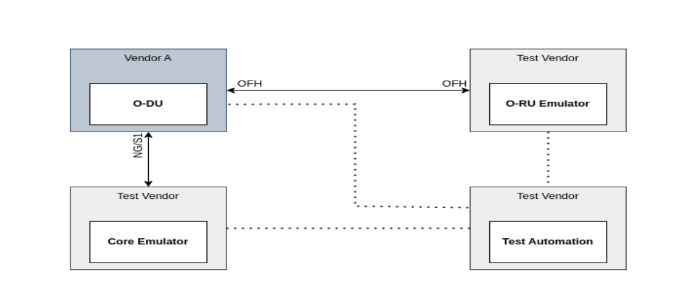
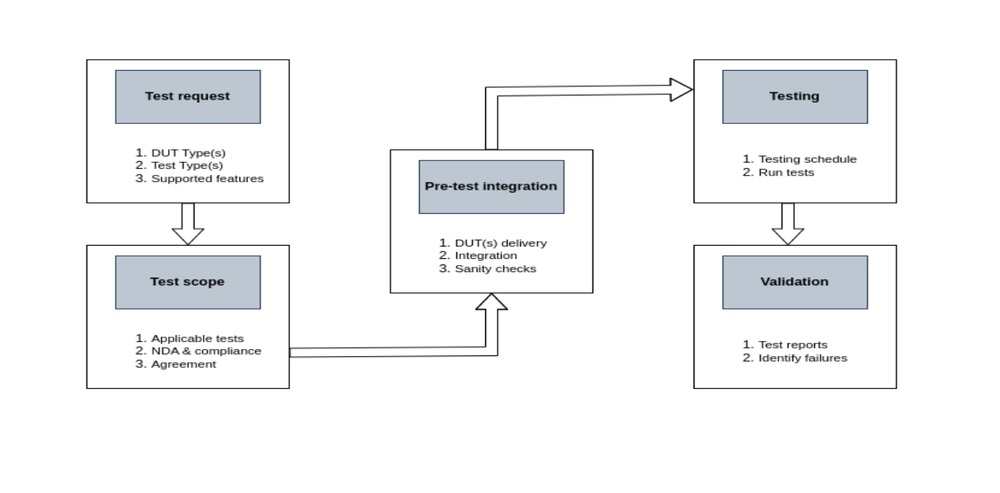

Conformance
===========

Introduction to O-RAN Alliance Conformance Testing
----------------------------------------------------

Purpose: To ensure that vendor implementations of O-RAN components conform to the standards and specifications defined by the O-RAN Alliance.

Objective: To validate the functional correctness and protocol compliance of the 7.2x split interface between the O-RU (Open Radio Unit) and O-DU (Open Distributed Unit), focusing on interoperability, reliability, and standards alignment.

Scope: At the OTIC, we provide a vendor-neutral, open, and standards-compliant testing environment to support validation, troubleshooting, and certification of O-RAN components before commercial deployment or multi-vendor integration.

Applicable O-RAN Specifications
----------------------------------

Our conformance testing framework is primarily based on the specifications developed by Work Group 4 (WG4) of the O-RAN Alliance, which defines the Open Fronthaul (OFH) interface. We specifically focus on validating compliance to the following:

- **M-Plane Specifications:** for management and configuration of the O-RU.
- **U-Plane and C-Plane Specifications:** for user and control data handling.
- **S-Plane Specifications:** for synchronization and timing signal validation.
- **WG4 Conformance Test Specifications:** which outline mandatory and optional test cases for interface validation.

Types of Conformance Tests
-----------------------------

The conformance testing focuses on validating the behavior of the Devices Under Test (DUTs)—typically the O-DU, O-RU, and the Open Fronthaul (OFH) interface. Testing is categorized based on the logical planes defined in the O-RAN architecture.

- **M-Plane (Management Plane):** Validates the conformance of NETCONF-based management protocols and YANG data models used to configure and manage the O-RU. This ensures accurate handling of provisioning, fault, and performance management operations.
- **S-Plane (Synchronization Plane):** Ensures that the DUT can correctly synchronize with an external timing source (e.g., grandmaster clock via PTP or SyncE), which is critical for fronthaul timing alignment and air interface scheduling.
- **U/C-Plane (User and Control Planes):** Verifies the basic functionality of the data and control transport layers, including message structures, beamforming, compression, and handling of real-time data traffic on the 7.2x split interface.

Test Environment Setup
-------------------------

The following diagram illustrates a typical setup used for M-Plane conformance testing of an O-DU:

   **Figure:** Example M-Plane conformance test setup for O-DU.

In this scenario, an O-DU provided by Vendor A is integrated with test equipment available at the OTIC. The setup allows for validation of management interface behaviors using standard M-Plane tools and test scripts. Similarly, other DUTs can be tested with this setup. For other categories of conformance testing, it may require additional components like timing and synchronization test equipment, UE emulator, O-DU emulator, etc.

This modular architecture allows the OTIC to support equipment from any vendor and run conformance tests independently. Components such as traffic generators, PTP grandmasters, and RU/DU emulators, etc., can be configured flexibly to support various test scenarios.

Example Test Case
--------------------

Consider an example test case specified in WG4.CONF document from O-RAN Alliance:

**Test Case 3.1.1.1 – Transport and Handshake in IPv4/SSH (Positive Case)**

We understand the objective, applicability, procedure, and expected results of the test case prior to running the test. Here is a summary for test case 3.1.1.1:

- **Objective:** Verify that the O-RU NETCONF server can establish a TCP connection with the O-DU NETCONF client and perform a successful Call Home.
- **Expected Result:** A secure SSH connection is established, and both units exchange <hello> messages to confirm NETCONF capability negotiation.

   **Figure:** Example test case 3.1.1.1 – Transport and Handshake in IPv4/SSH.
